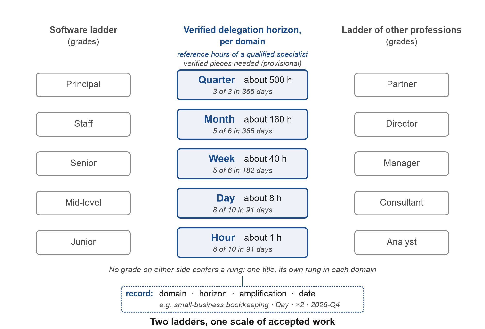
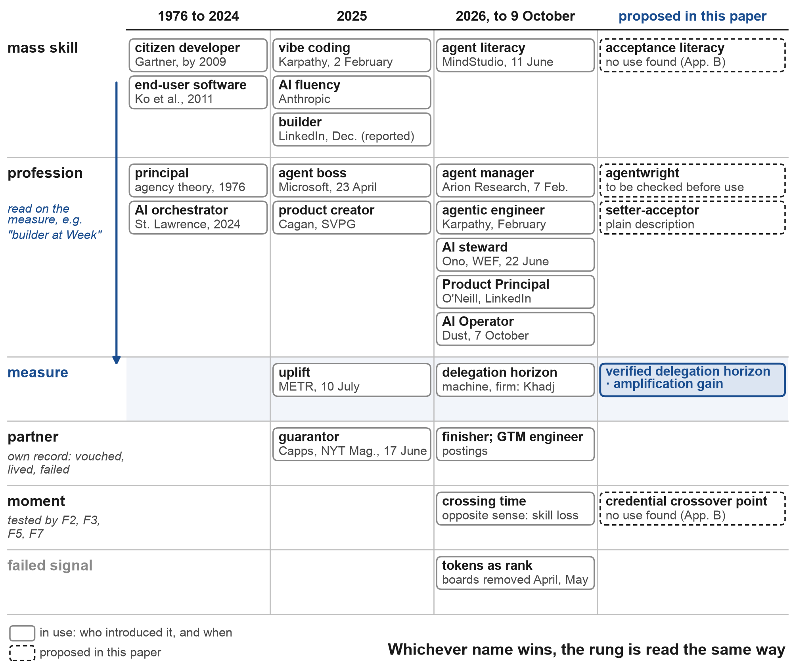
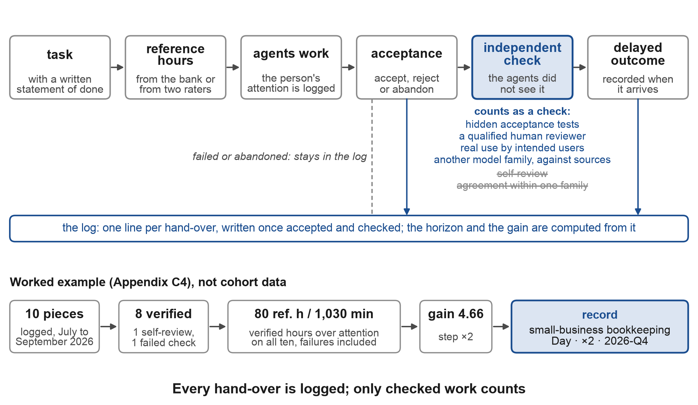
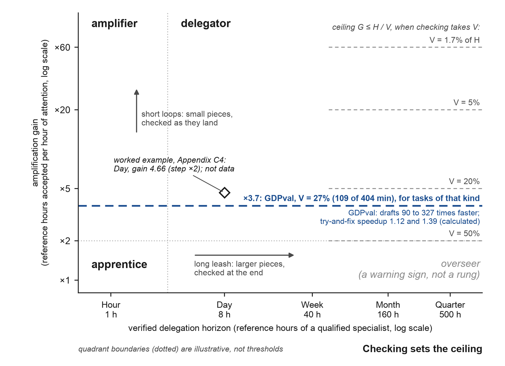
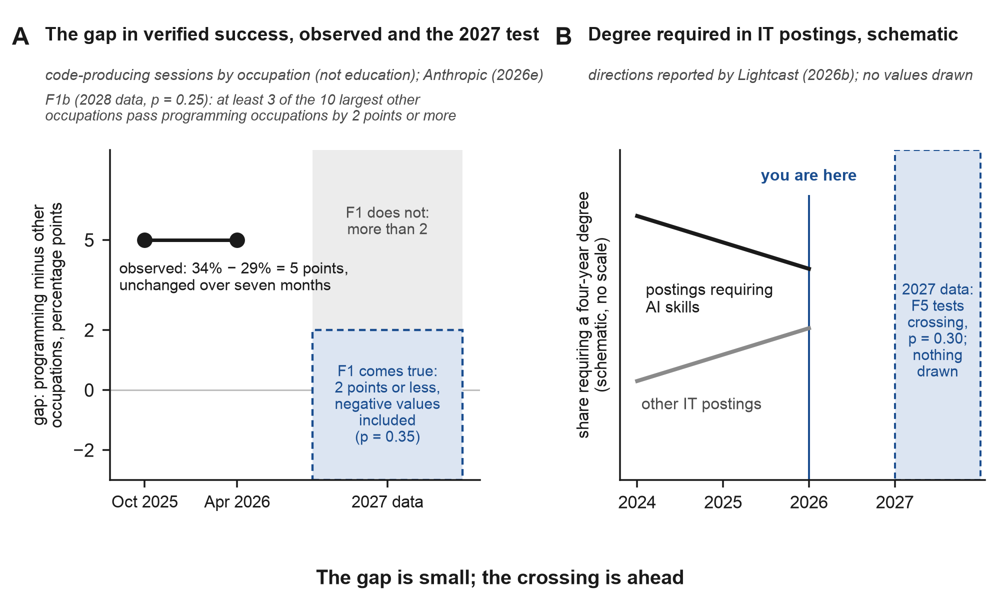
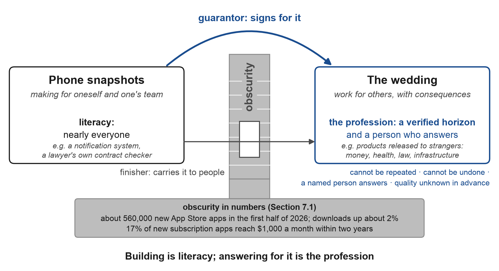
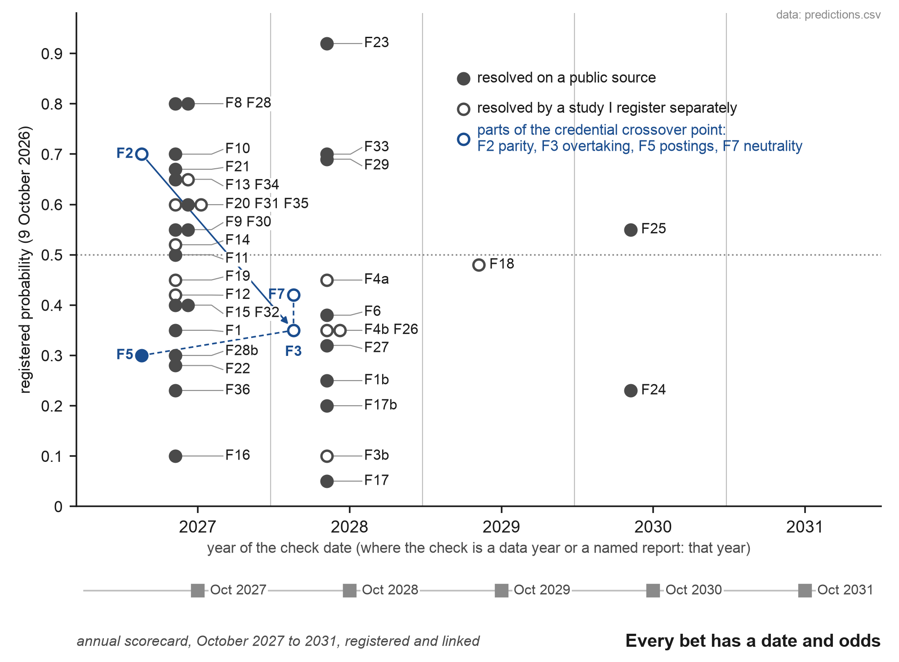
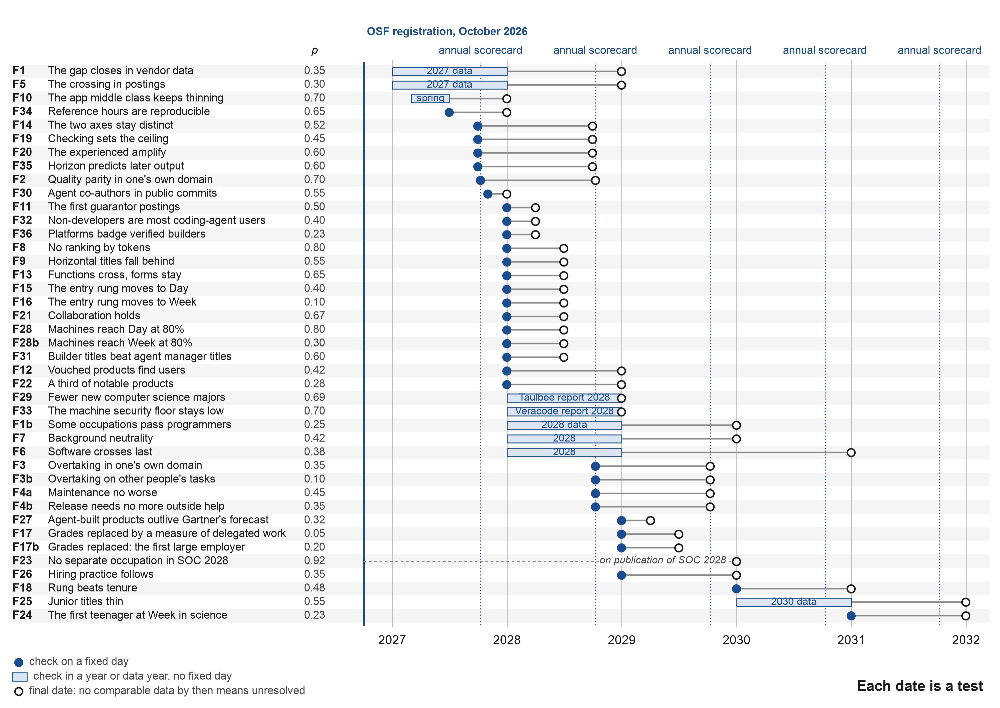
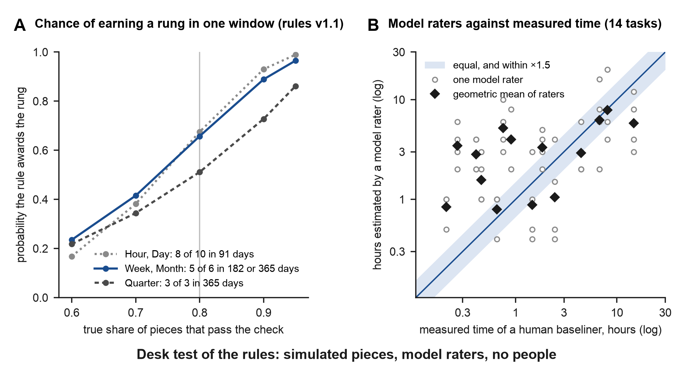
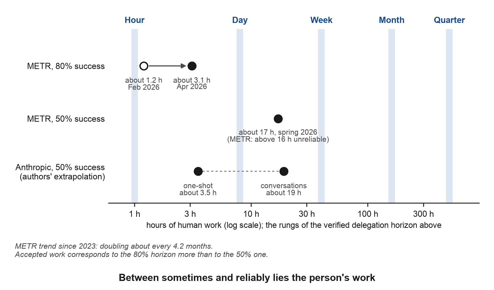

# After the Programmer Divide: One Measure for People Who Build Through AI Agents

*The verified delegation horizon, amplification gain, a dated map of role names, and 41 registered predictions scored each year until 2031*

**Vadym Chernets**, PhD, AI systems architect · ORCID [0009-0007-4845-3163](https://orcid.org/0009-0007-4845-3163)

**Download this paper**

- **SSRN** (version of record): [ssrn.com/abstract=7589918](https://ssrn.com/abstract=7589918) · DOI [10.2139/ssrn.7589918](https://doi.org/10.2139/ssrn.7589918)
- **Zenodo** (archived, open access): [doi.org/{{ZENODO_DOI}}](https://doi.org/{{ZENODO_DOI}})
- **OSF** (the 41 predictions, registered 9 October 2026): [doi.org/{{OSF_DOI}}](https://doi.org/{{OSF_DOI}})
- **GitHub** (full text as Markdown): [github.com/vadimchernets/papers/tree/main/after-the-programmer-divide](https://github.com/vadimchernets/papers/tree/main/after-the-programmer-divide); code of Appendix C: [github.com/vadimchernets/delegation-horizon](https://github.com/vadimchernets/delegation-horizon)

*SSRN holds the version of record; cite that one.*

**Keywords:** AI agents; agentic AI; non-programmers; job titles; verified delegation horizon; amplification gain; acceptance literacy; background neutrality; credential crossover point; skills-based hiring; principal-agent theory; end-user software engineering; Goodhart's law; guarantor; AI literacy; preregistered predictions; Brier score

---

## Abstract

A bookkeeper asks an agent for a reconciliation tool; a developer asks one to change a billing system. Each must accept a day's work and show it holds. By October 2026 lawyers were setting tasks for the same agents too. In about 400,000 sessions, vendor-verified success on code-producing work was 34% for programming occupations and 29% for others, though occupation is not education. No career ladder says what someone building through agents can be trusted to deliver. I propose a measure in place of a title. The verified delegation horizon is the largest coherent piece of work, in reference hours of a qualified specialist, that a person regularly hands to agents and accepts after an independent check the agents did not see. Amplification gain, accepted reference hours per hour of attention, is a verified throughput, not a causal estimate of speedup. Both are scored per domain, Hour to Quarter; a desk pre-pilot corrected one threshold. Three large employers tried token counts and dropped them in 2026: a ranking removed, a leaderboard gamed, a budget spent. Checked work is harder to game by spending; the remaining routes have proposed, untested defences. A dated map records rival names (builder, agent manager, principal and others) without choosing. Background neutrality is the hypothesis that at an equal horizon a programming education stops predicting checked quality. The credential crossover point is the moment, domain by domain, when products of people without an IT education begin to overtake those of programmers under the same checks, after which degrees and seniority labels lose weight. Forty-one dated predictions, priced on 9 October 2026 at the median of three blind model forecasts, are registered on OSF and scored yearly until 2031; a study never run counts as a failure, and overtaking in one's own domain stands at 0.35.

## Executive summary

By 2026 bookkeepers were comparing coding agents the way programmers did a year earlier, lawyers were building their own tools with them, and people outside software had become a fast-growing part of one vendor's coding-agent users; in another vendor's records, about 400,000 sessions, the occupations that do not program trailed programmers by a few percentage points in verified success on coding work (34% against 29%). Where the work is done, the boundary between programmers and everyone else has thinned. In job titles, pay grades and résumés it stands where it stood.

Some programmers and some domain professionals now share a workflow: they hand work to agents and decide whether to accept it. Tasks and workflows have merged ahead of whole professions, so the informative question about a person is how large a piece of work they can hand over and prove, whichever side of the old boundary they came from. The measure I propose for that question, the verified delegation horizon, rests on a few design choices, and this summary gives the reason for each. The unit is the time a qualified specialist would have needed (an hour, a day, a week, a month, a quarter), because both old ladders can read it and no translation between professions is needed. A bookkeeper's reconciliation tool and a developer's billing change face the same rule. Only work that passed a check the agents did not see is counted, and agreement among models of one family does not count as such a check, because their errors are correlated. A second number, amplification gain, records how much checked work each hour of the person's attention yields (failed work still costs attention, and the agents' unattended time does not), so that someone who works beside an agent in short loops is credited as fully as someone who hands over large pieces. Both numbers are kept per domain, for a symmetrical reason: a lawyer who moves into software and a programmer who moves into law lose the same thing, the ability to accept work in a field they do not know. The thresholds are provisional, and a desk pre-pilot without people has already corrected one of them (Appendix E).

The names are not settled. Builder, agentic engineer, agent manager, AI operator, orchestrator and principal are all in use by October 2026, each with an owner and a date. I map them without choosing, so that whichever wins can be read on one scale: a builder at Week, an agent manager at Day.

The market has already tried a shortcut. In 2026 token counts were tried as a measure of staff at large employers and failed within months: an employee's unofficial ranking at Meta was taken down and the company's official guidance later ruled out token counts, a leaderboard at Amazon was gamed with empty tasks and removed, and Uber spent its annual AI budget in four months. A count of inputs rewards spending. A count of accepted work, checked independently, is harder to inflate that way, by design rather than yet by measurement, although it can still be gamed through easy checks, generous raters, hidden help and work sliced into pieces. Section 5.8 lists those routes with a defence against each: random audits, independent raters of hours, a public record of failures, a coherent unit of work and planted errors.

Two predictions carry my dated thesis. Background neutrality says that at the same rung a programming education stops predicting checked quality. The credential crossover point is the moment, in a domain, when products made by people without an IT education begin to overtake those of programmers using the same agents, after which a degree and the labels junior and senior lose weight. Quality parity comes before that moment, a crossing of degree requirements in job postings is its visible sign, and each part is dated and tested on its own. The main prediction runs against current opinion, and the paper says so where it states the prediction. Each prediction also names the result that would refute it, so a reader can see in advance what a failure would look like. All 41 appear in a table with probabilities, thresholds, fallback sources and final dates, registered on OSF on 9 October 2026 (DOI {{OSF_DOI}}) and scored by the Brier rule each year until 2031. Twenty-seven resolve from public data. Fourteen need studies registered separately before data are collected, and missing or inconclusive evidence is recorded as unresolved and does not count as a success; a study that is never run is a failure of the testing programme and stays on the scorecard. The probabilities were fixed on 9 October 2026 as the median of three blind model forecasts, which I adopted, and are registered on OSF; the probability of overtaking in one's own domain is 0.35.

When building costs little, trust becomes the scarce filter. App stores and code hosts are flooded, platforms are closing their doors to unknown contributors, and agents increasingly write a solution instead of adopting someone else's. Beside the person who builds, two partner functions are visible: a finisher brings the product to people, and a guarantor signs for it. The second name comes from a 2025 description of the role, and I propose a measure for the guarantor too.

## 1. Introduction

On 23 September 2026 a blog for bookkeepers compared two coding agents, Claude Code and Codex, for categorising transactions and reconciling accounts (Growthy, 2026). A year earlier that comparison belonged to programmers, and in programmers' threads it still does, complete with camps and loyalties. What moved was the reader. The people now choosing between agents keep books, write contracts and run campaigns, and the agents they choose between are the ones software developers use.

For decades the economy has kept two ladders. In software the rungs were junior, mid-level, senior, staff and principal, priced by years of experience and by how many engineers a project needed. Elsewhere the rungs were analyst, consultant, manager, director and partner. The ladders met at the door of the IT department, in the sense that a professional on the second ladder got software by commissioning it from someone on the first. In 2025 and 2026 both ladders began to describe the same work. Developers were told that their main activities had become delegation and verification (GitHub, 2025b). Professionals outside software, with an agent in a terminal or a desktop window, began to build the tools, sites and small applications they used to commission (Bloomberg Law, 2026; OpenAI, 2026). Neither ladder says what such a person can be trusted to deliver, and neither says how to compare a former developer with a former analyst who now do the same job.

The questions that follow are what the people on the merged side of that boundary should be called, how their level should be measured once a degree and years of service stop telling an employer what they can deliver, and when the boundary might disappear. The last of them gets its answer in the form of dated predictions.

That question also has a dated origin. On 8 October 2026 I stated a forecast: within one to two years agentic capability will grow so far that technical education is no longer needed, and people without it will build better applications, sites and products, with code better than programmers' code. Later the same evening I added a corollary. When products made by people without an IT education begin to overtake those made by IT professionals, IT degrees and the labels junior and senior will rapidly lose weight on a résumé. (Both statements are translated from my notes of that day.) Sections 6 and 11 turn both into predictions with dates, measures, thresholds and results that would refute them. The second statement names the moment that the rest of the paper calls the credential crossover point.

The companion paper in this series followed non-programmers from chat to agents and defined four levels by where an agent works and what the person must own (Chernets, 2026a). It counted a transition only when an agent had produced an artefact, and it declined to make the manager of agents into a job title, using the term "for a pattern of behaviour rather than a role anyone should hire against, because the behaviour leaves evidence and a title does not" (Chernets, 2026a, Section 8.4). The present paper starts from that condition: a level is granted, and any title may attach to it, only on evidence, meaning work handed to agents, accepted by a person, and confirmed by a check the agents did not see.

Section 3 gives a dated map of the names in circulation in October 2026. Section 5 gives the scale on which any of those names can be read, the verified delegation horizon with its second axis, amplification gain. Section 6 states two hypotheses, background neutrality and the credential crossover point. Sections 7 and 8 take up trust, the boundary that does not dissolve, and the two partner functions beside the person who builds. Section 11 sets out dated predictions with probabilities, thresholds and fallback sources, registered on OSF and scored every year until 2031 in public.

I do not choose among the names. The market will choose, probably within months, and a paper that bets on one word is wrong the day another word wins. What a paper can fix is the scale. Section 5 defines it in full; in short, the verified delegation horizon asks how large a piece of work, in the hours a qualified specialist would have needed, a person regularly hands to agents and accepts with an independent check behind the acceptance, and amplification gain asks how many such hours each hour of the person's own attention yields. Both are kept per domain, dated, and placed on five rungs from Hour to Quarter. Figure 1 sets the two old ladders beside that one.

One definition of the credential crossover point serves the whole paper. In a domain, it is the moment when products made by people without an IT education, accepted under the same independent checks, begin to overtake those of programmers who use the same agents, after which a degree and the labels junior and senior lose their weight in hiring. Quality parity is the step before that moment, and a crossing of degree requirements in job postings is its visible sign. Background neutrality, the hypothesis that education stops predicting checked quality at an equal rung, is the mechanism that would explain it. Each of these four parts carries its own dated prediction (Section 6.2).

The evidence is drawn from 2025 and 2026, a span in which a month of agent development changes what a measure has to count. A widely quoted figure puts new-graduate hiring at large technology firms far below its 2019 level. It is left out, as are comparisons with the hiring peak of 2022, because they measure a world before agents. Series from before agents enter only as predecessors, and the macroeconomics of hiring is carried by the LinkedIn counterpoint of Section 2.4. Older work also enters as theory, precedent or analogy: Jaques on the time-span of responsibility, Jensen and Meckling on the cost of delegation, a gold rush and a photographer.

**Figure 1.** *Two ladders and one measure.*



Note: The old ladders are drawn side by side with the five rungs and are deliberately not connected: no grade on either ladder confers a rung, and the same person holds a separate rung in each domain (Section 5.2). The rungs are counted in reference hours of a qualified specialist, with the provisional counts and windows of Section 5.2. The record shown is the one printed by the worked example of Appendix C4.

Around those parts, Section 2 lays out the evidence of convergence and Section 4 tells how the market's first measure failed, which is the case for a measure of this kind. Section 9 checks which topics of programmers' conversations cross over to other professions, and Section 10 draws the implications. Section 12 collects the evidence against the thesis, Section 13 states its boundary conditions, and Section 14 concludes.

## 2. Two worlds converging: evidence from 2025 and 2026

### 2.1 The programmer's job, redescribed

The vendors that sell to developers now describe the developer's job as directing agents. GitHub's account of "the new identity of a developer" put delegation and verification at the centre of the work (GitHub, 2025b). Anthropic surveyed 132 of its own engineers and researchers in August 2025. They reported using AI in about 60% of their work and a self-assessed productivity gain of about 50%, and described themselves as becoming more "full-stack". Most said they could fully delegate only up to a fifth of their work, and 27% of their AI-assisted work consisted of tasks that would not have been done at all without AI (Anthropic, 2025a). A measure built on full delegation alone would therefore see at most a fifth of what the most advanced users in the world do with AI, which is why Section 5 adds a second axis. The same report named an "oversight paradox": supervising the model takes the coding skills that atrophy when everything is handed to it.

The words followed the work. Andrej Karpathy named "vibe coding" on 2 February 2025 (Karpathy, 2025), Collins made it a word of the year (Collins Dictionary, 2025), and a year later Karpathy moved on to "agentic engineering". At Sequoia's AI Ascent on 30 April 2026 he put the difference as "vibe coding raises the floor, agentic engineering extrapolates the ceiling" (Karpathy, 2026; Willison, 2026a). An academic paper described the agentic engineer as a new professional archetype, with responsibility shifting from authorship of code to ownership of outcomes (Alenezi, 2026), and Microsoft described the patterns of work in its customers as author, editor, director and orchestrator (Microsoft, 2026b).

### 2.2 Everyone else, inside the same agents

Two vendors report wide use of coding agents by people outside software, with different selection and measurement limits. OpenAI reported in June 2026 that weekly users of its coding agent who are not developers had grown 137-fold among individual users and 189-fold among organisations since August 2025 (OpenAI, 2026). The base was low and the data are the vendor's. The same report gives a distribution that matters for Section 5. In a sample of about 0.1% of the agent's individual users in May 2026, 80.6% made at least one request whose by-hand duration, as estimated by a model, exceeded 30 minutes, 70.2% at least one above an hour, and 25.6% at least one above eight hours. These are shares of users making long requests, with durations estimated by a model, which is a different thing from a completion rate or a verified horizon, and Section 5 explains why the difference matters. More than a quarter of the agent's work for business functions was engineering work.

Anthropic's study of Claude Code, published on 16 June 2026, is the closest public data to the thesis (Anthropic, 2026e). It analysed about 400,000 sessions by about 235,000 people between October 2025 and April 2026. Expertise was judged from behaviour, by three signs: how precisely the person stated the task, what they asked to have verified, and who corrected whom. A bookkeeper with no Python who wrote exact reconciliation rules and caught edge cases was rated an expert. In sessions where code was produced, each of the ten largest occupations trailed programming occupations by no more than seven percentage points in verified success, where success means accomplishment backed by evidence such as passing tests or committed work. The vendor's classification rests partly on signals in the session transcript, such as a user's explicit confirmation, and the report notes that the managers' slightly higher rate may partly reflect how they report success, so "verified" here is the vendor's term, not an independent check. Aggregated over code-producing sessions it was 34% against 29% (about 30% against 26% across all sessions), and management did slightly better than programmers. These data sort people by occupation and say nothing about education: an accountant may hold a computer science degree, and a programmer may have none. The report concluded that "coding agents are making a coding background less relevant to successful programming". People made about 70% of the decisions about what to do and the agent about 80% of the decisions about how. An expert's instruction set off about twelve agent actions, a novice's about five.

The same shift shows up in sources that do not come from the companies selling the agents. Lawyers, from junior associates to partners, have been building working prototypes of their own tools with Claude Code instead of waiting for vendors, and the share of lawyers with broad AI access rose from 61% in 2025 to 83% in 2026 (Bloomberg Law, 2026; Artificial Lawyer, 2026). Bookkeepers compare agents (Growthy, 2026). Lovable, a browser-based app builder, passed $600 million in annualised revenue in September 2026 (TechCrunch, 2026a). By one estimate, Claude Code authored about 4% of public commits on GitHub in early February 2026 (SemiAnalysis, 2026).

### 2.3 The ladders under strain

Employers have started to rename their ladders without yet saying what replaces them. From 1 June 2026 Deloitte gave its roughly 181,500 US staff new titles organised by job family and added a leadership level (Business Insider, 2026). Its internal levels and pay principles stayed in place (Fortune, 2026a), so this was a renaming with the measure left as it was. LinkedIn was reported to have replaced its associate product manager programme with an "Associate Product Builder" track and to have opened a "Full Stack Builder" role to people from any function (Lenny's Newsletter, 2025). Microsoft counted 3,233 of 20,000 surveyed AI users, about 16%, as "Frontier Professionals" who run multistep agents and redesign their processes (Microsoft, 2026a). Srinivasan and Wei argued in the Harvard Business Review in February 2026 that companies need agent managers, and expected the title to become standard within 12 to 18 months (Srinivasan & Wei, 2026). Some employers go further and write the new role into postings: State Street advertised an "Agentic Product Builder" that still requires programming (State Street, 2026). On 7 October 2026 Dust introduced the "AI Operator" as the person who builds and maintains shared agent workflows (Dust, 2026).

Hiring has noticed. The share of job interviews in which candidates' use of AI was discussed rose from 0.33% in the third quarter of 2025 to 4.54% in the second quarter of 2026 (Metaview, 2026). The question has entered hiring before any scale for the answer exists.

### 2.4 Postings, entry-level hiring and education

US job postings that mention "agentic AI" went from 151 in 2024 to 16,541 in 2025 (Stanford HAI, 2026). A different count, by Lightcast, found more than 86,000 postings in 2025 that mentioned agentic AI skills, a 280% annual rise in mentions of those skills and a median advertised salary of $153,000; the skills were mostly added to existing job titles (Lightcast, 2026a). The AI Index counts postings that contain the phrase "agentic AI", while Lightcast's blog counts postings that carry agentic skills in its own taxonomy, which explains most of the distance between 16,541 and about 86,000. The numbers measure different things and are kept apart here.

Entry-level hiring has weakened, and the cause is disputed. LinkedIn found US entry-level hiring in April to June 2026 down 7.6% year on year against 6.9% for all levels, and in occupations that AI augments, entry-level hiring fell 9.6% against 6.5% for all levels in those occupations (LinkedIn Economic Graph, 2026). LinkedIn itself attributes more of the fall to economic uncertainty than to AI, and notes that, among entry-level roles, those insulated from AI fell most in France, the United Kingdom and the United States. The August 2026 update of the Stanford "canaries" study found employment of 22- to 25-year-olds in AI-exposed occupations about 19% below expectation with no comparable gap for experienced workers, and describes the result as descriptive (Stanford Digital Economy Lab, 2026a). Employers cited AI in 101,743 announced job cuts in the first half of 2026, about 23% of all announced cuts (Challenger, Gray & Christmas, 2026).

Education is moving too. New undergraduate computer science majors fell 13% in the departments covered by the 2026 Taulbee survey, which counts PhD-granting departments in North America; its authors describe this as the first clear signs of contraction in the enrolment pipeline, alongside record degree production (Computing Research Association, 2026). A field experiment with 673 German IT apprentices found gains of 26 to 31 percentage points on tasks outside their formal training when they had AI (Stanford Digital Economy Lab, 2026b). The joint OECD and European Commission framework of June 2026 includes a domain called "Manage AI" (OECD & European Commission, 2026).

Table A1 (Appendix F) lists ten signals of this convergence with their sources, and for each what it shows and what it does not show. Read together, the limits matter as much as the signals: vendor data on non-developers inside coding agents show growth, not the quality of their results. The closeness of occupations in verified success concerns occupation, not degree. Renamed ladders and survey segments are titles, not measures. And the weaker entry rung is not shown to be caused by AI.

These signals show, with some confidence, that setting and accepting agent work is now done on both sides of the old boundary, and that employers, schools and vendors have begun renaming things. Do people outside software do this work as well as programmers? The signals leave that open, and they show no measure for it either. Section 5 proposes the measure, Section 11 puts dates on the question of quality, and Section 12 sets out the evidence the predictions must overcome.

The 2026 evidence separates people who can show that a result is right from people who cannot. A programming education is one route to that ability. Command of a domain, a habit of checking and tools for checking are others, and the data of Section 2.2 suggest they can stand in for the first more often than the old ladders assume, though not yet that they always can. The measure of Section 5 is built to test that claim.

## 3. Names in circulation: a dated map

### 3.1 Why I do not choose a name

Every few weeks in 2026 a company or a consultant, sometimes a magazine, proposed a name for the people described here, and some of those names will stick. Because usage is unsettled, I do two things instead of recommending one: map the names already in circulation, including those that are taken, with who introduced each, when and in what sense, and offer a measure on which any of them can be read. If "builder" wins, the record reads "builder at Week"; if "agent manager" wins, it reads "agent manager at Day". Priority is claimed for the measure, the ladder, the definitions and the predictions, including the terms that name them (verified delegation horizon, amplification gain, credential crossover point), and for no role name; the role names added in Section 3.3 are offered as candidates without priority.

### 3.2 Six layers

The candidates do not all compete for one slot. Some name a skill nearly everyone will have, others a profession, a measure, a moment, a partner, or a signal that failed. Table A2 (Appendix F) lists the names already in use, with their owners, and, in a second part, the names proposed in this study or used here only as plain descriptions, together with variants that were considered and set aside, so that a reader can see the whole family. Figure 2 places the names by layer and by the date each was introduced.

**Figure 2.** *Names in circulation, by layer and by the date each was introduced.*



Note: Owners and dates follow Table A2. A name whose source gives only a year carries no month. The figure is a selection; Table A2 lists every candidate. Only the mass-skill and profession layers are read on the measure ("builder at Week", "agent manager at Day", Section 3.1). The partner has a record of its own, how many products were vouched for, how long each lived and how many failed (Section 7.2), and the moment is not a rung but is tested by dated predictions F2, F3, F5 and F7 (Section 11.2). "Delegation horizon" in the measure row is the machine or firm sense (Khadj, 2026; Alonso, 2026), not the personal measure of Section 5. The figure carries no judgement about which name will prevail.

### 3.3 Remarks on the map

"Builder" is probably winning in mass HR: LinkedIn has adopted it, and journalists wrote in 2026 that everyone in the Bay Area is a builder now (SF Standard, 2026). There is no reason to fight the word, since it says nothing about level and level is what the measure supplies.

The managerial names (agent manager, AI operator, orchestrator) are horizontal: they describe running agents in general, in no particular domain. Section 6.3 gives the reason to expect them to follow the prompt engineer, a title that was everywhere in 2023 and was called obsolete in 2025 (Fortune, 2025; TechRepublic, 2025).

"Principal" has the strongest theory behind it and the worst collisions. In agency theory the principal is the party who delegates and pays the costs of monitoring (Jensen & Meckling, 1976), and Anthropic's constitution for its models calls "principals" those on whose behalf the model acts (Anthropic, 2026b). Verheul (2026) argues that when machines perform the agency function, people in a firm hold only principal positions and the career ladder disappears. I accept the diagnosis and propose a new ladder in its place. In identity and access management, though, "agent principal" names the agent's own identity, the reverse of the intended sense, so the English phrase "Agent Principal" should not be used for a person. O'Neill's "Product Principal" is a precedent in nearly this sense and is cited as such, and JetBrains' AIDEs framework already describes developer levels as properties of a principal-agent relationship (Tikhomirov, 2026).

The names proposed here (agentwright, setter-acceptor, agent director) join the family as candidates, none of them a favourite. Agentwright is free in the scholarly bases searched, but search engines split it into "Agent Wright", it sounds like a browser-testing tool developers know, and by October 2026 the word was already used for a Python package and a catalogue of agent skills, so it stays a variant that would need a qualifier.

One observation about meaning can be recorded without taking the choice from the market. By sense, "principal" lies closest to the profession of Section 8, work done for others with responsibility for the result, and "builder" closest to the mass skill, work done for oneself.

## 4. Why a measure: the year tokens were tried as seniority

The market did not wait for a scale. In 2026 it tried several, and because the episodes differ in kind they are kept apart here, in the order they happened.

At Meta, an employee built an internal dashboard nicknamed "Claudeonomics" that ranked about 85,000 colleagues by tokens consumed, more than 60 trillion of them in thirty days (Shopifreaks, 2026a). It was one employee's project, with no official standing, and it was taken down in April after it was reported outside the company. Meta's official line moved separately. From February AI use was a formal part of employee evaluation, and at the start of September WIRED and CIO reported new guidance under which Meta "will not use AI adoption dashboards or token counts to evaluate impact" and dropped the "AI Native" label as a criterion (CIO, 2026b; Shopifreaks, 2026b). At Amazon a leaderboard of token use was gamed with empty tasks and removed in May (CIO, 2026a), which is Goodhart's law in its cleanest form: once the measure became a target, it stopped measuring. Uber's case is a budget event. The company spent its annual AI budget in four months and capped employees at $1,500 a month (Fortune, 2026b). In July the chief executive of Cognition said companies should measure productivity, not AI usage (Fortune, 2026c).

The counterexamples matter as much. Shopify adds questions about AI usage to its performance and peer reviews (Shopify, 2026), and one commentator expects token metrics to be "downgraded, not killed" (Kingy AI, 2026). Questions about how a person uses AI are a different thing from a ranking by volume, and prediction F8 in Section 11 distinguishes them.

The developers' threads examined in Section 9 show the same instinct in single people. They introduce themselves with inputs: a monthly AI bill of $1,148, a screenshot of a subscription, about 330 of some 600 pull requests done (a unit described in the thread as very approximate), 36 stages built in three days. One of them published the savings his agent had calculated for him without checking the calculation, which is the token episode repeated by one person. Each of these counts what was spent or produced; what was accepted, by whom and after which check, goes unrecorded.

I draw one direct lesson for the measure: count work, and only work that passed a check the agents did not see. Agreement among models of the same family cannot be that check, because their errors are correlated and their agreement is worth fewer independent opinions than it looks (Chernets, 2026b). Spending more tokens cannot inflate a measure built this way, since unaccepted work adds nothing to it. Other ways of inflating it remain, and Section 5.8 lists them with their defences.

## 5. The measure: verified delegation horizon and amplification gain

### 5.1 Reference hours

Both axes use one unit, the reference hour: the time a qualified specialist would need to do the same piece of work by hand. The reference is external on purpose. Whether the person could have done the work themselves does not enter the measure, and neither does their background. A bookkeeper's reconciliation tool and a developer's billing module are both measured by what a competent professional would have spent on them.

Reference hours come from one of two sources. One is a frozen bank of tasks whose by-hand times were measured in 2025 and 2026; GDPval, with tasks drawn from 44 occupations and their experts' times, shows such a bank can be built (Patwardhan et al., 2025). The other is two independent raters who estimate the hours without knowing who did the work. I freeze the bank deliberately, the way the metre was once kept in a vault near Paris, because in a few years few people will still do these tasks by hand and there will be nothing left to compare against. The bank should hold, for each domain, tasks at every rung, each with a written statement of what counts as done, measured by-hand times, the hidden checks, and a few planted errors whose detection is part of acceptance. GDPval's by-hand times are verified self-reports of experts, while its review times were measured, which is the standard a bank should meet or improve on. To keep the measure from judging itself, the horizon is scored on one set of tasks and the quality used to test hypotheses about it (Section 6) on another.

### 5.2 The verified delegation horizon

**Definition.** A person's verified delegation horizon in a domain is the largest size of work, in reference hours, at which the person regularly hands work to agents, accepts it, and has it confirmed by an independent check the agents did not see.

**The rule in one paragraph.** A piece of delegated work counts as verified, and enters the horizon, only when all of the following hold. It was set with a written statement of what will count as done, and its reference hours come from the bank or from two raters. The person accepted it as one coherent deliverable: a month of work cut into 160 one-hour tickets is 160 Hours, while work done in stages and accepted as one whole counts whole, by the reference hours of that whole. An independent check confirmed it, and a check is independent when it differs from the agents in data (inputs the agents did not produce), in access (the agents could not see or edit it) and in incentives (whoever runs it gains nothing from a pass). Four kinds qualify: hidden acceptance tests, a qualified human reviewer, real use by the intended users, or a model of another family that verifies against sources the person opened and leaves a verdict that can be audited. Self-review and agreement among models of one family do not count, because their blind spots coincide with the agents' own. Within the rung's window (91 days at Hour and Day, 182 at Week, 365 at Month and Quarter) the person accepted the required number of pieces of at least that size, ten at Hour and Day, six at Week and at Month and three at Quarter, and at least eight of every ten passed, which means five of six at Week and Month and all three at Quarter. From Week upward at least one piece in the window carries planted errors. One missed planted error, of any kind, blocks the rungs from Week upward for that window, and the piece with it counts neither toward a rung nor toward amplification gain. Where an error cannot be undone (money moved, a patient's record, a filing that cannot be withdrawn), every such piece must pass, with a hidden test or a qualified human as the default check and a model of another family as a second line, and the stricter rule applies to those pieces alone. Every hand-over is logged, failures and abandoned pieces included, with the attention they took. The rung is confirmed again each quarter: at Week and above, at least one verified piece of the rung's size must fall within the last 91 days, so a horizon cannot rest on work close to a year old. The paragraphs below give the reasons for each part.

**Scoring rule.** Within the window set for each rung (91 days for Hour and Day, 182 for Week, 365 for Month and Quarter), a rung counts if the person accepted the required number of pieces of at least that size in the domain (ten for Hour and Day, fewer above, as set out below), and at least eight of every ten passed a check of one of these kinds: hidden acceptance tests, a qualified human reviewer, real use by the intended users, or a model of another family that verified against sources. Self-review and agreement among models of one family do not count. Where errors cannot be undone (money moved, a patient's record, a filing that cannot be withdrawn), every such piece must pass, and the stricter threshold applies to those pieces only. For these pieces the default check is a hidden test or a qualified human, with a model of another family as a second line.

**Upper rungs.** A single count of ten would put the upper rungs out of anyone's reach, since ten pieces of 40 reference hours in three months is 400 hours of a specialist's work, and ten pieces of 500 hours is 5,000. The rule therefore lengthens the window and lowers the count as the rung rises: ten pieces in 91 days for Hour and Day, six in 182 days for Week, six in 365 days for Month and three in 365 days for Quarter, with the same share of eight in ten (which means five of six for Week and Month, and all three for Quarter). An earlier version asked for four of four at Month; the desk pre-pilot of Appendix E showed that this made Month harder to earn than Quarter for a person of any reliability, and the count was changed. From Week upward at least one piece in the window must carry planted errors. Any planted error the person misses, whatever its kind, blocks the rungs from Week upward for that window, and a piece with a missed planted error does not count as verified, either toward a rung or toward amplification gain. Quarter is meant to remain a rare rung, and the counts above are set so that it does.

**Every hand-over is logged.** The log records every piece handed to agents, including those that failed the check and those abandoned before it, and only a piece accepted as one coherent deliverable counts toward a rung. A month of work cut into 160 one-hour tickets is 160 Hours, not a Month: reference hours are estimated for the deliverable that the user, client or reviewer accepts as a whole, in the spirit of METR's coherent tasks. The converse also holds: work done in stages and accepted as one coherent deliverable counts whole, by the reference hours of that deliverable, however many stages it took.

**Independence.** A check is independent when it differs from the agents in data (it uses inputs the agents did not produce), in access (the agents could not see or edit it) and in incentives (whoever runs it gains nothing from a pass). A model of another family adds diversity of errors. It counts only when it verifies against sources the person opened, and its verdict is one input that can be audited.

One piece of work travels this path (Figure 3). A task is set with a written statement of what will count as done. Its reference hours are taken from the bank or from two raters. Agents do the work while the person spends attention, which is logged. The person accepts, rejects or abandons the piece, an independent check confirms or refutes, and the line of the log is written at that moment, with the start date kept as a separate field where it matters. Where a delayed outcome exists (a filing accepted, a release still running after a month), it is recorded when it arrives. The horizon and the gain are computed from those records, with a date.

**Figure 3.** *One piece of work, one record.*



Note: The upper row is the path of Section 5.2. The four kinds of independent check are those of the scoring rule. Self-review and agreement among models of one family do not count. Failed and abandoned pieces stay in the log and add their minutes to the denominator of amplification gain. The lower row is the worked example of Appendix C4, a constructed log, not cohort data: ten pieces, eight verified, 80 reference hours against 1,030 minutes of attention, a gain of 4.66 (step ×2) and the record "small-business bookkeeping · Day · ×2 · 2026-Q4".

**Re-verification.** A horizon is confirmed again each quarter. Anthropic's oversight paradox (Section 2.1) explains why: a horizon earned while the checking skill decays is borrowed, and a quarterly check shows whether it still holds. For the rungs whose windows run longer than a quarter (Week, Month and Quarter), the check has a concrete form: at least one verified piece of the rung's size must fall within the last 91 days, so that a rung cannot rest on pieces close to a year old.

### 5.3 The ladder

I name the five rungs in units of time because units of time need no translation between professions, can be read from logs, and grow with the technology without renaming. Table 1 gives them with examples and the counts each needs.

**Table 1.** *The ladder of the verified delegation horizon.*

| Rung | Size of work handed over and verified | Example in software | Example elsewhere | Verified pieces needed, window |
|---|---|---|---|---|
| Hour | About 1 reference hour | A script, a small fix | Answers drawn from a stack of documents | 8 of 10 in 91 days |
| Day | About 8 | A feature, a small internal tool | A month-end report with its checks | 8 of 10 in 91 days |
| Week | About 40 | A site or internal tool to specification, with overnight runs | A complete due-diligence pack, a campaign system | 5 of 6 in 182 days |
| Month | About 160, usually in several streams | A product release; acceptance rules others work by | A practice's tooling, with rules colleagues use | 5 of 6 in 365 days |
| Quarter | About 500 | A product line with live users | A service line run through agents | 3 of 3 in 365 days |

Note: A rung is earned only by the scoring rule of Section 5.2, separately in each domain, with the provisional counts of rules v1.1 (Appendix E). No grade on an old ladder confers a rung, and a person can be at Week in financial tools and at Day in web applications.

The record for a résumé or an HR file holds the domain, the horizon, the amplification and the date, for example "small-business bookkeeping · Day · ×2 · 2026-Q4". The date belongs in the record because the same rung will mean something different a year later, as the technology moves.

### 5.4 Amplification gain

Not everyone who works well with agents hands them large pieces. One of the developers in Section 9, who builds with four machines, describes three of them as "a boost of personal efficiency" with no autonomous agent on them. The autonomous agents he also runs "did not take root" for daily work, he writes, and he prefers "boost, not delegation" (translated). His longest flow ran to 36 stages over three days, each stage handed over and committed, with the agent then asked to confirm that everything had deployed. By the rule of Section 5.2 that confirmation is self-review, so his record as posted shows no verified rung at all, and the thread gives no numbers for his gain. Where he would stand with an independent check depends on what was accepted. If the 36 stages were accepted as one coherent deliverable, the flow counts whole, by its reference hours, as the staged work of Appendix C, section C4, does. If each stage was accepted on its own, each is a small piece and he stands at Hour on the first axis. The post does not say which. Yet he builds tools that replace software he used to buy, and he names the denominator of the second axis himself when he calls time the only bottleneck.

He is not an exception. Anthropic reported that users with six months or more of experience were "much less likely to delegate greater responsibility through directive use patterns", worked with the model more iteratively, and brought harder tasks, with success three to five points higher after controls (Anthropic, 2026d). In Claude.ai, collaborative use led automation 52% to 45% in November 2025, and conversations succeeded more often than one-shot programmatic requests, 67% against 49% (Anthropic, 2026a). People in higher-paid occupations took about 1.5 times as many turns, and women automated 7.3 points less than men in the same occupation (Anthropic, 2026f). In Stanford's survey of 1,500 workers, the most preferred arrangement in 47 of 104 occupations was an equal partnership between person and agent (Shao et al., 2025). A measure built only on delegation would therefore understate the most experienced users, the highest paid and women, although nothing in these data says their work is worse.

**Definition.** Amplification gain is the reference hours of accepted, verified work divided by the hours of the person's attention spent on it, over the last 91 days in the domain, whatever the window of the person's rung. Work done with outside help (a colleague or contractor fixing it off the log) is recorded as such and adds nothing to the numerator, while the person's minutes on it stay in the denominator. Attention covers planning, instructing, reading, checking and fixing. Time the agent runs while the person does something else does not count.

Amplification gain is a verified throughput: accepted, checked output per hour of attention. It is not a causal estimate of how much faster the same person works with agents than without them. A gain in that comparative sense needs a baseline, the same person or matched people doing the same kind of work without agents, and only a comparative study can supply it.

Failed work adds nothing to the numerator and all its minutes to the denominator, which keeps self-deception visible. In METR's 2025 trial, experienced developers believed AI had sped them up while measurement showed they were 19% slower (METR, 2025).

The steps of the second axis are ×1 ("a day for a day"), ×2, ×5 ("a week for a day"), ×20 ("a month for a day") and ×60 ("a quarter for a day"). The two scales are independent, so a step on one is not equal to a rung on the other. When a person runs several agents in parallel, attention is still counted once, in the person's own minutes: an hour spent watching three streams is one hour in the denominator, shared among the pieces in proportion to the minutes logged against each. A score is reported together with the setting that produced it (the model and tools, the kind of check, and the rung of the tasks), because the same person will score differently under a stricter check.

### 5.5 Two axes, four profiles and a ceiling

Placing people on both axes gives four profiles (Figure 4). An apprentice has a short horizon and low gain. An amplifier has a short horizon and high gain, like the builder of 36 stages if his stages were accepted one by one. A delegator has a long horizon and high gain. The fourth profile, which I call the overseer, is a long horizon with low gain: the agents run for a long time, and checking and rework eat the benefit, so it is a warning sign more than a rung.

The two axes are linked by a ceiling. Attention goes into setting a piece of work and into checking it. Write H for the reference hours of a piece, V for the hours of attention that checking it takes, and S for the hours spent setting it. Then gain G = H / (S + V + rework), and so G ≤ H / V. If checking alone takes a quarter of the by-hand time, gain cannot exceed ×4, however long the agent runs unattended. By the same bound, the steps ×2, ×5, ×20 and ×60 are open only when checking takes no more than 50%, 20%, 5% and about 1.7% of the by-hand time (Figure 4). This is a simplified model with stated accounting bounds: it ignores the value of work the person could not have done at all, it assumes checking time scales with the piece, and it holds per piece, so a person who checks small pieces cheaply can beat the ceiling computed for large ones. At the level of the economy, Catalini et al. (2026) make the same point: the binding constraint becomes "human verification bandwidth", and a "Measurability Gap" opens between what agents can execute and what people can afford to verify.

GDPval shows what the bound means in practice. Its experts reported (and the authors verified) on average 404 minutes per task by hand, and reviewing a deliverable took a measured 109 minutes, about 27%, which puts the ceiling near ×3.7 for tasks of that kind. The models produced their drafts 90 to 327 times faster than the experts. Yet in the scenario where a person tries the model and then fixes its work, the authors' calculation (not a measurement) gave GPT-5 a speedup of 1.12 when the model is tried once and 1.39 when it is tried several times, two separate columns of the same table (Patwardhan et al., 2025). Whatever the agent's speed, the price of checking sets the ceiling, and that price rises with the rung, since a larger piece costs more to check. Kamara (2026) calls this cost verification friction. Practitioners in the threads of Section 9 put it in their own words: past a point, checking agent code "differs less and less from rewriting it by hand", and can take longer than writing it oneself (translated).

The same gain can be reached by two roads. A long leash hands over a large piece and checks it at the end; short, fast loops hand over small pieces and check each as it lands. My hypothesis is that checking small pieces along the way is often cheaper than checking a large result at the end, and Anthropic's data point that way. Conversations succeeded more often than one-shot requests, and by the authors' own extrapolation one-shot requests reach 50% success on tasks of about 3.5 hours while conversations would reach it on tasks of about 19 hours (Anthropic, 2026a). The share of collaborative use fell below automation in August 2025 and was back in front, 52% to 45%, by November. Predictions F19 to F21 in Section 11 test the short-loop road.

**Figure 4.** *Two axes, four profiles and the ceilings that checking sets.*



Note: The quadrants are profiles, not rungs, and their boundaries are illustrative. Each grey line is the bound G ≤ H / V of Section 5.5 for a given share of checking time V in by-hand time H. The accent line uses GDPval's averages, 404 minutes by hand and 109 minutes of expert review of model output (Patwardhan et al., 2025), and holds for tasks of that kind. The speedups 1.12 and 1.39 are the authors' calculation, not a measurement. The diamond is the worked example of Appendix C4, not data. It lies above the GDPval line because the ceiling is computed per kind of task, and small pieces checked cheaply can beat a ceiling computed for large ones (Section 5.5). The case of 36 stages in Section 5.4 is not plotted: the post gives no gain and no independent check.

### 5.6 Where the measure comes from, and what is new

The measure has ancestors, and the oldest is Elliott Jaques, who measured the level of any job, in any function, by its time-span of discretion: the longest time a person works on their own judgement before anyone reviews the result. He argued that fair pay rises with that span (Jaques, 1956). The verified delegation horizon carries the idea into the age of agents with one change. Jaques measured how long a person works unchecked, whereas this measure counts how much work a person hands to agents, accepts and has checked. The two can diverge, and his strata, counted in months and years, do not map onto these rungs.

Principal-agent theory is the second ancestor. Jensen and Meckling (1976) priced delegation as monitoring, bonding and residual loss. Checking is the monitoring cost of handing work to an agent, and the horizon marks the point where checking a larger piece no longer pays.

METR measures machines on the same axis. Its time horizon is the length of task, in human hours, that a model completes at a given success rate (Kwa et al., 2025). In spring 2026 the frontier model on its dashboard reached about 17 hours at 50% success, though METR itself cautions that measurements above 16 hours are unreliable with its current tasks. The horizon at 80% success rose from about 1.2 hours in February 2026 to about 3.1 hours in April, two points that illustrate the pace of growth without measuring its rate. The trend fitted on the dashboard across models since 2023 doubles about every 4.2 months (128.7 days), and the dashboard had not been updated after 8 September 2026 when it was last accessed (METR, 2026c). The forecasters of the AI Futures Project work with a doubling time of 4 to 4.5 months (AI Futures Project, 2026). Accepted work corresponds to the 80% horizon more than to the 50% one. The gap between what a model sometimes finishes and what it reliably finishes is the person's work, which is showing that a result is right and seeing it through. Figure A3 (Appendix F) sets these machine horizons against the rungs.

The theory of 2026 points to the same gap. Huang, Xiao and Vishnoi (2026) model delegation under AI and find that small differences in the ability to verify produce large differences in outcomes: AI helps those who check and harms those who hand over too much. Their paper was accepted at ICML 2026, and they call the effect verification amplification. A structured review of 24 studies found that no validated instrument in its focal corpus covers the full combination of skills needed to oversee agents (scope, permissions, recovery, independent review and evidence-based closure), although some instruments cover parts of it (Veri', 2026). DeepMind's framework for intelligent AI delegation describes delegation in general and contains no person-level measure (Tomašev et al., 2026), and the economics of delegation now has its own frontier models (Wang, 2026). Chen and Meng (2026) show that generative AI compresses skill differences within a task and shifts value to scarce complementary assets, and they add that the person-by-task panel data needed to test their predictions "do not yet exist at scale". The measure I propose produces data of exactly that kind, since each logged piece carries a person, a size and a date.

The second axis has its own neighbours, and amplification gain is their person-level, verified form. Engelbart (1962) framed computing as augmenting human intellect, and "superagency" is McKinsey's word for the same hope in 2025 (McKinsey, 2025). The Anthropic Economic Index scores conversations by speedup (time without AI divided by time with it) and agent autonomy on a scale of 1 to 5, both judged by a model (Anthropic, 2026a). Stanford's WORKBank grades the human involvement workers prefer on a scale from H1 to H5 (Shao et al., 2025). A 2026 essay defined supervisory capacity as useful verified output against human effort and explicitly declined to give it a number (em360, 2026), and "amplified oversight" is a term of AI safety for helping people supervise systems stronger than themselves. Observation of a search agent shows the same shift of human time toward checking: the agent works alone for 26 minutes per session, where a plain search took 33 seconds (Yang et al., 2026). On the side of delegation, Khadj (2026) and Alonso (2026) use "delegation horizon" for how far a machine or a firm can delegate, CHI 2026 work on "decision horizons" studies the loss of self-direction (University of Lübeck, 2026), and Dawson (2026) and Metal Toad (2026) publish practitioners' levels of AI delegation. None of these places a person on a level by work an independent check confirmed.

The closest recent framework is compared here directly. JetBrains Research's AIDEs framework (Tikhomirov, 2026) shares two features with the measure: it treats delegation as a principal-agent relationship, and it orders delegation in levels, five of them, described by attributes such as autonomy and planning. It differs on four. Its subject is software development, while the horizon is scored in any domain. Its levels describe how work is delegated, while a rung is set by the size of the work, in reference hours of a qualified specialist. It has no rule that the check be independent of the agents, while a rung counts only pieces confirmed by a check the agents did not see. And it has no count over a window and no second axis, while a rung needs a pass share over a dated window and amplification gain adds the hours of attention. The language of agency is shared; the unit, the independence rule and the scope beyond software are what this paper proposes.

Many scales were published in 2025 and 2026, and none of the scales in Table 2 measures a person by verified work. Table 2 groups the main ones by what they measure; Table A3 (Appendix F) lists each of them.

**Table 2.** *Scales of 2025 and 2026, grouped by what they measure.*

| Family | Examples | Unit measured | Places a person by verified delegated work? |
|---|---|---|---|
| Autonomy levels of agents and machines | Feng et al., 2025; Shapiro, January 2026; Memari & Rudolph, 2026; METR, 2025-2026 | The agent, the model or the team's setup | No |
| Stages of a developer's practice | Yegge, 2026; Park et al., 2026; Microsoft, May 2026 | Practice, supervision work or work patterns | No |
| Delegation by organisations and firms | Dawson, 2026; Metal Toad, 2026; Tomašev et al. (DeepMind), February 2026; Khadj, 2026 | An organisation, a manager, a firm or delegation in general | No |
| Developer delegation as a principal-agent relationship | JetBrains Research (Tikhomirov), September 2026 | A developer's delegation | Developers only; no independence rule for checks and no unit of size |
| Competence and literacy frameworks | AI Certification Standards, 23 August 2026; Anthropic AI Fluency, 2025b | Competences or literacy | No exam, thresholds or levels |
| Verified delegation horizon and amplification gain | This paper | A person in a domain | Yes, by the rule of Section 5.2 |

Note: "Places a person by verified delegated work" means that the scale puts an individual on a level by the size of work handed to agents and confirmed by a check the agents did not see. The nearest neighbour is JetBrains' five levels: they share the language of principal and agent, and differ in the rule of verification (an independent check the agents did not see) and in the unit (reference hours). Table A3 (Appendix F) lists each scale separately.

One practitioner put the objection to any personal scale well: "your autonomy level is a property of the repository, not the developer and not the model" (Phoenix, 2026). I accept half of that. A horizon belongs to a person, in a domain, under a checking regime, and a well-built repository with hidden tests is part of that regime, which is one reason the horizon is recorded per domain and with a date.

### 5.7 Two questions from the companion paper

The companion paper left open the question of why experienced users delegate less, whether they got burned or whether their judgement is the product (Chernets, 2026a). The second axis can tell the two apart. If the share of directive use falls while verified gain rises, judgement is the product; if gain falls too, they were burned. The companion paper also asked whether the vocabulary of delegation is one grammar or one per profession. I take a position: the grammar is one (set the task, then accept it on evidence), while what counts as evidence differs by domain, which is why the rungs are shared and the scoring happens per domain.

The instrument of Appendix C reports the directive share for each person and domain (the share of pieces handed over in one piece, against stages or joint work), so the first test can be run on the same records that give the rungs, and prediction F20 states it with a date.

### 5.8 How the measure can be gamed, and the defences

Counting accepted, independently checked work closes the cheapest route, spending, but a determined person or an employer chasing a target still has others. Table 3 lists them with the defence the rules provide. The defences cost something, and the cost is part of the design: an audited rung is worth more than a self-reported one, in the same way that an audited account is worth more than a statement.

**Table 3.** *Ways to game the measure, and the defences.*

| Route | What it looks like | Defence |
|---|---|---|
| Easy checks | Hidden tests that a weak solution passes; a reviewer who skims | Random audit of a share of accepted pieces by a second independent checker; planted errors from Week upward; the kind of check is printed next to the score |
| Choosing tasks just above a threshold | Many pieces of 8.1 reference hours to reach Day | Rungs read from the distribution of sizes, with the median accepted size reported beside the rung |
| Generous raters of hours | Raters who inflate reference hours | Two raters blind to the person; disagreement above a fixed ratio sends the piece to the frozen bank or a third rater; raters' records audited |
| Hidden help | A colleague or contractor fixes the work off the log | Attention logged per piece; random interviews or replays; outside help recorded as a field and excluded from the person's gain |
| Slicing | A month of work cut into one-hour tickets | Only a coherent deliverable, accepted as a whole, counts toward a rung |
| Hiding failures | Abandoned or failed pieces left out of the log | Every hand-over logged, with its start date, and closed when it is accepted, rejected or abandoned; a public record of failures; a pass rate that looks too clean triggers an audit |
| Correlated checking | A second model of the same family agreeing | Not counted (Section 5.2) |
| Parallel streams | Attention counted once per stream | Attention counted once per person-minute (Section 5.4) |

The thresholds are my design choices, and they are provisional. Ten pieces in a window is the smallest count at which an 80% pass share means something (eight passes out of ten). The 91-day window of the lower rungs, and of the recent piece required at the upper ones, matches the quarterly re-verification and the pace at which tools change. The rung rule is a rule of qualification and makes no estimate of a person's reliability. Eight passes out of ten are consistent with a true pass rate anywhere from about 44% to 97% (exact 95% interval), and three out of three with one as low as about 37% (one-sided 95% bound). The pilot will estimate reliability. The share of 80% follows METR's use of the 80% horizon as the level of reliable work, and the rungs of 1, 8, 40, 160 and 500 hours follow the working hour, day, week, month and quarter, so that they need no translation between professions. A desk pre-pilot, with no human participants, tested what can be tested before people are involved (Appendix E). It computed how often a person of known reliability earns each rung (Figure A2, Appendix E). At a true pass rate of 0.8, Day is earned in 68% of windows and the same verdict repeats in the next window in 56%, which is why the record prints the count beside the rung, as in "Day (8/10)". It also found an error in the first version of the rules: four of four at Month was harder to earn than three of three at Quarter (41% against 51% at a pass rate of 0.8), so Month now asks for five of six in a year. Moving the count from ten to eight or twelve, or the share from 0.8 to 0.7 or 0.9, changes the Day verdict for 8% to 22% of simulated logs. Four model raters from four families, estimating reference hours blind, ordered 30 tasks consistently (intraclass correlation 0.89 on log hours) but put only 62% of pairs within a ratio of 1.5, against a target of 80%, and differed by a factor of two in their overall level; given only a task's public identifier, their mean estimate fell within 1.5 of measured human times for 3 of 14 tasks. Model raters therefore cannot replace the two human raters, and the raters of the pilot calibrate on tasks with measured times first. The pilot with people will test what the desk cannot: agreement between human raters (criterion: at least 70% of pairs within 1.5), repeatability of a person's rung across two consecutive windows (weighted kappa at least 0.6), and the ability of a rung to predict passing new tasks of the same size (AUC at least 0.7). Its protocol and registration text are in the companion repository.

Table A4 (Appendix F) gives the rule for the hard cases that come up first.

Appendix C, section C4, works through one person's log of ten lines to the single record it produces.

## 6. Background neutrality and the credential crossover point

### 6.1 Background neutrality

The hypothesis is that at an equal verified horizon in a domain, a programming education does not predict the quality of independently checked work once command of the domain and acceptance literacy are taken into account.

Anthropic's finding that "the ability to steer Claude toward success comes more from command of a domain than from the ability to write code" is consistent with the hypothesis but does not test it (Anthropic, 2026e): its data sort people by occupation, not by education, and the 34% against 29% gap of Section 2.2 is a gap between occupations. Only the study of F7 tests the hypothesis. A strong rival also exists. Savva (2026) models AI-augmented knowledge work as a principal-agent problem and predicts that AI narrows gaps between people on easy tasks and widens them on hard ones. If Savva is right, background neutrality will hold on short tasks and fail at the higher rungs, so prediction F7 is scored separately at Day and at Week and above, where the hypothesis faces its hardest test.

Acceptance literacy is the skill the hypothesis leans on. It means stating in advance what will count as done, and then showing it: through a hidden test, a second family of models checking against sources, a comparison with a source the person opened themselves, or an artefact in place of an assurance. Agent literacy covers delegating, checking and managing in general (MindStudio, 2026); acceptance literacy puts a standard of proof at its centre. It also differs from technology acceptance in the sense of the TAM tradition, which studies whether people adopt a technology, since acceptance here is the decision to accept a piece of work. The acceptance record of the companion paper becomes the unit of evidence for a rung.

### 6.2 The credential crossover point

The credential crossover point in a domain is the moment when products made by people without an IT education, accepted under the same independent checks, begin to overtake those made by programmers using the same agents, after which a degree in IT and the labels junior and senior lose their predictive weight in hiring for that domain.

This definition is my forecast of 8 October 2026 made exact (Section 1). Its components are each observable and each dated on their own, so that the moment can be read off when they line up. Quality parity is the step before the moment: in a domain, products of people without an IT education are no worse than those of programmers with the same agents, on the same tasks, under blind checks (prediction F2). Overtaking is the moment itself, when those products become better on the same checks (F3, with the stages of release and maintenance in F4a and F4b). The crossing in postings is the visible sign, when postings that ask for agentic skills require a degree less often than comparable postings that do not (F5). Background neutrality is the mechanism, since at an equal rung education stops predicting checked quality (F7).

The crossover point in a domain is dated by the first year in which, in that same named domain, overtaking is shown (F3) and the domain analogue of the crossing in postings is met (F5 computed on that domain's postings; Appendix D). Parity without overtaking is the approach to the point, and a crossing in postings without overtaking would show employers moving ahead of the evidence. F2, F3, F5 and F7 therefore form one programme over the same named domains: the domains are fixed in the registration, the experiment of F2, F3 and F7 is run in them, and F5 is computed both on the frozen set of IT occupations and on each of those domains' postings. The crossover point is declared for a domain only when the quality rule (F3) and the hiring rule (the domain analogue of F5) are both met in that same domain; either alone declares nothing.

The first two components are tested by experiments on matched tasks (Section 11). The third can already be watched in job postings. Lightcast reported in September 2026 that IT postings requiring AI skills are still more likely to ask for a four-year degree than IT postings without them. Among AI postings, though, degree requirements have been in "clear decline since 2024" while they rose in other IT postings (Lightcast, 2026b). The two lines are converging and have not crossed (Figure 5). Lightcast defines AI postings by more than 300 AI skills, so its lines describe AI work in general. The agentic subset, defined by a frozen list of agentic skills (Lightcast, 2026a), is the one the prediction uses, and its baseline is taken before registration.

The direction has a precedent. Bone, González Ehlinger and Stephany (2025), using about eleven million UK vacancies up to mid-2024, found that education requirements fell in AI roles and compared the wage premiums attached to skills and to degrees. That work documented skills-based hiring for AI before agents. This paper extends that line to agentic skills, with a dated threshold and a comparison with matched postings, and proposes to link posting requirements to independently checked performance, in tests that are to be preregistered. PwC's AI Jobs Barometer reports the same direction across countries and serves as the fallback source wherever it measures the same quantity (PwC, 2026).

A second indicator is the distance between what employers say and what they do. Many employers removed degree requirements from their policies before agents arrived, yet the Burning Glass Institute and Harvard Business School found that the change affected fewer than one hire in 700 (Burning Glass Institute & Harvard Business School, 2024). A degree requirement removed on paper is a policy change, and the crossover shows only when hiring itself changes. An audit study, sending matched portfolios that differ only in education to real postings, would see that first, and prediction F26 sets one.

The term "credential" has a second meaning in agent security, where it denotes a secret key or token. Here it means a degree or certificate. The phrase "credential crossover point" in this sense returned no matches in the scholarly bases searched on 9 October 2026 (Appendix B).

**Figure 5.** *The gap in verified success and the degree requirement in postings: what is observed, and what 2027 will test.*



Note: Panel A uses Anthropic (2026e), code-producing sessions, 34% for programming occupations against 29% for other occupations, unchanged for seven months. Occupation is not education, and success means accomplishment backed by evidence such as tests or commits. The band is the threshold of prediction F1 (a gap of 2 points or less, negative values included, probability 0.35); F1b (probability 0.25) is in Table A6. Panel B draws only the directions Lightcast (2026b) reported up to 2026, without its values. The 2027 window is left empty: no crossing is drawn, because prediction F5 (probability 0.30) is what will decide it.

### 6.3 Domains: why the programmer's advantage was horizontal

What AI makes cheap first is whatever is horizontal, the same in every industry, and the mechanism is plain: a capability that transfers across industries is one that a general-purpose model can supply to all of them at once. Thin wrappers over a model, general-purpose software and the general ability to write code have all gone that way. The prompt engineer, the most fashionable title of 2023, was called obsolete by 2025 because the skill dissolved into the tools and became everyone's (Fortune, 2025). The programmer's old advantage was horizontal too. Code works in any industry, so a programmer could build for a law firm or a hospital without knowing either, and agents, by making code cheap, are taking that advantage away. Nobody had to become a programmer for this to happen. Software became one vertical among many (with infrastructure and security as close neighbours), and inside it programmers remain the strongest. The same logic applies to people as to firms: a person without a vertical is a wrapper over AI, as exposed as a thin wrapper product. As agents make general-purpose software easier to build, the old vertical software may face pressure from two sides, from the laboratories, which take the information layer, and from professionals who build their own tools. The hypothesis is that domain knowledge joined to the ability to accept agent work gains value. Verticality on its own protects nobody; depth does, meaning the ability to accept work in the domain that a model or a newcomer cannot fake.

A vertical here is a domain where a person can accept an agent's work, and it may or may not be where they hold a degree. Accepting legal work takes knowing the law well enough to spot a plausible error. One developer in the threads of Section 9 says it plainly: to see that an output is nonsense, you need to know at least a little of the field (translated). Acceptance stays with the person, and so do the name and signature under a result, the person's own context (clients, data, local rules, language), and maintenance after release.

Laboratories are buying the information layer of the verticals. Mercor, which sells expert time to AI laboratories, passed a $2 billion gross annual run-rate in June 2026 by selling the time of experts such as radiologists (Dealroom, 2026). Enterprise spending on vertical AI applications nearly tripled to $3.5 billion in 2025 (Menlo Ventures, 2025). That fork gives the domain expert two fates. A donor sells knowledge to a laboratory as labels, and that knowledge is consumed once. A principal keeps the knowledge inside their own product and answers for the result, and the knowledge keeps working.

The consequence for the measure is that horizons do not transfer whole between domains. A lawyer who moves into software and a programmer who moves into law lose the same thing, the ability to accept work in a field they do not know. That symmetry is what the end of the programmer's special position looks like, and it can be measured. The crossover point will also arrive domain by domain. It should come first where code has become cheap, where checking needs domain knowledge, and where markets are small or local: law, bookkeeping, education, clinic administration, narrow business-to-business niches, markets in smaller languages. Software itself should come last. One analyst made a related forecast in February 2026, calling finance "the canary in the coalmine" and expecting every verifiable task to follow the trajectory of finance and accounting by 2027 (Hwang, 2026). Anthropic's finding that management already slightly outperforms programmers on coding sessions is an early sign (Anthropic, 2026e). The record of Section 5.3 names the domain in its first field, and any profession name can be put in front of it.

The same reasoning predicts the fate of titles. Horizontal titles such as agent manager, AI operator and orchestrator describe people who wrap agents in general. One practitioner expects agent management to last "for the next 18 months" before AI does it too (IT Brew, 2026), while Srinivasan and Wei (2026) expect "agent manager" to become a standard title within 12 to 18 months; prediction F9 sets the two views against each other. The same article counted 739 postings for AI orchestrators in February 2026, up 1,294%, and that figure points the other way. Titles bound to a domain, such as a "Vertical AI Lead" who answers for agent deployments in each vertical (Haize Labs, 2026), should grow faster, and Section 11 sets a prediction on the comparison.

### 6.4 Children with frontier models

An objection goes to the root of the domain argument. A frontier model knows more biology than a university department. A child with a fresh idea can describe it to an agent and have a working site or app about biology or about cars within a week, with no specialisation at all. Why should domains matter?

Part of the premise is already true. In Beijing, sixth-graders built their own AI agent in class on a graphical platform in September 2025 (Xinhua, 2025). China's education ministry set a goal of AI education in essentially all primary and secondary schools by 2030 (CSET, 2025). In the United States an executive order of April 2025 launched a Presidential AI Challenge whose winning school projects included a homework helper, an anti-bullying chatbot and a tool for visually impaired students (White House, 2025; EdWeek, 2026). Access to frontier agents is still gated by age, though. Claude is for adults, and accounts flagged as belonging to minors were suspended (MediaNama, 2026). OpenAI introduced age prediction and a restricted mode for teenagers (AlternativeTo, 2026). Children are likelier to reach frontier models through school platforms and teen modes than through a terminal, and "every school within a year" looks more like 2027 to 2030.

The deeper answer comes from the difference between paper and world. On paper the child wins: frontier models score above typical experts on graduate-level science questions, and in a randomised trial novices with a model were about four times more accurate than controls on written biology tasks (Turner, 2026). In the world the advantage disappears. In a study of 1,298 people published in Nature Medicine, the models alone named the right condition in 94.9% of cases, while people using the same models did so in fewer than 34.5%, no better than controls (Nature Portfolio, 2026). In METR's eight-week wet-laboratory trial with 153 novices, access to a model gave no significant gain, and about 5% in each group completed the whole protocol (METR, 2026a).

Those who raise the objection are right that the old vertical, years of study, is losing its value, because the knowledge is in the model for free. What knowledge cannot replace is the ability to tell a right result from a plausible one, and a contact with reality (users, tests, experiments, data) that settles which is which. That loop of acceptance is the new vertical, and it resolves the apparent conflict between "domains matter" and "children need no specialisation". A vertical in this sense is a loop of acceptance built by doing, and years of study are one way to build it among several. A teenager might build it in weeks, through their own product and its users, with no degree; without it, a week of agent work remains a convincing picture. Children are then the cleanest test of background neutrality, since they have no degree and no years of service, only the loop, and they also need someone to answer for their product, the partner that Section 7 names. I do not yet know whether the loop can be built that fast. No verified case was found by October 2026 of a teenager without formal training whose scientific product has users and has passed an independent check, and prediction F24 dates the first such case.

## 7. The second boundary: trust

### 7.1 Obscurity is the normal state of the market

What happens when everyone can build? The answer of 2026 is that most of what is built is never found. About 560,000 new apps reached the App Store in the first half of 2026, close to the roughly 600,000 of the whole of 2025, while downloads grew about 2%, according to Sensor Tower estimates first reported by The New York Times and summarised by secondary outlets (9to5Mac, 2026; Gigazine, 2026). Releases in the first quarter were up about 60% on the year (TechCrunch, 2026b). In RevenueCat's 2026 report, which covers apps using its software, 17% of new subscription apps reached $1,000 in monthly revenue within two years, against 19% a year earlier, and apps launched since 2025 earned about 3% of subscription revenue in January 2026 (RevenueCat, 2026; PPC Land, 2026). GitHub reported 121 million new repositories in the Octoverse year to August 2025, more than 230 a minute (GitHub, 2025a), and 7.38 billion commits in September 2026 alone, more than five times as many as a year earlier (Celenza, 2026). These numbers count production, not products that found users. Moderators of the "Show HN" section of a large developer forum reported generated projects overwhelming the section with noise and limited new accounts (Krebs, 2026). An investor at Startmate argued in August 2026 that when building is cheap, distribution is what protects a product, and described strong products sitting in a void with a handful of users (Batko, 2026).

Platforms protect themselves from the flood by shutting out those without a name. The curl project ended its bug bounty in January 2026 after reports generated by AI swamped it, "not even one in twenty" of them real (Stenberg, 2026). GitHub weighed restricting pull requests to trusted contributors (Open Source For You, 2026). Mitchell Hashimoto released Vouch, under which a newcomer cannot contribute to a project unless an existing participant vouches for them (Hashimoto, 2026; Willison, 2026b). A guard against a flood also stops a newcomer at the door, which is the pattern a companion paper describes for automated oversight in general (Chernets, 2026c). Vouching therefore exists as a mechanism, and whether it becomes a profession is a question for Section 7.2.

The new gatekeepers are agents. In a study of 2,430 runs, Claude Code wrote its own solution instead of adopting an existing product in 12 of 20 categories, and when it did adopt one it picked the familiar names (Amplifying, 2026). About half of Vercel's deployments were being triggered by agents by July 2026 (Startup Fortune, 2026). A free product on a code host is competing with whatever a user's agent can write in an hour, and what the agent cannot write for itself is trust, maintenance, a standard, or a person who answers.

A long horizon does not make a market. The horizon records what a person can deliver and prove, trust decides whether anyone outside will use it, and obscurity is the gap between the two. Herbert Simon saw the economics of this in 1971: a wealth of information creates a poverty of attention (Simon, 1971). Agents have lowered the barrier of code, and the evidence above shows platforms and users, faced with the flood, asking for new signals of trust before they let a newcomer in.

### 7.2 Two partner professions

One objection holds that a person who builds through agents is incomplete without the skill of reaching people. I read it differently: reaching people is a second axis, and two partner functions grow along it.

The finisher brings the product to people, through channels, launches and visibility to AI search. Its names are already taken (growth engineer, developer relations, GTM engineer, a role advertised widely in 2026), and agents will automate part of it, since mailings and launches are easy to automate and filters will harden in response.

The guarantor puts their name under a product and answers for it to their own circle. In June 2025 the New York Times Magazine named the role "legal guarantor": "someone who provides the culpability that the A.I. cannot" (Capps, 2025). An IBM training slide of 1979, first posted online in 2017 with its original lost, put the reason in one line: "A computer can never be held accountable" (Willison, 2025a). Neil Lawrence said the same in August 2026: computers do accounting very well, "but they do not do accountability well" (Sadki, 2026). This function is the hardest to automate, because its value lies in a person answering. In the terms of agency theory, the guarantor sells a bond: a promise backed by the guarantor's own reputation, and in mature form by a contract that allocates liability and by insurance that prices it (Jensen & Meckling, 1976).

The function and the profession are separate questions. The function exists wherever someone signs for work they did not make. A profession appears only when that signing is regularly bought and paid for on its own, and whether that will happen I do not know yet; predictions F11 and F12 watch for it. The guarantor also has a natural measure in how many products they vouched for, how long each lived, and how many failed, weighted by how badly. The guide in the second thread of Section 9 says it in four words: word of mouth is reputation (translated). Trust should rest on things that can be checked, as an earlier paper in this series argues for agentic commerce (Chernets, 2026d), and a guarantor's record is one such thing.

A third type appears in one of the threads of Section 9: a guide who sells a method for moving a whole company onto agents. The thread shows the selling. To read him as a guarantor for organisations, one who answers for the result to a company's management, is my interpretation of the role he is building.

The person who builds through agents answers inward, for what they accepted from agents. The guarantor answers outward, to people, for what was released. One person can hold both, as a wedding photographer both shoots and answers, and when products are too many the two functions separate, as author and publisher or scientist and journal once did.

## 8. Two markets: the gold rush and the wedding photographer

In 1849 crowds rushed to California for gold. The average daily take of a miner, or the daily wage of a hired one, fell from about $20 in 1848 to $16 in 1849, $10 in 1850 and $6 in 1852 (Paul, 1947, p. 349). Bancroft put the gold taken out per miner in 1852 at "only $600, or barely $2 a day", at a time when wages for common labor ran two and three times higher (Bancroft, 1888, pp. 423-424). Sam Brannan, who sold the miners their tools, showed that "the surest way to prosper was to leave the mining to others" (Andrist, 1962), and sellers of tools and cloth did well. The pattern is visible in 2026. A fifth of new subscription apps or fewer reach $1,000 a month (Section 7.1), while sellers of the tools grow fast: Lovable's revenue, for one (TechCrunch, 2026a), and Uber's annual AI budget spent in four months (Fortune, 2026b), flowing to the laboratories.

The analogy breaks in one place, and the break matters more than the fit. The price of gold was fixed by law, so gold did not get cheaper as more was mined, and miners lost because the placers ran out and the crowd grew. Software copies almost for free. Every new product adds a close substitute for the others, and the price of close substitutes falls toward the cost of copying, which is close to nothing. The gold does not run out; it turns into sand, except where something that cannot be copied (trust, a signature, a maintained service) is sold with it.

Photography is the closer analogy. In 2026 the US Bureau of Labor Statistics counts about 145,000 photographer jobs in 2025 and projects a 1% decline from 2025 to 2035, where its previous edition projected 2% growth from 2024 to 2034 (Bureau of Labor Statistics, 2025, 2026a). Unlike the previous edition, the new one names AI: smartphone photos may reduce the need for professionals, and stock photos "are projected to be partially replaced by artificial intelligence (AI)-generated images", while demand for portraits and commercial work continues and self-employment grows (Bureau of Labor Statistics, 2026a). Couples still hire a wedding photographer in 2026, and pay them. A job survives as a paid profession when the event cannot be repeated, when a mistake cannot be undone, when a named person must answer for the result, and when the client cannot judge the quality in advance and so buys trust.

Those conditions split the market in two (Figure 6). Phone snapshots are things people make for themselves and their team: a notification system, a replacement for a note-taking tool, a lawyer's own contract checker. Making for oneself is literacy, like writing, and nearly everyone will have it. The wedding is work for others with consequences: products released to strangers, money, health, law, infrastructure. Work for others is the profession, defined by a verified horizon and by someone who answers. Between the two markets stands the barrier of obscurity, and the guarantor works on that barrier.

This split also answers the question I began with, "what should these people be called?" There are two answers, one name for the mass skill and another for the profession, and the map of Section 3 already holds candidates for both.

Kent Beck put the effect on old seniority in one sentence: "90% of my skills just went to zero dollars and 10% of my skills just went up 1000x" (Willison, 2025b). Some senior engineers will become the wedding photographers of software, hired for the small share of systems where a failure cannot be undone. In the data of 2026 the weakness in employment shows among junior workers (Stanford Digital Economy Lab, 2026a), so I keep the senior side as an image, while prediction F25 follows the junior side.

**Figure 6.** *Two markets, the wall of obscurity between them, and the two partners who cross it.*



Note: The two numbers belong to the wall of obscurity, not to the finisher: about 560,000 new App Store apps in the first half of 2026 with downloads up about 2% (Sensor Tower estimates, as reported by 9to5Mac, 2026, and Gigazine, 2026), and 17% of new subscription apps reaching $1,000 a month within two years (RevenueCat, 2026). The examples at each pole are those of Section 8. The four conditions are those of Section 8; the arch and the door are the two partner functions of Section 7.2.

## 9. What crosses over from programmers' conversations

The conversations of programmers in 2026 may be the conversations of every profession in 2027. To check this I read three public threads on Facebook, collected on 8 October 2026 (posts and comments; commenters are not named here).

In the first, an author challenged developers who say AI writes broken code to show a case where every good practice had been applied and the code still failed. He himself was sure that such a case simply does not happen. The thread turned into a dispute about acceptance, and one participant summed it up: the problem is whether production can be organised so that AI's result can be checked, accepted and used (translated). Another, working on security fixes, reported that even with tests and instructions a strong model often fails to produce the right mitigation for vulnerabilities rated above 9 on the CVSS scale, and that automatic review-and-fix loops get expensive. A manager with thirty years in IT replied that human programmers had always given exactly the same headache. Another commenter priced the new task at $150 an hour, the rate of a reviewer who checks and fixes code written by AI, and a third described a senior engineer with twenty years of experience who found it hard to accept that his skills had lost value.

In the second, a person who says he knows neither language is migrating a platform of 650,000 lines from one programming language to another, with about 330 of some 600 pull requests done, and spends $1,148 a month on AI. He sells a method for moving companies onto agents and argues that for that task programmers do more harm than good. He also makes himself visible through public spending, a list of projects, promotional codes, a course and a free hour for larger firms. He is building, in effect, the guide's role of Section 7.2, and he is fighting obscurity with content.

The third shows a person building for himself on four machines, with the 36-stage flow of Section 5.4. He reports that none of his workflows from six months to a year earlier survives, that he expects to change them again within three months, and that he feels a constant fear of missing out. The comments argue over which agent belongs to which camp.

Table A5 (Appendix F) sets the topics of the threads against what was visible among people outside software in 2025 and 2026. Its rows are illustrative cases, not a sample.

What Table A5 shows is that the function crosses over and the form stays behind. A bookkeeper who learns to check one family of models with another will still call it "reconciliation rules" and "who checked it", will have no word for a harness, and will not treat the choice of agent as a matter of identity. The status markers of the threads, the big personal bill, the camp and the four machines, stay with the top layer of each profession, much as photographers argue about lenses and their clients do not.

The crossing also comes in layers: first the top tenth or so of each profession, then training programmes, then products that hide the setup inside. That sequence is diffusion theory applied to agents, and no priority is claimed for it here; Rogers (2003) put innovators and early adopters together at about a sixth of adopters. OpenAI's own report notes that outside the company "technical usage remains the dominant mode" (OpenAI, 2026), and Anthropic found that technical users came first and people with lower-paid tasks later (Anthropic, 2026f). Section 11 states the crossing of functions as a prediction that can be checked by reading curricula and posts.

## 10. Implications

### 10.1 For employers and HR

An employer who grades by the record learns more from "Domain · horizon · amplification · date" than from "senior" or "manager", and the record travels between functions. A hiring test follows: hand the candidate a day's work in their own domain, to be done through agents, and have it shown right by a check the candidate did not design, with a few planted errors the candidate must find. Jaques' logic of pay, under which fair pay rises with the span of responsibility, gives a starting hypothesis for pay by verified horizon. Whether it holds is an empirical question, and prediction F18 in Section 11 states it: where employers grade by verified work, the rung should predict pay and performance better than years of experience.

Ranking by tokens is a different matter, and the episode of Section 4 shows where it leads. Where usage is discussed at all, it belongs in a performance review the way any method does, as one input among many.

What to watch, in the end, is whom the organisation actually hires. A degree requirement removed from a policy page changes little on its own (Section 6.2). A change in who is hired, at equal verified horizon, is what the crossover point looks like from inside a firm.

### 10.2 For education and schools

For schools the lesson is to teach acceptance before syntax. The skills that carry a person up the ladder, stating what counts as done, choosing a check the agent cannot see, and recognising a plausible error in one's own field, can be taught in any discipline. A certificate is worth what its check is worth, so a certificate should state the verified horizon it attests, with the domain and the date.

Schools adding AI literacy to the curriculum can give the "Manage AI" domain of the OECD and European Commission framework a concrete content: one small piece of work handed over, a check fixed in advance, and an adult who answers for anything released to strangers.

### 10.3 For vendors and platforms

Vendors can let acceptance leave the product. A person should be able to export the task, the inputs, the check and the decision to accept, so that the record can travel to an employer or a school. Usage would then be reported the same way, by counting people who accepted verified work instead of people who opened the application.

Platforms that closed their doors to the unknown, as many did in 2026, can open a second door through vouching. A newcomer whose work a known person signs for passes, and the voucher's record grows or shrinks with what happens next.

### 10.4 For products that onboard people to agents

Many onboarding products, including my own teaching application, still separate "beginners" and "programmers" at the first screen. The measure suggests replacing the two doors with one question: what can you already hand to an agent and check, nothing yet, an hour, a day or a week? Until the doors merge, asking about IT education once, with consent, lets background neutrality be tested on the product's own users.

### 10.5 For researchers

Researchers can build the person-by-task panels that Chen and Meng (2026) say do not exist, compare people with people who use the same agents under blind checks, report the denominator with the work that failed checks included, and keep the reference bank frozen and published. The instrument of Appendix C is a start: it does not count pieces whose check is recorded as not independent, and it reports both axes with a date.

## 11. Dated predictions, registered and scored

### 11.1 Rules for writing the predictions

I wrote the predictions under rules that keep them checkable. Like is compared with like: non-programmers are compared with programmers who use the same agents, on the same tasks, with the same time, because a comparison with programmers who work without AI settles nothing here.

"Better" is split into three meanings, each tested on its own. For code, the tests are hidden tests, security review, and a change made by another agent a month later to check maintainability. For a product, the test is whether it reached strangers and was still alive six months later. For the résumé, the test is the weight of a degree in postings. Popularity is not used as a measure of "better", because it tests distribution, which may be a separate profession (Section 7.2).

The predictions also do not depend on a profession's name. They speak of "people without an IT education working through agents", so they survive whichever name wins.

### 11.2 The predictions

Table 4 gives the ten core predictions in short form; Table A6 (Appendix D) and the file predictions/predictions.csv of the companion repository give all 41, each with a measure, a baseline from 2025 or 2026, rules for three outcomes (came true, did not, unresolved), a check date and a final date, a probability, a fallback source and the nearest prior or counter forecast. A probability does not excuse a forecaster who turns out to be wrong, but it makes the error scorable. One prediction made at 35% that fails says little on its own. Whether 35% was the right number shows only across the set, where about a third of such predictions should come true. The Brier rule (Brier, 1950) gives one overall score of accuracy over the set, combining calibration with the ability to tell what happens from what does not. The main prediction runs against current opinion, since hiring data still favour degrees for AI work, Gartner expects most vibe-coded applications to be retired, and Andrew Ng argues that deep understanding of programs wins. The table bets the other way, at stated odds: the registered probability of overtaking in one's own domain (F3) is 0.35. It sits below even odds because the vendor data still put programming occupations about 5 points ahead (Section 2.2) and Savva (2026) predicts wider gaps on harder tasks (Section 6.1), and above 0.25 because parity, the step before, is priced at 0.70; the independent model forecasters ranged from 0.25 to 0.55. Figure 7 places every prediction at its check year and its probability.

The predictions fall into two sets. Set A (27 predictions) resolves from public data and from the frozen queries, lists and codebooks in predictions/resolve/, so anyone can score it without me. Set B (14 predictions: F2, F3, F3b, F4a, F4b, F7, F12, F14, F18, F19, F20, F26, F34, F35) is a research programme: it needs data that no public source publishes and resolves only from a study registered separately before data are collected, with a named owner, a protocol and a power calculation. A Set B prediction whose protocol is not registered by 30 June 2027 is recorded as not conducted and listed on every scorecard as a failure of the testing programme. The Brier score is then reported twice, over resolved predictions only and with each prediction not conducted scored as if the forecast had been wrong, so a study that is never run cannot drop out of the count. The experiments of F2, F3 and F3b are one study with 1,500 people per group: that gives about 0.8 power to detect a true advantage of 5 points (two-sided alpha 0.05), where 400 per group would show it only about 30% of the time. For every study-based prediction, an interval that meets neither the came-true rule nor the did-not rule is unresolved, not a failure.

The probabilities were fixed on 9 October 2026. Each is the median of three blind forecasts by models of three families (Claude Opus, an OpenAI model and Gemini) that priced the same table without seeing my numbers; I adopted these medians as my probabilities, they are registered on OSF, and every change from my earlier drafts is logged in the changelog. An earlier round of 4 independent model forecasters from 4 families also priced the table blind. Each gave a reference class, a one-line argument and a probability, and their pooled forecast (the geometric mean of odds) is shown beside the registered probability in Table 4, with the spread in the CSV. Where the registered probability differs from the median of that round by more than 0.15 (F28 and F32) the reason is given in the changelog. All probabilities are conditional on the prediction being resolved, because the Brier score is computed over resolved predictions. The share resolved is reported beside it.

**Table 4.** *Ten core predictions, with thresholds, final dates and probabilities (all 41 in Table A6).*

| # | Prediction | Threshold | Final date | p | Models | Data |
|---|---|---|---|---|---|---|
| F1 | The gap in verified success closes in vendor data | Programming minus other occupations 2 points or less (now 34% against 29%) | 31 December 2028 | 0.35 | 0.39 (0.25 to 0.65) | public |
| F2 | Quality parity in one's own domain | Lower 95% bound of (non-IT minus programmers) above minus 10 points; 1,500 per group | 8 October 2028 | 0.70 | 0.67 (0.62 to 0.70) | own study |
| F3 | Overtaking in one's own domain (the crossover in quality) | Lower 95% bound above zero; same study | 8 October 2029 | 0.35 | 0.33 (0.25 to 0.55) | own study |
| F5 | The crossing in postings | Degree share in agentic postings below matched postings by 2 points or more, two consecutive quarters of 2027 | 31 December 2028 | 0.30 | 0.34 (0.25 to 0.60) | public |
| F7 | Background neutrality | 90% interval of the odds ratio for IT education within 0.67 to 1.5, at Day and at Week | 31 December 2029 | 0.42 | 0.43 (0.40 to 0.48) | own study |
| F14 | The two axes stay distinct | Spearman of log horizon and log gain 0.8 or below; gain adds 0.02 out-of-sample R squared | 30 September 2028 | 0.52 | 0.49 (0.45 to 0.50) | own study |
| F19 | Checking sets the ceiling | Checking share in months 1 to 3 beats horizon in predicting verified output in months 4 to 6 | 30 September 2028 | 0.45 | 0.44 (0.30 to 0.65) | own study |
| F26 | Hiring practice follows | Audit study: callback gap under 3 points, 95% interval within 5 | 31 December 2029 | 0.35 | 0.32 (0.25 to 0.35) | own study |
| F27 | Agent-built products outlive the forecast | Under 50% of a sample frozen by 31 December 2026 retired at end 2028 (Gartner: 60%) | 31 March 2029 | 0.32 | 0.35 (0.20 to 0.55) | public |
| F28 | Machines reach Day at 80% | METR 80% horizon of 8 hours or more by end 2027 (3.1 hours in April 2026) | 30 June 2028 | 0.80 | 0.66 (0.55 to 0.80) | public |

Note: p is the registered probability that the prediction comes true, given that it is resolved: the median of three blind model forecasts of 9 October 2026, which I adopted. Models: the pooled forecast of independent model forecasters who did not see my numbers (geometric mean of odds), with their range. Data: public means resolvable from public sources by anyone (Set A); own study means a separately preregistered study (Set B). Rules for came true, did not and unresolved, fallback sources and prior forecasts for all predictions are in Table A6 and in predictions/predictions.csv. A prediction without comparable data by its final date is unresolved and never counted as a success. The programme registered at OSF (Chernets, 2026e) has no hypotheses and does not ask about IT education, so it cannot test Set B.

**Figure 7.** *The prediction register: every dated prediction at its check year and stated probability.*



Note: Each marker is one of the 41 predictions of Table A6, placed at the year of its check date (where the check is a data year or a named report, that year) and at its registered probability. Filled markers resolve on a public source. Hollow markers resolve only through a study registered separately before data are collected. The four parts of the credential crossover point are in the accent colour: quality parity (F2) leads to overtaking (F3). The crossing in postings (F5) is its visible sign and background neutrality (F7) its mechanism. Only parity is priced above even odds (0.70). Overtaking, the moment itself, stands at 0.35. Squares below the axis mark the annual scorecards, to be registered on OSF and linked by DOI, October 2027 to 2031. Probabilities were fixed on 9 October 2026 and are registered on OSF.

One annual measurement accompanies the predictions without being a prediction itself, a race of names: each year the same queries count how often each candidate of Table A2 appears in US postings and in OpenAlex and Crossref. The question that was once only a long-range check, whether SOC 2028 will name an occupation for agent-directed work, is now prediction F23, with a probability (Bureau of Labor Statistics, 2026b). On 9 October 2026 the Bureau of Labor Statistics had published neither a proposed nor a final SOC 2028 structure; the final structure is expected in 2027.

### 11.3 Prior forecasts

On 9 October 2026 I searched Metaculus, Manifold, Good Judgment Open, Kalshi, Polymarket and Long Bets, as well as the open web (company research pages, analyst releases, arXiv, SSRN and news), for dated forecasts that people without technical education, working through AI agents, would match or outperform programmers who use the same agents. None found carries a date and a refuting result. The nearest are these. Gartner forecast in 2021 that by 2024, 80% of technology products and services would be built by people who are not technology professionals (Gartner, 2021). Mark Cuban said in 2017 that he would rather be a philosophy major, expecting critical thinking to outvalue programming (Black Enterprise, 2017). D. H. Hansson answered "100%" on the Lex Fridman Podcast of 26 August 2026 when asked whether there are problems for which programmers are worse than non-programmers at agentic engineering (Lex Fridman Podcast, 2026). Anthropic observed in June 2026 that coding agents are making a coding background less relevant (Anthropic, 2026e). Forecasts in the opposite direction exist. Gartner expects 60% of vibe-coded applications to be retired by 2028 (Gartner, 2026, as summarised by Tray.ai, 2026), and expected in 2024 that through 2026 a fifth of organisations would use AI to flatten their structure (Gartner, 2024). Srinivasan and Wei (2026) expect "agent manager" to become a standard title within 12 to 18 months. Forrester expected 60% of Fortune 100 companies to appoint a head of AI governance (Forrester, 2025). Markets on Manifold put a third fewer junior developer roles by 2030 at about 74%, and a fall of more than 15% in US developers from 2023 to 2028 at about 42% (Manifold, 2026b; Manifold, 2026c). On Manifold, the probability that it will be common by 2027 for non-programmers to write small scripts with AI stood near 27% (Manifold, 2026a), and that question asks about use alone, with no measure of quality. The predictions here differ from all of these in comparing people with people who use the same agent, in making education the variable, and in carrying a date, a measure and a refuting result. The search log is in Appendix B. Adoption in layers (Rogers, 2003), machine time horizons (Kwa et al., 2025) and the observation that junior roles are shrinking are earlier work, and no priority is claimed for them.

### 11.4 Freezing and scoring

Where should a prediction live so that nobody, its author included, can quietly change it? Of the places this series uses, only one freezes. An OSF registration cannot be edited or deleted; it can be withdrawn, but a page with its title, dates, DOI and the reason for withdrawal remains (OSF, 2026). Zenodo lets the depositor change or delete files for 30 days after publication, and only new versions after that (OpenAIRE, 2025). SSRN replaces the PDF on revision. So the predictions will be registered on OSF first, as an open-ended registration made public immediately, with no embargo, because an embargo would hide the record and withhold its DOI, and a priority nobody can see is worth little.

On 9 October 2026 the table was registered on OSF as a set of preregistered predictions (DOI {{OSF_DOI}}), and the paper was posted on SSRN and Zenodo; snapshots of every baseline source are archived in the Wayback Machine. Each year from 2027 to 2031, on the anniversary of the registration, a scorecard is published that lists every prediction without exception, its status (came true, did not, not yet due, unresolved, not conducted) and the evidence. It reports the Brier score over resolved predictions overall, by set and by family, where linked predictions (F1 and F1b; F2, F3 and F3b; F4a and F4b; F15 and F16; F17 and F17b; F28 and F28b) count once; the share resolved; a worst bound in which every prediction past its final date and still unresolved, and every prediction not conducted, is scored as if the forecast had been wrong; the score with and without the predictions not conducted; and the Brier skill score against three references: a flat 0.5, the pooled model forecasters of Table 4, and the market price where a market existed on the registration day. Selective non-resolution therefore cannot improve the score. The scorecard is itself registered on OSF, linked to the original by DOI, and deposited on Zenodo. Models from at least two families check each scorecard independently against the frozen rules; where they disagree the rule decides and the disagreement is reported. The registration text is in Appendix D, and Figure A1 (Appendix D) shows the full calendar of check and final dates. Two commitments fall due before the scoring starts. The sample of agent-built products for F27 is frozen on Zenodo by 31 December 2026, and the baselines of F5 and F30 are computed and archived before registration.

Once the predictions are registered, the public ones will also be posted where outside forecasters can price them: five markets on Manifold (F5, F8, F10, F11 and F22, which are free to post; these five were chosen because each resolves on a public source and an external series that anyone can read, with none of my own data), one question on Metaculus (the crossing in postings, F5), and the Social Science Prediction Platform for the experiments of F2, F3 and F7, so that other people's forecasts are collected before the data exist. Prediction markets that trade money on the outcome are not used.

### 11.5 What the cohort programme can test

I run a preregistered cohort programme (OSF, https://osf.io/x4egq, DOI 10.17605/OSF.IO/X4EGQ) that follows non-programmers from chat to agents to orchestration (Chernets, 2026e). Its first cohort was registered as a single-arm feasibility study with no hypotheses, and its frozen core items do not ask about IT education. Only its design is used here, and no results are reported. Predictions such as F7, F14 and F18 to F20, which need person-level data that only a cohort can supply, can be tested only by a later cohort registered separately before data are collected, with a question about IT education among its frozen items. The records of Appendix C, kept with consent, are the natural data for that cohort.

## 12. What the evidence does not show yet

The predictions of Section 11 run against several kinds of evidence from 2026, and each of them shaped a rule of the measure or a prediction.

Security has not kept pace. Across more than a hundred models, the share of generated code that passed security testing stayed at 56% in Veracode's 2026 report (Veracode, 2026). Those tests ran on models alone, under standard prompts without security instructions, and without an agentic harness, tools or human review, so they describe the raw material a person starts from. A passive scan of 5,600 public applications built by vibe coding found more than 2,000 vulnerabilities, over 400 exposed secrets and 175 exposures of personal data, and its authors present these as a lower bound (Escape, 2026). This is why F2 includes a blind security review, and why irreversible work needs every piece to pass (Section 5.2).

Passing tests is short of being accepted. METR asked maintainers to review agent-written fixes that had passed a benchmark's tests and found that about half would not have been merged as they stood; the agents were of an earlier generation without a review loop, so the share may now be lower (METR, 2026b). The scoring rule answers with hidden tests, qualified reviewers and real use, and F2 adds a maintenance change a month later.

Verification depends on experience. In a survey of 162 people who build by vibe coding, every group recognised the risks of generated code, but how they checked it varied with experience. The authors call this a perception-action gap (Fawzy et al., 2026). Business users and novices produce working prototypes fast, while code quality is uneven and rework follows (Gama et al., 2026). Business users also missed material errors in an AI's analysis even after being warned (arXiv:2508.06484, 2025). A randomised study of 52 junior engineers learning a new library found comprehension scores of 50% with AI against 67% without, and no significant gain in speed. Those who asked the model for explanations scored 65% or more, and those who handed over all the code scored under 40% (Anthropic, 2026c). This is the strongest reason the measure rests on acceptance literacy and planted errors: the skill that separates people is the one these studies show varying.

The comparisons that exist are not yet the comparison the thesis needs. Esnaola et al. (2026) found that some non-programmers using GPT-4o through ChatGPT solved small, well-specified programming problems at a level comparable to programmers working without AI, and faster; the authors call the study exploratory. The programmers worked without AI, so the design had no programmers-with-AI arm, and it studied short individual tasks, not sustained development; a replication package is public (Esnaola et al., 2026). In Anthropic's data, people who were new to a task had a verified success rate of 15% against 28% to 33% for more experienced users (Anthropic, 2026e). There, "novice" means a novice at the task, as judged by a model, and says nothing about IT education. I do not yet know whether the gap it shows is a gap of education or of task familiarity, and F7 is written to tell the two apart. Earlier still, generative AI at a customer-support firm raised the productivity of novice and low-skilled agents most and that of the most experienced little (Brynjolfsson et al., 2025), a predecessor from before agents. In 2024 a field experiment at Procter & Gamble with chat models found that individuals with AI matched teams without it and produced balanced work regardless of their professional background, a predecessor from before agents (Dell'Acqua et al., 2025). F2, F3 and F7 are designed to supply the missing comparison.

Respected voices disagree with the strong version. Karpathy keeps a floor and a ceiling (Section 2.1). Andrew Ng argued in August 2026 that developers who understand deeply how programs work far outperform those who vibe code without that understanding (Ng, 2026). Hiring data point the same way for now: postings that require AI skills are still more likely to require a four-year degree than comparable postings that do not (Lightcast, 2026b), and LinkedIn attributes much of the weakness in entry-level hiring to the economy (Section 2.4). The predictions take these views as their counterparty, with odds stated in advance.

## 13. Scope and boundary conditions

**Time.** The evidence runs to 9 October 2026. Product facts will date quickly, so the measure is defined in reference hours and checks, with no product named.

**Sources.** Much of the strongest evidence comes from vendors about their own products: OpenAI on its coding agent, Anthropic on its sessions. These are marked as vendor data and used for what vendors can know. Several press-reported episodes, such as the token rankings, rest on reports by named outlets and are cited as such. Secondary sources (Growthy, Startup Fortune, Shopifreaks) are archived in the Wayback Machine before posting, and the primary report is cited wherever it could be reached.

**Population.** The argument concerns work done at a computer, through agents, by people who can check it. People without a computer they control, and work that cannot be checked at all, fall outside the measure.

**What the measure claims.** A verified horizon describes what a person delivered under a checking regime, in a domain, at a date. It does not claim that higher is better for every task. Much work belongs at Hour, and choosing to keep work by hand is a legitimate decision. In domains where a mistake cannot be undone, the stricter threshold of Section 5.2 applies, and some work should not be handed to agents at all.

**Names.** The map of Section 3 records use found on 8 and 9 October 2026. Names will be adopted and abandoned after that, which is why the map is paired with an annual race of names and no single name is chosen.

**The strong thesis.** That people without technical education will build better products than programmers is stated as a set of predictions with dates and thresholds (F2 to F7). I present it as a forecast, to be scored in public.

**Pre-agent data.** Series from before 2025 enter only as predecessors. A reader may object that this selects the evidence. The macroeconomics of hiring is carried by the 2026 LinkedIn data (Section 2.4), which point to the economy more than to AI.

**Status of claims.** Table A7 (Appendix F) applies the series' language of confidence to each element.

## 14. Conclusion

A bookkeeper comparing coding agents and a lawyer building her own contract checker now work the way a developer does when she hands a module to an agent and checks the result. By 2026 the three share one workflow, and neither of the old ladders can say which of them is further along. A title would not settle it, because every title proposed in 2026 is either a slogan or someone's job advertisement, and the market has not chosen among them. A measure can settle it, provided it counts the right thing.

The measure proposed here does not wait for the profession to be named. It reads the bookkeeper, the lawyer and the developer on one scale, the size of the work each handed to agents and had checked, in a domain and at a date, with a second axis for how much verified work an hour of their own attention bought. Its thresholds are provisional until a pilot with people sets them, and a desk test has already corrected one of them, its rules name the ways the record can be gamed and a defence for each, and its ceiling explains why the price of checking sets the limit whatever the agent's speed. For an employer, a school or a platform the question changes. Instead of asking whether a person is a programmer, or how much AI they used, they ask for a day's work in the person's own field that passed a check the person did not design. Any name the market chooses can be read on that scale.

Dated predictions carry the thesis that began this paper. Domain by domain, products made by people without an IT education will begin to overtake those of programmers who use the same agents. At an equal verified horizon, a programming education will stop predicting the quality of checked work. And in job postings, the lines for degree requirements will cross, first in domains where experts can accept the work themselves and last in software. If the scorecards of 2027 and 2028 go against these forecasts, they will say so in public, with a Brier score. If the forecasts hold, the words junior and senior may survive, with their meaning shifted toward the size of work a person can prove; whether large employers replace their grade ladders with such a measure is itself a prediction here (F17), with low draft odds.

One boundary will remain whatever happens to these predictions. Building is becoming a literacy, like writing. Answering for what is built remains a profession, and between the two stands obscurity, the condition of the 2026 market, in which good work goes unseen and platforms close their doors to the unknown. The person who builds through agents will need a partner who signs for the work, or will have to become that partner, and the guarantor in turn can be measured by what they vouched for and how much of it held.

## Declarations

**Funding.** No external funding supported this work.

**Competing interests.** The author develops multi-model orchestration methods and has filed related patent applications (pending; no patent has been granted). The author designed the preregistered cohort programme described in Section 11.5 and its materials, and develops a teaching application that helps people work through AI agents. No finding in this paper depends on the author's implementation; the instrument in Appendix C uses only the Python standard library.

**Tools and verification.** AI assistants were used as instruments under the author's direction; the ideas, research and conclusions are the author's. Quantitative claims and citations were checked against primary sources or archived copies as of 9 October 2026 where those could be retrieved. Where only a press report or a vendor's page was available, the claim is attributed to that report or vendor in the text. Titles given in square brackets in the references are descriptive titles for pages whose headline was not re-read verbatim.

**Data and code availability.** The code and schema of Appendix C, the desk pre-pilot of Appendix E and the prediction files are released under the MIT licence in a companion repository (https://github.com/vadimchernets/delegation-horizon), archived on Zenodo with release v1.0.0 (DOI {{CODE_DOI}}); the code printed in Appendix C is identical to the repository's, byte for byte. The predictions of Tables 4 and A6 were registered on OSF on 9 October 2026 (DOI {{OSF_DOI}}).

**Ethics.** This paper reports no data from human participants. The cohort programme it describes is preregistered (OSF, DOI 10.17605/OSF.IO/X4EGQ); its results will be reported separately. The public threads discussed in Section 9 are paraphrased, and their authors are not named.

**Author contributions.** Sole author.

**Correspondence.** vadimchernets9@gmail.com · ORCID: 0009-0007-4845-3163

## References

9to5Mac. (2026). [App Store new apps doubled in the first half of 2026, Sensor Tower data reported by The New York Times]. https://9to5mac.com/?p=1061510

AI Certification Standards. (2026). AI Competence Framework (version of 23 August 2026). https://www.aicertificationstandards.org/framework

AI Futures Project. (2026, April 2). Q1 2026 timelines update. https://blog.aifutures.org/p/q1-2026-timelines-update

aicodex. (2026). AI agent manager vs agent operator. https://www.aicodex.to/articles/ai-agent-manager-vs-agent-operator

Alenezi, M. (2026). From determinism to delegation: AI-native software engineering and the evolution of the agentic engineer. arXiv:2606.28791. https://arxiv.org/abs/2606.28791

Alonso, M. N. (2026). The artificial intelligence economy [working paper, ResearchGate; contains the proposition "A delegation horizon"].

AlternativeTo. (2026, January). OpenAI rolls out age prediction for ChatGPT accounts. https://alternativeto.net/news/2026/1/openai-rolls-out-age-prediction-for-chatgpt-accounts-to-automatically-estimate-your-age/

Andrist, R. K. (1962). Gold! American Heritage, 14(1). https://www.americanheritage.com/content/gold

Amplifying. (2026). What Claude Code actually chooses. https://amplifying.ai/research/claude-code-picks

Anthropic. (2025a, December 2). How AI is transforming work at Anthropic. https://www.anthropic.com/research/how-ai-is-transforming-work-at-anthropic

Anthropic. (2025b). AI Fluency framework (the four Ds). https://aifluencyframework.org/

Anthropic. (2026a, January 15). Anthropic Economic Index report: Economic primitives. https://www.anthropic.com/research/anthropic-economic-index-january-2026-report

Anthropic. (2026b, January 22). Claude's constitution. https://www.anthropic.com/constitution

Anthropic. (2026c, January 29). [AI assistance and coding skills: a randomised study of junior engineers]. https://www.anthropic.com/research/AI-assistance-coding-skills

Anthropic. (2026d, March 24). Anthropic Economic Index report: Learning curves. https://www.anthropic.com/research/economic-index-march-2026-report

Anthropic. (2026e, June 16). Agentic coding and persistent returns to expertise. https://www.anthropic.com/research/claude-code-expertise

Anthropic. (2026f, June 26). [Anthropic Economic Index report, June 2026]. https://www.anthropic.com/research/economic-index-june-2026-report

Arion Research. (2026, February 7). [The agent manager role]. https://www.arionresearch.com/blog/nfkxv53ktwxqkwtxwm2d03woml1c65

Artificial Lawyer. (2026, January 27). Claude Cowork: the DIY revolution in law. https://www.artificiallawyer.com/2026/01/27/claude-cowork-the-diy-revolution-in-law/

arXiv:2508.06484. (2025). [Business users overlooking material errors in AI-generated analysis]. https://arxiv.org/abs/2508.06484

Batko, M. (2026, August 20). [Distribution is the moat]. Startmate. https://startmate.com/writing/distribution-is-the-moat

Berkeley California Management Review. (2025, July). Rethinking AI agents: A principal-agent perspective. https://cmr.berkeley.edu/2025/07/rethinking-ai-agents-a-principal-agent-perspective/

BetterUp. (2026, May 18). [Workslop research with Stanford]. https://www.betterup.com/blog/workslop-canada

Black Enterprise. (2017). [Mark Cuban on liberal arts and the future of work]. https://www.blackenterprise.com/mark-cuban-right-libreal-arts-key-future/amp/

Bloomberg Law. (2026, April 20). Vibe coding empowers lawyers to influence AI winners, losers. https://news.bloomberglaw.com/legal-exchange-insights-and-commentary/vibe-coding-empowers-lawyers-to-influence-ai-winners-losers

Bone, M., González Ehlinger, E., & Stephany, F. (2025). Skills or degree? The rise of skill-based hiring for AI and green jobs. Technological Forecasting and Social Change. https://doi.org/10.1016/j.techfore.2025.124042

Brier, G. W. (1950). Verification of forecasts expressed in terms of probability. Monthly Weather Review, 78(1), 1-3. https://doi.org/10.1175/1520-0493(1950)078<0001:VOFEIT>2.0.CO;2

Bancroft, H. H. (1888). History of California (Vol. 6, 1848-1859). The History Company. https://archive.org/details/historyofcaliforv6banc

Brynjolfsson, E., Li, D., & Raymond, L. (2025). Generative AI at work. The Quarterly Journal of Economics, 140(2), 889-942. https://doi.org/10.1093/qje/qjae044

Bureau of Labor Statistics. (2025). Photographers. Occupational Outlook Handbook, 2024-34 edition (archived 19 August 2026). https://web.archive.org/web/20260819060531/https://www.bls.gov/ooh/media-and-communication/photographers.htm

Bureau of Labor Statistics. (2026a). Photographers. Occupational Outlook Handbook (updated 27 August 2026). https://www.bls.gov/ooh/media-and-communication/photographers.htm (archived copy: https://web.archive.org/web/20261001165113/https://www.bls.gov/ooh/media-and-communication/photographers.htm)

Bureau of Labor Statistics. (2026b). 2028 SOC revision. https://www.bls.gov/soc/2028/2028_soc_revision.htm

Burning Glass Institute & Harvard Business School. (2024). Skills-based hiring: The long road from pronouncements to practice. https://www.burningglassinstitute.org/research/skills-based-hiring-2024

Business Insider. (2026, January 22). [Deloitte gives US employees new job titles]. https://www.businessinsider.com/deloitte-gives-us-employees-new-job-titles-leader-role-2026-1

Cagan, M. (2025). The era of the product creator. SVPG. https://www.svpg.com/the-era-of-the-product-creator/

Capps, R. (2025, June 17). [New jobs that AI could create]. The New York Times Magazine. https://www.nytimes.com/2025/06/17/magazine/ai-new-jobs.html

Challenger, Gray & Christmas. (2026). [Job cuts report, June 2026]. https://www.challengergray.com/wp-content/uploads/2026/07/Challenger-Report-June2600986996.pdf

Chen, X., & Meng, S. (2026). When AI levels the playing field: Skill homogenization, asset concentration, and two regimes of inequality. arXiv:2603.05565. https://arxiv.org/abs/2603.05565

Catalini, C., Hui, X., & Wu, J. (2026). Some simple economics of AGI. arXiv:2602.20946. https://arxiv.org/abs/2602.20946

Celenza, B. (2026, October 6). Building Git infrastructure for agent-scale development. GitHub Blog. https://github.blog/engineering/architecture-optimization/building-git-infrastructure-for-agent-scale-development/

Chernets, V. (2026a). After Chat: The three transitions between non-programmers and agentic AI. SSRN. https://doi.org/10.2139/ssrn.7520019 (Zenodo: https://doi.org/10.5281/zenodo.22943313)

Chernets, V. (2026b). Agreement is not independent evidence: Auditable multi-model synthesis without an API. SSRN. https://doi.org/10.2139/ssrn.7390698

Chernets, V. (2026c). AI-Watchbird (Sheckley): When automated oversight widens its own mandate and harms what it guards. SSRN. https://doi.org/10.2139/ssrn.7473658

Chernets, V. (2026d). Architectural trust: Why consumer trust in agentic commerce migrates from AI models to verifiable architecture. SSRN. https://doi.org/10.2139/ssrn.7191261

Chernets, V. (2026e). Three steps into agentic AI: A preregistered feasibility study of how non-programmers cross from chatbot to agent to multi-model orchestration (Cohort 1). OSF. https://doi.org/10.17605/OSF.IO/X4EGQ

CIO. (2026a, May 29). Amazon deletes devs' tokenmaxxing leaderboard to minimize costs. https://www.cio.com/article/4178825/amazon-deletes-devs-tokenmaxxing-leaderboard-to-minimize-costs-2.html

CIO. (2026b, September 4). Meta minimizes role of token-maxing in employee evaluations. https://www.cio.com/article/4218661/meta-minimizes-role-of-token-maxing-in-employee-evaluations-2.html

Clark, M. (2026). [Proposal for a Chartered Financial Intelligence Architect]. SSRN.

Collins Dictionary. (2025). Collins Word of the Year 2025. https://blog.collinsdictionary.com/language-lovers/collins-word-of-the-year-2025-ai-meets-authenticity-as-society-shifts/

Computing Research Association. (2026, June). [New CRA Taulbee Survey findings: record degree production alongside a cooling enrollment pipeline]. https://cra.org/crn/2026/06/cra-update-new-cra-taulbee-survey-findings-show-record-degree-production-alongside-a-cooling-enrollment-pipeline/

CSET. (2025). [Translation: China's notice on AI education in primary and secondary schools]. Center for Security and Emerging Technology. https://cset.georgetown.edu/publication/china-primary-secondary-ai-education-notice/

Dawson, R. (2026). [Framework: levels of AI delegation in decision making]. https://rossdawson.com/framework-levels-ai-delegation-decision-making

Dealroom. (2026). Mercor doubles to $2B gross revenue run-rate as AI labs buy expert data. https://dealroom.co/news/137121-mercor-doubles-to-2b-gross-revenue-run-rate-as-ai-labs-buy-expert-data/

Dell'Acqua, F., et al. (2025). The cybernetic teammate: A field experiment on generative AI reshaping teamwork and expertise. NBER Working Paper 33641. https://www.nber.org/papers/w33641

Digg. (2026). [Your job title is about to change: AI Agent Supervisor]. https://digg.com/aiagentchat/TvbtLF2/your-job-title-is-about-to

Dust. (2026, October 7). [Dust Index: AI strategy beyond models]. https://dust.tt/blog/dust-index-ai-strategy-beyond-models

EdWeek. (2026, June 11). [White House honors AI challenge winners]. https://www.edweek.org/technology/white-house-honors-ai-challenge-winners-as-tech-backlash-grows/2026/06

em360. (2026, September 7). [AI productivity and supervisory capacity]. https://em360tech.com/tech-articles/ai-productivity-supervisory-capacity

Engelbart, D. C. (1962). Augmenting human intellect: A conceptual framework (Summary Report AFOSR-3223). Stanford Research Institute.

Escape. (2026). Methodology: how we discovered vulnerabilities in apps built with vibe coding (accessed 9 October 2026). https://escape.tech/blog/methodology-how-we-discovered-vulnerabilities-apps-built-with-vibe-coding/

Esnaola, L. M., Ramón, H. D., & Lanzarini, L. C. (2026). Can generative AI bridge the gap? A quasi-experimental study of non-programmers with AI vs. programmers without AI. Empirical Software Engineering, 31(3), 75. https://doi.org/10.1007/s10664-026-10813-7 Replication package: https://doi.org/10.5281/zenodo.17803568

Fawzy, A., Tahir, A., & Blincoe, K. (2026). From prompting to verification: How experience shapes vibe coding practices. arXiv:2605.24521. https://arxiv.org/abs/2605.24521

Feldman, M. Q., & Anderson, C. J. (2024). Non-expert programmers in the generative AI future. CHIWORK 2024 (author version). https://www.feldmanmolly.com/chiwork2024-author-version.pdf

Feng, K. J. K., McDonald, D. W., & Zhang, A. X. (2025). Levels of autonomy for AI agents. arXiv:2506.12469. https://arxiv.org/abs/2506.12469

Flowtivity. (2026, February 24). Your boss will measure you in tokens. https://flowtivity.ai/blog/your-boss-will-measure-you-in-tokens/

Forrester. (2025, October). [Predictions 2026 for AI and technology leadership], as reported by iTWire. https://itwire.com/it-industry-news/strategy/forrester-unveils-2026-predictions-for-ai-and-tech-leadership.html

Fortune. (2025, May 7). [Prompt engineering, a six-figure role, now obsolete]. https://www.fortune.com/2025/05/07/prompt-engineering-200k-six-figure-role-now-obsolete-thanks-to-ai

Fortune. (2026a, January 22). [Deloitte's job title change]. https://www.fortune.com/2026/01/22/deloitte-job-title-change-ai-reshapes-big-4-accounting-consulting-firms

Fortune. (2026b, May 26). [Uber's chief operating officer on AI spending]. https://www.fortune.com/2026/05/26/uber-coo-ai-spending-tokens-claude-code/

Fortune. (2026c, July 7). [Cognition's chief executive on tokenmaxxing]. https://fortune.com/2026/07/07/cognition-ceo-tokenmaxxing-big-tech-carried-away-ai-productivity-gains/

Gama, et al. (2026). [Novice teams building software with AI]. ICSE 2026. arXiv:2512.02750. https://arxiv.org/abs/2512.02750

Gartner. (2009). Gartner Symposium/ITxpo Orlando brochure (use of "citizen developer"). https://www.gartner.com/imagesrv/symposium/pdf/orlando_symposium_conference_brochure.pdf

Gartner. (2021, June 10). Gartner says the majority of technology products and services will be built by professionals outside of IT by 2024. https://www.gartner.com/en/newsroom/press-releases/2021-06-10-gartner-says-the-majority-of-technology-products-and-services-will-be-built-by-professionals-outside-of-it-by-2024

Gartner. (2024, October 22). Gartner unveils top predictions for IT organizations and users in 2025 and beyond. https://www.gartner.com/en/newsroom/press-releases/2024-10-22-gartner-unveils-top-predictions-for-it-organizations-and-users-in-2025-and-beyond

Gartner. (2026). Tyagi, N. Govern vibe coding for citizen developers with self-service platforms (29 June 2026; document 8068765). https://www.gartner.com/en/documents/8068765 (subscriber access; figures cited as summarised by Tray.ai, 2026)

Gigazine. (2026, July 21). [Sensor Tower: new App Store apps in the first half of 2026]. https://www.gigazine.net/gsc_news/en/20260721-app-store-new-apps

GitHub. (2025a). Octoverse: A new developer joins GitHub every second as AI leads TypeScript to #1. https://github.blog/news-insights/octoverse/octoverse-a-new-developer-joins-github-every-second-as-ai-leads-typescript-to-1/

GitHub. (2025b, December 8). The new identity of a developer: What changes and what doesn't in the AI era. https://github.blog/news-insights/octoverse/the-new-identity-of-a-developer-what-changes-and-what-doesnt-in-the-ai-era/

Growthy. (2026, September 23). Claude Code vs Codex for bookkeeping. https://growthy.com/blog/claude-code-vs-codex-for-bookkeeping

Haize Labs. (2026). Vertical AI Lead [job posting]. https://job-boards.greenhouse.io/haizelabs/jobs/5173890008

Hashimoto, M. (2026). Vouch [repository]. https://github.com/mitchellh/vouch

HCA Magazine. (2026, July 29). [Atlassian introduces AI wallets for employees]. https://www.hcamag.com/ca/news/general/atlassian-introduces-new-ai-wallets-to-employees/584258

Huang, L., Xiao, W., & Vishnoi, N. K. (2026). Delegation and verification under AI. Accepted at ICML 2026. arXiv:2603.02961. https://arxiv.org/abs/2603.02961

Hwang, J. (2026, February 13). Claude Code is the new Excel. https://nextword.substack.com/p/claude-code-is-the-new-excel

IT Brew. (2026, June 5). AI orchestrators are the newest in-demand AI role. https://www.itbrew.com/stories/ai-orchestrators-are-the-newest-in-demand-ai-role

Jaques, E. (1956). Measurement of responsibility: A study of work, payment and individual capacity. Tavistock Publications. (Reviewed in Industrial and Labor Relations Review, 10(3), 475. https://doi.org/10.2307/2519792)

Jensen, M. C., & Meckling, W. H. (1976). Theory of the firm: Managerial behavior, agency costs and ownership structure. Journal of Financial Economics, 3(4), 305-360. https://doi.org/10.1016/0304-405X(76)90026-X

Kamara, S. (2026). Verification friction. SSRN. https://doi.org/10.2139/ssrn.6469865

Karpathy, A. (2025, February 2). [Post introducing "vibe coding"]. X. https://x.com/karpathy/status/1886192184808149383

Karpathy, A. (2026, April 30). Sequoia AI Ascent 2026 [talk notes]. https://karpathy.bearblog.dev/sequoia-ascent-2026/

Khadj, O. J. (2026). The delegation frontier. SSRN. https://doi.org/10.2139/ssrn.7348378

Kingy AI. (2026, May 4). Token spend is coming for your performance review. https://kingy.ai/news/token-spend-is-coming-for-your-performance-review-and-mine/

Ko, A. J., Abraham, R., Beckwith, L., Blackwell, A., Burnett, M., Erwig, M., Scaffidi, C., Lawrance, J., Lieberman, H., Myers, B., Rosson, M. B., Rothermel, G., Shaw, M., & Wiedenbeck, S. (2011). The state of the art in end-user software engineering. ACM Computing Surveys, 43(3), 21. https://doi.org/10.1145/1922649.1922658

Krebs, A. (2026). [Design slop and Show HN]. https://www.adriankrebs.ch/blog/design-slop/

Kwa, T., et al. (2025). Measuring AI ability to complete long tasks. arXiv:2503.14499. https://arxiv.org/abs/2503.14499

Lenny's Newsletter. (2025). [Why LinkedIn is replacing PMs]. https://www.lennysnewsletter.com/p/why-linkedin-is-replacing-pms

Lex Fridman Podcast. (2026, August 26). #501, David Heinemeier Hansson [transcript]. https://lexfridman.com/dhh-2-transcript/

Lightcast. (2026a, August 7). Tracking the agentic AI explosion in jobs. https://lightcast.io/resources/blog/tracking-the-agentic-ai-explosion-in-jobs

Lightcast. (2026b, September 9). [Degree requirements still higher for AI jobs]. https://lightcast.io/resources/blog/degree-requirements-ai-jobs

LinkedIn Economic Graph. (2026). AI labor market update, August 2026. https://delivery-p143253-e1476319.adobeaemcloud.com/adobe/assets/urn:aaid:aem:ef153078-1061-4817-82e7-a1c027d7a7d7/original/as/AI-Labor-Market-Update-August-2026-v2.pdf

Manifold. (2026a). [Will it be common for non-programmers to create small scripts using AI by 2027?] (accessed 9 October 2026). https://manifold.markets/jskf/will-it-be-common-for-nonprogrammer-dfc979ea7fec

Manifold. (2026b). [Will the number of junior developer roles fall by a third by 2030?] (accessed 9 October 2026). https://manifold.markets/OliverKuperman/will-the-number-of-junior-developer

Manifold. (2026c). [Will the number of people employed as software developers in the US fall by more than 15% from 2023 to 2028?] (accessed 9 October 2026). https://manifold.markets/MatthewBarnett/will-the-number-of-people-employed

McKinsey & Company. (2025, January). Superagency in the workplace: Empowering people to unlock AI's full potential at work. https://www.mckinsey.com/~/media/mckinsey/business%20functions/quantumblack/our%20insights/superagency%20in%20the%20workplace%20empowering%20people%20to%20unlock%20ais%20full%20potential%20at%20work/superagency-in-the-workplace-empowering-people-to-unlock-ais-full-potential-v4.pdf

MediaNama. (2026, April). [Claude users' accounts suspended after being flagged as minors]. https://www.medianama.com/2026/04/223-claude-users-accounts-suspended-flagged-minors/

Memari, M., & Rudolph, G. (2026). The capability ladder. arXiv:2608.07779. https://arxiv.org/abs/2608.07779

Menlo Ventures. (2025). 2025: The state of generative AI in the enterprise. https://menlovc.com/perspective/2025-the-state-of-generative-ai-in-the-enterprise/

Metal Toad. (2026). 6 levels of AI delegation: A framework for AI management. https://www.metaltoad.com/blog/6-levels-of-ai-delegation-a-framework-for-ai-management

Metaview. (2026). [AI use in hiring interviews]. https://www.metaview.ai/resources/blog/ai-baseline-shopify-memo-hiring-process

METR. (2025, July 10). Measuring the impact of early-2025 AI on experienced open-source developer productivity. https://metr.org/blog/2025-07-10-early-2025-ai-experienced-os-dev-study/

METR. (2026a, February 19). [Five lessons from an AI biology randomised trial]. https://metr.org/blog/2026-02-19-five-lessons-from-ai-biology-rct

METR. (2026b, March 10). Many SWE-bench-passing PRs would not be merged into main. https://metr.org/notes/2026-03-10-many-swe-bench-passing-prs-would-not-be-merged-into-main/

METR. (2026c). Time horizons (dashboard, accessed 9 October 2026). https://metr.org/time-horizons/

METR. (2026d). eval-analysis-public, release time-horizon 1.1, runs.jsonl [Data set]. GitHub. https://github.com/METR/eval-analysis-public (accessed 9 October 2026)

Microsoft. (2025, April 23). 2025: The year the Frontier Firm is born. Work Trend Index. https://www.microsoft.com/en-us/worklab/work-trend-index/2025-the-year-the-frontier-firm-is-born

Microsoft. (2026a, May 5). Agents, human agency and the opportunity for every organization. Work Trend Index 2026. https://www.microsoft.com/en-us/worklab/work-trend-index/agents-human-agency-and-the-opportunity-for-every-organization

Microsoft. (2026b, May 5). How Frontier Firms are rebuilding the operating model for the age of AI. https://blogs.microsoft.com/blog/2026/05/05/how-frontier-firms-are-rebuilding-the-operating-model-for-the-age-of-ai/

MindStudio. (2026, June 11). What is agent literacy? https://www.mindstudio.ai/blog/what-is-agent-literacy-core-skill-ai-builders

n8n. (2026). AI Product Builder [job posting]. https://jobs.ashbyhq.com/n8n/42e72645-d99a-4545-97b7-53ba3a699893

Nature Portfolio. (2026, February 9). [Press release: people using language models for medical scenarios, Nature Medicine]. https://www.natureasia.com/en/info/press-releases/detail/9231

Ng, A. (2026, August 28). The AI engineering skills map in detail: Software engineering fundamentals. The Batch. https://www.deeplearning.ai/the-batch/the-ai-engineering-skills-map-in-detail-software-engineering-fundamentals

OECD & European Commission. (2026, June). [AI literacy framework for primary and secondary education]. https://ailiteracyframework.org/blog/empowering-learners-for-the-age-of-ai-literacy-framework/

O'Neill, N. (2026). [The Product Principal, LinkedIn post]. https://www.linkedin.com/posts/nicholasoneill_the-product-principal-activity-7445921322486009856-hAwj

Ono, A. (2026, June 22). [Defining the roles of humans and AI]. World Economic Forum. https://www.weforum.org/stories/artificial-intelligence/future-of-work-define-roles-humans-ai/

Open Source For You. (2026, February). GitHub weighs pull request kill switch as AI slop floods open source. https://www.opensourceforu.com/2026/02/github-weighs-pull-request-kill-switch-as-ai-slop-floods-open-source/

OpenAI. (2026, June). How agents are transforming work. https://openai.com/index/how-agents-are-transforming-work/

OpenAIRE. (2025, December 9). Zenodo introduces a new way to manage and correct published records. https://www.openaire.eu/zenodo-introduces-a-new-way-to-manage-and-correct-published-records

OSF. (2026). Updating registrations; Addressing fear of scooping on OSF preregistrations (help pages, accessed 9 October 2026). https://help.osf.io/hc/en-us/sections/4414482864279-Updating-Registrations ; https://help.osf.io/article/634-addressing-fear-of-scooping-on-osf-preregistrations

Page, M. J., McKenzie, J. E., Bossuyt, P. M., et al. (2021). The PRISMA 2020 statement: An updated guideline for reporting systematic reviews. BMJ, 372, n71. https://doi.org/10.1136/bmj.n71

Park, Y. S., et al. (2026). The work behind delegation: A framework for supervising AI coding agents. arXiv:2609.24234. https://arxiv.org/abs/2609.24234

Paul, R. W. (1947). California gold: The beginning of mining in the Far West. Harvard University Press. https://archive.org/details/in.ernet.dli.2015.177982

Patwardhan, T., et al. (2025). GDPval: Evaluating AI model performance on real-world economically valuable tasks. arXiv:2510.04374. https://arxiv.org/abs/2510.04374

Phoenix, J. (2026). [Five levels, gated by verification]. https://understandingdata.com/posts/five-levels-gated-by-verification/

PPC Land. (2026, March 6). The app middle class is dying, and RevenueCat's data shows exactly how fast. https://ppc.land/the-app-middle-class-is-dying-and-revenuecats-data-shows-exactly-how-fast/

PwC. (2026). AI Jobs Barometer 2026 (press release). https://www.pwc.com/id/en/media-centre/press-release/2026/english/ai-jobs-barometer-en.html

Retool. (2026, February 17). Retool's 2026 Build vs. Buy Report (press release). https://www.businesswire.com/news/home/20260217548274/en/Retools-2026-Build-vs.-Buy-Report-Reveals-35-of-Enterprises-Have-Already-Replaced-SaaS-With-Custom-Software

RevenueCat. (2026). State of subscription apps 2026. https://www.revenuecat.com/state-of-subscription-apps ; https://www.revenuecat.com/sosa-26-insights/

Rogers, E. M. (2003). Diffusion of innovations (5th ed.). Free Press. ISBN 978-0743222099.

Sadki, R. (2026, August 14). [Quotes from the agentic AI summit in Berkeley]. https://redasadki.me/2026/08/14/you-cannot-send-an-ai-agent-to-jail-the-scariest-quotes-from-the-agentic-ai-summit-in-berkeley/

Savva, N. (2026). Context engineering: A principal-agent theory of AI-augmented knowledge work. SSRN. https://doi.org/10.2139/ssrn.6506600

Search Engine Journal. (2026). Marketers report highest rates of AI brain fry. https://www.searchenginejournal.com/marketers-report-highest-rates-of-ai-brain-fry-report-finds/569110/

SemiAnalysis. (2026, February). Claude Code is the inflection point. https://newsletter.semianalysis.com/p/claude-code-is-the-inflection-point

SF Standard. (2026, March 5). [In AI land, everyone's a builder now]. https://sfstandard.com/2026/03/05/engineer-2025-ai-land-everyone-s-builder-now/

Shao, Y., et al. (2025). Future of work with AI agents: Auditing automation and augmentation potential across the U.S. workforce. arXiv:2506.06576. https://arxiv.org/abs/2506.06576

Shapiro, D. (2026, January). The five levels: From spicy autocomplete to the software factory. https://www.danshapiro.com/blog/2026/01/the-five-levels-from-spicy-autocomplete-to-the-software-factory/

Shopifreaks. (2026a). Meta employees compete on an internal AI token leaderboard called Claudeonomics. https://www.shopifreaks.com/meta-employees-compete-on-an-internal-ai-token-leaderboard-called-claudeonomics-that-tracked-60-trillion-tokens-in-30-days/

Shopifreaks. (2026b). Meta stops grading employees on how much AI they use, dropping token counts and AI Native labels from performance reviews (reporting WIRED, 2 September 2026). https://www.shopifreaks.com/meta-stops-grading-employees-on-how-much-ai-they-use-dropping-token-counts-and-ai-native-labels-from-performance-reviews/

Shopify. (2026). AI usage (candidate guide). https://www.shopify.com/careers/candidate-guide/ai-usage

Simon, H. A. (1971). Designing organizations for an information-rich world. In M. Greenberger (Ed.), Computers, communications, and the public interest (pp. 37-72). Johns Hopkins Press.

Srinivasan, S., & Wei, V. (2026, February 12). To thrive in the AI era, companies need agent managers. Harvard Business Review. https://hbr.org/2026/02/to-thrive-in-the-ai-era-companies-need-agent-managers

Stanford Digital Economy Lab. (2026a, August 12). [Canaries in the coal mine: August 2026 update]. https://digitaleconomy.stanford.edu/news/canariesaug26/

Stanford Digital Economy Lab. (2026b, October 7). Task expansion with generative AI: Experimental evidence on middle-skilled early-career workers. https://digitaleconomy.stanford.edu/publication/task-expansion-with-generative-aiexperimental-evidence-on-middle-skilled-early-career-workers/

Stanford HAI. (2026). AI Index Report 2026, chapter 4: Economy. https://hai.stanford.edu/assets/files/ai_index_report_2026_chapter_4_economy.pdf

Startup Fortune. (2026). Guillermo Rauch says AI agents now trigger more than half of all Vercel deployments. https://startupfortune.com/guillermo-rauch-says-ai-agents-now-trigger-more-than-half-of-all-vercel-deployments/

State Street. (2026). Agentic Product Builder, Senior Associate [job posting]. https://statestreet.wd1.myworkdayjobs.com/en-US/Global/job/Agentic-Product-Builder--Sr-Associate---State-Street-Investment-Managment_R-796094

Stenberg, D. (2026, January 26). The end of the curl bug bounty. https://daniel.haxx.se/blog/2026/01/26/the-end-of-the-curl-bug-bounty/

TechCrunch. (2026a, September 24). Lovable's annualized revenue crosses $600M as vibe coding takes off. https://techcrunch.com/2026/09/24/lovables-annualized-revenue-crosses-600m-as-vibe-coding-takes-off/

TechCrunch. (2026b, April 18). The App Store is booming again, and AI may be why. https://techcrunch.com/2026/04/18/the-app-store-is-booming-again-and-ai-may-be-why/

TechRepublic. (2025). [Prompt engineering jobs called obsolete]. https://www.techrepublic.com/article/news-prompt-engineering-ai-jobs-obsolete/

The Decoder. (2025, September). AI-generated workslop is costing companies millions and hurting team morale, study finds. https://the-decoder.com/ai-generated-workslop-is-costing-companies-millions-and-hurting-team-morale-study-finds/

The geometry of learning under AI delegation. (2026). [Review of the paper]. https://www.themoonlight.io/fr/review/the-geometry-of-learning-under-ai-delegation

Tikhomirov, S. (2026, September). [The AIDEs framework: levels of delegation in software development]. JetBrains Research. https://blog.jetbrains.com/research/2026/09/aides-framework/

Tomašev, N., Franklin, M., & Osindero, S. (2026). Intelligent AI delegation. arXiv:2602.11865. https://arxiv.org/abs/2602.11865

Tray.ai. (2026). Gartner: Govern vibe coding for citizen developers with self-service platforms [Guide summarising Tyagi, 2026]. https://tray.ai/guides/gartner-govern-vibe-coding/

Turkovic, I. (2026, April 24). [AI job titles in 2026: naming chaos]. https://www.ivanturkovic.com/2026/04/24/ai-job-titles-2026-naming-chaos/

Turner, S. (2026). [An AI biosecurity uplift randomised trial by Scale AI and SecureBio]. https://blog.stephenturner.us/p/ai-biosecurity-uplift-rct

University of Lübeck, Institute for Multimedia and Interactive Systems. (2026). [The cost of convenience: decision horizons, CHI 2026]. https://www.imis.uni-luebeck.de/en/node/11007

Veracode. (2026, July 28). LLMs are getting smarter but not safer: Veracode 2026 GenAI code security report. https://www.veracode.com/news/llms-are-getting-smarter-but-not-safer-veracode-2026-genai-code-security-report-finds-ai-generated-code-security-has-stalled-at-56%25-pass-rate/

Verheul, J. (2026). The principal firm: Organisational form when the agency function is performed by machines. SSRN. https://doi.org/10.2139/ssrn.7235518

Veri', D. (2026). Beyond AI literacy: A structured review and exploratory meta-analysis of measures for competent generative-AI use. arXiv:2609.15624. https://arxiv.org/abs/2609.15624

Wang, S. (2026). The delegation efficient frontier. SSRN. https://doi.org/10.2139/ssrn.7275801

Washington Monthly. (2026, May 29). [AI and entry-level jobs for college graduates]. https://washingtonmonthly.com/2026/05/29/ai-entry-level-jobs-college-graduates/

White House. (2025, April 23). Advancing artificial intelligence education for American youth. https://www.whitehouse.gov/presidential-actions/2025/04/advancing-artificial-intelligence-education-for-american-youth/

Willison, S. (2025a, February 3). A computer can never be held accountable. https://simonwillison.net/2025/Feb/3/a-computer-can-never-be-held-accountable/

Willison, S. (2025b, June 22). [Kent Beck on skills going to zero and up 1000x]. https://simonwillison.net/2025/Jun/22/kent-beck

Willison, S. (2026a). What is agentic engineering? https://simonwillison.net/guides/agentic-engineering-patterns/what-is-agentic-engineering/

Willison, S. (2026b, February 7). [Vouch]. https://simonwillison.net/2026/Feb/7/vouch/

Writer. (2026). [The AI agent owner]. https://writer.com/blog/ai-agent-owner/

Xinhua. (2025, September 19). [Beijing pupils build AI agents in class]. https://english.news.cn/20250919/740f7bd40ec84b69b9d983e1068a94ac/c.html

Yang, et al. (2026). [How people work with an autonomous search agent]. arXiv:2606.07489. https://arxiv.org/abs/2606.07489

Yegge, S. (2026). Welcome to Gas Town. https://steve-yegge.medium.com/welcome-to-gas-town-4f25ee16dd04

## Appendix A. Glossary

**Reference hour.** The time a qualified specialist would need to do a piece of work by hand, taken from a frozen task bank or from two independent raters who do not know who did the work.

**Verified delegation horizon.** The largest size of work, in reference hours, at which a person regularly hands work to agents, accepts it, and has it confirmed by an independent check the agents did not see. Scored per domain by the rule of Section 5.2.

**Independent check.** Hidden acceptance tests, a qualified human reviewer, real use by the intended users, or a model of another family verifying against sources, differing from the agents in data, access and incentives. Self-review and agreement among models of one family are not independent checks.

**Planted error.** An error placed in a task before hand-over, which the person must catch. A piece with a missed planted error does not count as verified, and any miss in a rung's window blocks the rungs from Week upward.

**Amplification gain.** Reference hours of accepted, verified work divided by hours of the person's attention over the last 91 days in the domain, failed work included in the denominator and work done with outside help excluded from the numerator.

**Ceiling of gain.** In a simplified model, amplification gain G for a piece of H reference hours whose checking takes V hours of attention satisfies G ≤ H / V, that is, one over the share of by-hand time that checking takes.

**Rungs.** Hour (about 1 reference hour), Day (about 8), Week (about 40), Month (about 160), Quarter (about 500). Provisional counts and windows: ten pieces in 91 days for Hour and Day, six in 182 days for Week, six in 365 days for Month (five of them verified), three in 365 days for Quarter. For Week and above, at least one verified piece of the rung's size within the last 91 days.

**Record.** Domain · horizon · amplification · date, for example "small-business bookkeeping · Day · ×2 · 2026-Q4".

**Acceptance literacy.** The skill of stating in advance what will count as done and then showing it with evidence an agent cannot fabricate.

**Background neutrality.** The hypothesis that, at an equal verified horizon in a domain, a programming education does not predict the quality of independently checked work once domain command and acceptance literacy are considered.

**Credential crossover point.** The moment, in a domain, when products of people without an IT education, accepted under the same checks, begin to overtake those of programmers using the same agents, after which degree requirements and the labels junior and senior lose predictive weight in hiring. Its components are quality parity (the step before), overtaking (the moment), the crossing in postings (the sign) and background neutrality (the mechanism).

**Guarantor.** A person who signs for a product made by others and answers for it to their circle, measured by how many products they vouched for and how many held.

**Finisher.** A person who brings a product to its users.

**Two markets.** Making for oneself (literacy) and work for others with consequences (profession).

## Appendix B. Search log, 8 and 9 October 2026

Web checks of names and terms were run on 8 October 2026 with several AI assistants searching independently and in parallel, and on 9 October 2026 by one assistant with extended web search. Each answer was kept in full, with its sources. Scholarly checks were run on 9 October 2026, as follows.

| Base | What it searches | Result for the terms of this paper |
|---|---|---|
| arXiv (API) | Exact phrase, all fields | "delegation horizon": 0; "delegation ladder" or "ladder of delegation": 0; "time span of discretion": 0 |
| Semantic Scholar | Title and abstract | One search returned 0 and another was rate-limited (HTTP 429); to be repeated before submission |
| OpenAlex | Title, abstract, some full text | "credential crossover": 0; "agentwright": unrelated matches only; "background neutrality": unrelated; "acceptance literacy": work on technology acceptance only |
| Crossref | Metadata including SSRN abstracts | "principal" as a profession: agency theory only |
| Europe PMC | Open full texts | No exact matches |
| Zenodo | Records and descriptions | No matches for any term |
| DOAJ | Open-access journals | "delegation horizon": four unrelated matches |
| Google Scholar | Full texts, SSRN | "delegation horizon": 6, used in 2026 papers for machines or firms (Khadj, 2026; Alonso, 2026); "verified delegation horizon", "credential crossover", "credential crossover point" and "agentwright": 0 (repeated on 9 October 2026 without errors); "acceptance literacy", "background neutrality" and "amplification gain": matches in other senses only |
| DBLP; SSRN pages | | Blocked by bot protection (DBLP) or returned 403 (SSRN); covered through Crossref and Scholar |

Prior forecasts were searched on Metaculus, Manifold, Good Judgment Open, Kalshi, Polymarket and Long Bets, and on the open web; Metaculus and some Gartner pages returned HTTP 403 and were read through archived or reprinted copies where available. The results are summarised in Section 11.3. Reporting follows item 6 of PRISMA 2020 (Page et al., 2021): every base and the date of last access are listed. A match that is not found is reported as not found on that date, and no claim is made about bases that were not searched.

## Appendix C. The measurement instrument

This appendix gives a research instrument, a record format and a scorer, in the Python standard library, under the MIT licence. It teaches how the rules of Section 5.2 become code. It is not an application and makes no decision about any person beyond computing the two numbers from records the person or a researcher supplies. It does not judge whether a check was well chosen; it trusts the fields it is given. In particular it does not test independence. Of the three conditions of Section 5.2 (data, access and incentives) it reads only the kind of check and whether the agents saw it, and independence itself is confirmed by the random audit of Table 3.

### C1. The record

One line of a JSON Lines file per piece of work handed to agents, written when the piece is accepted, rejected or abandoned. The date the hand-over started goes in the field `started`, expected from rules v1.1; the scorer still reads lines without it and warns. Pieces that failed the check or were abandoned stay in the log.

```json
{"person": "P07", "domain": "small-business bookkeeping", "started": "2026-09-10", "date": "2026-09-14",
 "reference_hours": 8, "reference_basis": "two raters",
 "attention_minutes": 95, "mode": "stages",
 "check": "expert", "agent_saw_check": false, "passed": true,
 "irreversible": false, "planted_errors": 0, "planted_missed": 0, "outside_help": false}
```

| Field | Meaning |
|---|---|
| person | A pseudonymous label, never a real name |
| domain | The domain in which the work was accepted |
| date | Date of acceptance, rejection or abandonment, when the line is written (ISO format) |
| started | Date the hand-over started (ISO format); expected from rules v1.1, not later than date |
| reference_hours | By-hand hours of a qualified specialist for the whole deliverable |
| reference_basis | Where the reference came from: a named task bank or two raters |
| attention_minutes | The person's minutes of planning, instructing, reading, checking and fixing |
| mode | one_piece, stages or together (one_piece counts toward the directive share of Section 5.7) |
| check | hidden_tests, expert, real_use, other_family_with_sources, same_family, self_review or none |
| agent_saw_check | Whether the agents could see the check (must be false to count) |
| passed | Whether the check passed (false for failed or abandoned pieces) |
| irreversible | Whether a mistake in this kind of work cannot be undone (this piece must then pass) |
| planted_errors | How many errors were planted in the task before hand-over |
| planted_missed | How many of them the person failed to catch (any miss makes the piece unverified and blocks Week and above in the window) |
| outside_help | Whether a colleague or contractor helped off the log (such a piece adds nothing to the numerator of gain) |
| task_id, model, tools | Optional: task bank identifier, the agents and models used, and their tools (Section 5.4) |
| checker | Optional: who or what ran the check, as a role, never a real name |
| rater_hours | Optional: the raters' estimates behind reference_hours; if the largest is more than 1.5 times the smallest, the scorer prints "needs third rater" (Table 3) |
| audit | Optional: none, passed or failed, the result of a second, independent check; a failed audit makes the piece unverified |
| revoked | Optional: true if a delayed outcome revoked the piece (Table A4); a revoked piece is unverified |

### C2. `horizon.py`

The code below implements rules v1.1 and is identical, byte for byte, to `horizon.py` in the companion repository.

```python
#!/usr/bin/env python3
"""horizon.py: score the verified delegation horizon and the amplification gain.

Teaches: how the rules of Section 5.2 turn a log of work handed to agents into a dated record
"domain . horizon . gain . quarter". Limits: it trusts the fields it is given; it does not
judge whether a check was well chosen or whether the reference hours are fair.
Usage: python3 horizon.py work-log.jsonl --as-of 2026-10-09 [--stable]   Rules v1.1   Licence: MIT
"""
import argparse
import datetime as dt
import json
import sys
import statistics
from collections import Counter, defaultdict

# rung, reference hours, minimum pieces, window in days (provisional; Section 5.8)
RUNGS = [("Quarter", 500.0, 3, 365), ("Month", 160.0, 6, 365), ("Week", 40.0, 6, 182),
         ("Day", 8.0, 10, 91), ("Hour", 1.0, 10, 91)]
PLANTED_FROM = 40.0         # from Week upward a planted error must be in the window
GAIN_STEPS = [60, 20, 5, 2, 1]
GAIN_WINDOW = 91            # gain, directive share and the recent piece of upper rungs (91 days)
PASS_SHARE = 0.8            # 8 of 10; every irreversible piece must pass
INDEPENDENT = {"hidden_tests", "expert", "real_use", "other_family_with_sources"}
RATER_SPREAD = 1.5          # raters further apart than this need a third rater
CHECKS = INDEPENDENT | {"same_family", "self_review", "none"}
MODES = {"one_piece", "stages", "together"}
KEYS = {"person", "domain", "date", "reference_hours", "reference_basis",
        "attention_minutes", "mode", "check", "agent_saw_check", "passed", "irreversible",
        "planted_errors", "planted_missed", "outside_help"}
OPTIONAL = {"started",      # date the hand-over started (expected from v1.1; the line is written at close)
            "task_id", "model", "tools", "checker", "rater_hours", "audit", "revoked"}


def load(path):
    """Every piece handed to agents is a line, including failed and abandoned ones."""
    records, undated = [], 0
    with open(path, encoding="utf-8") as fh:
        for n, line in enumerate(fh, 1):
            if not line.strip():
                continue
            r = json.loads(line)
            if set(r) - OPTIONAL != KEYS:
                sys.exit(f"line {n}: unknown {sorted(set(r) - KEYS - OPTIONAL)}, missing {sorted(KEYS - set(r))}")
            if r["check"] not in CHECKS or r["mode"] not in MODES:
                sys.exit(f"line {n}: check or mode is not one of the allowed values")
            if float(r["reference_hours"]) <= 0 or float(r["attention_minutes"]) < 0:
                sys.exit(f"line {n}: reference hours must be positive, minutes not negative")
            if not 0 <= int(r["planted_missed"]) <= int(r["planted_errors"]):
                sys.exit(f"line {n}: planted_missed must lie between 0 and planted_errors")
            if not isinstance(r["outside_help"], bool) or not isinstance(r.get("revoked", False), bool):
                sys.exit(f"line {n}: outside_help and revoked must be true or false")
            if r.get("audit", "none") not in {"none", "passed", "failed"}:
                sys.exit(f"line {n}: audit must be none, passed or failed")
            if "rater_hours" in r and (len(r["rater_hours"]) < 2 or min(map(float, r["rater_hours"])) <= 0):
                sys.exit(f"line {n}: rater_hours needs two or more positive estimates")
            undated += "started" not in r
            r["date"] = dt.date.fromisoformat(r["date"])
            if "started" in r and dt.date.fromisoformat(r["started"]) > r["date"]:
                sys.exit(f"line {n}: started must not be later than date")
            records.append(r)
    if undated:
        print(f"warning: {undated} lines without started (expected from rules v1.1)", file=sys.stderr)
    return records


def verified(r):
    """A pass counts only if the check was independent, the agents never saw it, no planted error
    was missed, nobody helped off the log, no audit failed and no delayed outcome revoked it.
    Another model family alone never verifies irreversible work."""
    return (r["passed"] is True and r["check"] in INDEPENDENT and r["agent_saw_check"] is False
            and int(r["planted_missed"]) == 0 and not r["outside_help"]
            and not (r["irreversible"] and r["check"] == "other_family_with_sources")
            and r.get("audit") != "failed" and not r.get("revoked", False))


def rung_holds(pieces, hours, minimum, as_of, days):
    start = as_of - dt.timedelta(days=days)
    window = [r for r in pieces if start < r["date"] <= as_of]
    big = [r for r in window if float(r["reference_hours"]) >= hours]
    if len(big) < minimum:
        return False
    if sum(map(verified, big)) / len(big) < PASS_SHARE:
        return False
    if any(r["irreversible"] and not verified(r) for r in big):   # strict rule, these pieces only
        return False
    if hours >= PLANTED_FROM:
        if not any(int(r["planted_errors"]) > 0 for r in big):
            return False
        if any(int(r["planted_missed"]) > 0 for r in window):   # any missed planted error blocks
            return False
    if days > GAIN_WINDOW:                                       # quarterly re-verification
        recent = as_of - dt.timedelta(days=GAIN_WINDOW)
        if not any(verified(r) and r["date"] > recent for r in big):
            return False
    return True


def horizon(pieces, as_of):
    for name, hours, minimum, days in RUNGS:        # from the top rung down
        if rung_holds(pieces, hours, minimum, as_of, days):
            return name
    return "below Hour"


def rung_pieces(pieces, name, as_of):
    """Pieces of the rung's size in its window (Hour's for 'below Hour'): what the count is out of."""
    _, hours, _, days = next(r for r in RUNGS if r[0] == name or (name == "below Hour" and r[0] == "Hour"))
    return [r for r in pieces if as_of - dt.timedelta(days=days) < r["date"] <= as_of
            and float(r["reference_hours"]) >= hours]


def gain(pieces):
    done = sum(float(r["reference_hours"]) for r in pieces
               if verified(r) and not r["outside_help"])                  # outside help excluded
    spent = sum(float(r["attention_minutes"]) for r in pieces) / 60.0   # failures included
    return None if spent == 0 else done / spent


def step(g):
    if g is None:
        return "n/a"
    for s in GAIN_STEPS:
        if g >= s:
            return f"x{s}"
    return "below x1"


def main():
    ap = argparse.ArgumentParser()
    ap.add_argument("log")
    ap.add_argument("--as-of", default=dt.date.today().isoformat())
    ap.add_argument("--stable", action="store_true", help="also score 91 days earlier and label the rung")
    args = ap.parse_args()
    as_of = dt.date.fromisoformat(args.as_of)
    longest = max(days for *_, days in RUNGS) + (GAIN_WINDOW if args.stable else 0)
    groups = defaultdict(list)
    for r in load(args.log):
        if as_of - dt.timedelta(days=longest) < r["date"] <= as_of:
            groups[(r["person"], r["domain"])].append(r)
    quarter = f"{as_of.year}-Q{(as_of.month - 1) // 3 + 1}"
    recent_start = as_of - dt.timedelta(days=GAIN_WINDOW)
    for (person, domain), pieces in sorted(groups.items()):
        recent = [r for r in pieces if r["date"] > recent_start]
        g = gain(recent)
        shown = "n/a" if g is None else f"{g:.2f}"
        failed = sum(1 for r in recent if not verified(r))
        directive = (sum(r["mode"] == "one_piece" for r in recent) / len(recent)) if recent else 0.0
        rung = horizon(pieces, as_of)
        counted = rung_pieces(pieces, rung, as_of)
        label = ""
        if args.stable:
            before = horizon(pieces, as_of - dt.timedelta(days=GAIN_WINDOW))
            label = " stable" if before == rung else f" provisional (was {before})"
        print(f"{person}: {domain} . {rung} ({sum(map(verified, counted))}/{len(counted)}){label}"
              f" . {step(g)} . {quarter}  (pieces in last 91 days: {len(recent)}, not verified: {failed};"
              f" gain {shown}; directive share {directive:.0%})")
        kinds = Counter(r["check"] for r in counted).most_common()
        sizes = [float(r["reference_hours"]) for r in recent if r["passed"]]
        median = f"{statistics.median(sizes):.1f} h" if sizes else "n/a"
        spread = any(max(map(float, r["rater_hours"])) / min(map(float, r["rater_hours"])) > RATER_SPREAD
                     for r in pieces if "rater_hours" in r)
        print(f"  checks: {', '.join(f'{k} {v}' for k, v in kinds) or 'none'};"
              f" median accepted size {median}{'; needs third rater' if spread else ''}")


if __name__ == "__main__":
    main()
```

### C3. `brier.py`

```python
#!/usr/bin/env python3
"""brier.py: score dated predictions by the Brier rule.

Teaches: why one missed prediction made at 35% says little on its own, and why 'unresolved' is
never a success. Input CSV columns: id,probability,outcome (outcome: 1, 0 or unresolved).
Usage: python3 brier.py predictions.csv                                  Licence: MIT
"""
import csv
import sys


def main(path):
    resolved, pending = [], []
    with open(path, newline="", encoding="utf-8") as fh:
        for row in csv.DictReader(fh):
            p = float(row["probability"])
            if not 0.0 <= p <= 1.0:
                sys.exit(f"{row['id']}: probability must lie between 0 and 1")
            outcome = row["outcome"].strip().lower()
            if outcome in ("0", "1"):
                resolved.append((row["id"], p, int(outcome)))
            else:
                pending.append(row["id"])
    for pid, p, o in resolved:
        print(f"{pid}: p={p:.2f} outcome={o} score={(p - o) ** 2:.3f}")
    if resolved:
        mean = sum((p - o) ** 2 for _, p, o in resolved) / len(resolved)
        print(f"Brier score over {len(resolved)} resolved: {mean:.3f} (always saying 0.5 gives 0.250)")
    print("unresolved or not yet due: " + (", ".join(pending) or "none"))


if __name__ == "__main__":
    main(sys.argv[1])
```

### C4. A worked example

The log below holds ten pieces of bookkeeping work handed to agents by one person between July and September 2026.

```json
{"person": "P07", "domain": "small-business bookkeeping", "started": "2026-07-17", "date": "2026-07-20", "reference_hours": 9, "reference_basis": "two raters", "attention_minutes": 95, "mode": "stages", "check": "expert", "agent_saw_check": false, "passed": true, "irreversible": false, "planted_errors": 0, "planted_missed": 0, "outside_help": false}
{"person": "P07", "domain": "small-business bookkeeping", "started": "2026-07-24", "date": "2026-07-28", "reference_hours": 8, "reference_basis": "two raters", "attention_minutes": 80, "mode": "stages", "check": "hidden_tests", "agent_saw_check": false, "passed": true, "irreversible": false, "planted_errors": 0, "planted_missed": 0, "outside_help": false}
{"person": "P07", "domain": "small-business bookkeeping", "started": "2026-07-29", "date": "2026-08-04", "reference_hours": 12, "reference_basis": "two raters", "attention_minutes": 150, "mode": "one_piece", "check": "expert", "agent_saw_check": false, "passed": true, "irreversible": false, "planted_errors": 0, "planted_missed": 0, "outside_help": false}
{"person": "P07", "domain": "small-business bookkeeping", "started": "2026-08-09", "date": "2026-08-11", "reference_hours": 8, "reference_basis": "two raters", "attention_minutes": 70, "mode": "stages", "check": "self_review", "agent_saw_check": false, "passed": true, "irreversible": false, "planted_errors": 0, "planted_missed": 0, "outside_help": false}
{"person": "P07", "domain": "small-business bookkeeping", "started": "2026-08-13", "date": "2026-08-18", "reference_hours": 10, "reference_basis": "two raters", "attention_minutes": 110, "mode": "together", "check": "real_use", "agent_saw_check": false, "passed": true, "irreversible": false, "planted_errors": 0, "planted_missed": 0, "outside_help": false}
{"person": "P07", "domain": "small-business bookkeeping", "started": "2026-08-21", "date": "2026-08-25", "reference_hours": 8, "reference_basis": "two raters", "attention_minutes": 120, "mode": "stages", "check": "expert", "agent_saw_check": false, "passed": false, "irreversible": false, "planted_errors": 0, "planted_missed": 0, "outside_help": false}
{"person": "P07", "domain": "small-business bookkeeping", "started": "2026-08-24", "date": "2026-09-01", "reference_hours": 16, "reference_basis": "two raters", "attention_minutes": 180, "mode": "one_piece", "check": "hidden_tests", "agent_saw_check": false, "passed": true, "irreversible": false, "planted_errors": 0, "planted_missed": 0, "outside_help": false}
{"person": "P07", "domain": "small-business bookkeeping", "started": "2026-09-05", "date": "2026-09-08", "reference_hours": 8, "reference_basis": "two raters", "attention_minutes": 60, "mode": "stages", "check": "expert", "agent_saw_check": false, "passed": true, "irreversible": true, "planted_errors": 0, "planted_missed": 0, "outside_help": false}
{"person": "P07", "domain": "small-business bookkeeping", "started": "2026-09-11", "date": "2026-09-15", "reference_hours": 9, "reference_basis": "two raters", "attention_minutes": 90, "mode": "together", "check": "other_family_with_sources", "agent_saw_check": false, "passed": true, "irreversible": false, "planted_errors": 0, "planted_missed": 0, "outside_help": false}
{"person": "P07", "domain": "small-business bookkeeping", "started": "2026-09-27", "date": "2026-09-29", "reference_hours": 8, "reference_basis": "two raters", "attention_minutes": 75, "mode": "stages", "check": "hidden_tests", "agent_saw_check": false, "passed": true, "irreversible": false, "planted_errors": 0, "planted_missed": 0, "outside_help": false}
```

Running `python3 horizon.py work-log.jsonl --as-of 2026-10-09` prints the record and a line about the checks behind it:

```
P07: small-business bookkeeping . Day (8/10) . x2 . 2026-Q4  (pieces in last 91 days: 10, not verified: 2; gain 4.66; directive share 20%)
  checks: expert 4, hidden_tests 3, self_review 1, real_use 1, other_family_with_sources 1; median accepted size 9.0 h
```

All ten pieces are of at least 8 reference hours. Two do not count as verified: one was checked only by self-review, and one failed an expert's check. Eight of ten is exactly the share Day requires, and the one irreversible piece passed, so the rung is Day. Week is out of reach, since no piece reaches 40 hours. The verified pieces add up to 80 reference hours, against 1,030 minutes (about 17.2 hours) of attention spent on all ten, failures included, which gives a gain of 4.66 and the step ×2. No piece carried planted errors or outside help, so neither of those rules changes the result. Had the failed piece been left out of the log, the rung would have rested on nine pieces and failed the count of ten, which is why failures belong in the record. The count beside the rung, 8/10, shows how close the verdict was (Appendix E), and the second line gives the kinds of check behind the counted pieces and the median accepted size, 9.0 hours, so a reader can see whether the horizon rests on pieces just above a threshold (Table 3). The person's attention, 1,030 minutes, is about 18% of the 96 reference hours handed over and about 21% of the 80 that were verified. The record for a résumé reads "small-business bookkeeping · Day · ×2 · 2026-Q4".

### C5. The companion repository

The companion repository (https://github.com/vadimchernets/delegation-horizon) holds the instrument and the materials that let readers use each part of the paper. The main files, by section:

| Section | Files | What they do |
|---|---|---|
| 5.2, C1 to C4 | `horizon.py`, `log.schema.json`, `examples/` | Scorer, schema of one log line, the worked example and the lines it must print |
| 5.2, 5.3 | `tools/log_piece.py`, `record_card.py`, `checker.html` | Writing the log by answering questions, a record card, and the same scoring in an offline browser page |
| 5.8, Table 3 | `audit_sample.py`, `tools/too_clean.py`, `kits/` | Reproducible audit sample, flags for logs that look too clean, audit and planted-error guides |
| 5.8, Appendix E | `pilot/` | Desk pre-pilot of the thresholds, a bank of 30 tasks, and the protocol, preregistration draft and consent form of the pilot with people |
| 7.2 | `templates/` | Task card for a task bank and a guarantor record |
| 11, Tables 4 and A6, C3 | `predictions/`, `brier.py` | The 41 predictions (probabilities fixed on 9 October 2026), resolution rules and files, and the scoring tools |

## Appendix D. Registration text for the predictions (OSF)

> **Title.** Dated predictions on work through AI agents, 2026 to 2031: frozen forecasts and annual scoring.
>
> **Type.** Open-Ended Registration, public immediately, no embargo.
>
> **Summary.** This registration freezes the dated predictions stated in "After the Programmer Divide: One Measure for People Who Build Through AI Agents" (SSRN 7589918; Zenodo DOI {{ZENODO_DOI}}). The attached table gives, for each prediction: its wording; its measure; a public source and a fallback source; a 2025 or 2026 baseline with the date accessed and an archived snapshot; a check date and a final date; a probability fixed on the date of this registration; and the thresholds for three outcomes: came true, did not come true, unresolved.
>
> **Scoring.** Each prediction is scored at the first annual check on or after its check date at which the data exist, and no later than its final date. Resolved predictions are scored by the Brier rule. A prediction without comparable data by its final date is recorded as unresolved and is not counted as a success.
>
> **Sets and probabilities.** Set A resolves from public data and the files in predictions/resolve/, whose SHA-256 hashes are listed in this registration. Set B resolves only from studies registered separately before data collection; a Set B prediction whose protocol is not registered by 30 June 2027 is recorded as not conducted, as a failure of the testing programme; the Brier score is reported both over resolved predictions and with every prediction not conducted scored as wrong. Probabilities are conditional on resolution. They are the median of three blind model forecasts collected on 9 October 2026 (Claude Opus, an OpenAI model and Gemini) and adopted by the author; the earlier pooled forecasts of four models are attached for reference.
>
> **Crossover point.** F2, F3, F5 and F7 are measured in the same named domains: small-business bookkeeping, and legal and marketing documents, the two non-software domains of the task bank (Appendix E); for the postings analogue of F5 they map to SOC 43-3031, 23-2011 and 13-1161. The third bank domain, small internal web tools, is the programmers' home domain and is not a crossover domain. The crossover point in a domain is the first year in which F3 and the domain analogue of F5 are both met in that same named domain; neither alone declares it.
>
> **Scoring additions.** Each scorecard also reports the share resolved, the Brier score by set and by family, a worst bound that scores overdue unresolved predictions as wrong, and the Brier skill score against 0.5, the pooled model forecasters and market prices.
>
> **Annual checks.** Each year from 2027 to 2031, on the anniversary of this registration, the author publishes a scorecard covering every prediction registered here. Each scorecard is itself registered on OSF, linked to this registration by DOI, and deposited on Zenodo.
>
> **Fixed rules.** No prediction is removed, reworded or given a new date. Anything added later is registered separately and carries its own date. If a named source stops publishing or changes its method, the fallback source is used, provided it measures the same quantity; if no comparable source exists, the prediction is unresolved.
>
> **Independent checking.** Each scorecard is checked against the rules frozen here by models from at least two different families. Where they disagree, the rule decides and the disagreement is reported. A named human arbiter decides disputes between the two model families.
>
> **Own data.** Predictions that rely on the author's cohort data are tested only under a separate preregistration filed before those data are collected, as the programme registered at OSF (DOI 10.17605/OSF.IO/X4EGQ) does for each cohort.
>
> **Competing interests.** As declared in the paper.
>
> **Files.** Predictions table (CSV, and Table A6 of the attached paper); list of archived snapshots; predictions/resolve/ (frozen queries, lists and codebook, with hashes); resolution-rules.md; changelog-v1-v2.md.

The attached predictions table is Table A6, and Figure A1 draws its calendar.

**Figure A1.** *The calendar of checks, 2026 to 2031.*



Note: One row per prediction of Table A6, sorted by check date, with its probability. A filled dot is a check on a fixed day. A light bar is a check in a year or a data year without a fixed day. The ring is the final date, after which a prediction without comparable data is recorded as unresolved (Section 11.4). Dotted lines mark the annual scorecards, to be registered on OSF each October from 2027 to 2031. The figure is generated from the prediction table itself and changes only with it.

**Table A6.** *All 41 dated predictions: sets, measures, thresholds, probabilities, model forecasts, fallbacks and prior forecasts.*

| # (set) | Prediction, measure, baseline and threshold | Dates, probability, model forecasts, unresolved rule, fallback and prior forecast |
|---|---|---|
| F1 (A) | **The gap closes in vendor data.** Verified success on code-producing sessions, programming against other occupations: 34% against 29%, unchanged for seven months (Anthropic, 2026e). The gap is the success rate of programming occupations minus that of other occupations, with its sign. Came true if the gap is 2 points or less, negative values included, in a comparable report on 2027 data; did not if it is more than 2. Baseline: Verified success on code-producing sessions: programming 34% against other occupations 29%, unchanged for seven months (Anthropic, 2026e) | Check: 2027 data. Final date: 31 December 2028. p = 0.35; models 0.39 (0.25 to 0.65). Unresolved if: No report on 2027 data by the final date, or the session definition changed (never counted as a success). Fallback: Any vendor report giving verified success by occupation on comparable sessions. Nearest prior or counter forecast: Anthropic: the gap "has neither widened nor narrowed" |
| F1b (A) | **Some occupations pass programmers.** Same measure as F1. The 10 largest non-programming occupations are frozen at registration as the 10 with the largest session shares in Anthropic (2026e). An occupation exceeds programming only if its success rate is higher by 2 points or more (a margin for multiplicity across 10 comparisons). Came true if at least 3 of the 10 do so in 2028 data. Baseline: As F1; management already slightly ahead of programming (Anthropic, 2026e) | Check: 2028 data. Final date: 31 December 2029. p = 0.25; models 0.30 (0.20 to 0.45). Unresolved if: No report on 2028 data by the final date, or the session definition changed (never counted as a success). Fallback: As F1. Nearest prior or counter forecast: Management already slightly ahead (Anthropic, 2026e) |
| F2 (B) | **Quality parity in one's own domain (the step before the crossover point).** Same agent, same time, blind acceptance and security checks, a maintenance change by another agent after a month; one study with 1,500 people per group. Came true if the lower bound of the 95% interval for (people without IT education minus programmers) lies above minus 10 points; did not if the upper bound lies below minus 10; otherwise unresolved. Baseline: No public baseline; separately preregistered study, 1,500 people per group | Check: 8 October 2027. Final date: 8 October 2028. p = 0.70; models 0.67 (0.62 to 0.70). Unresolved if: No comparable data by the final date, or an interval that meets neither rule (never counted as a success). Fallback: An independent study with the same design. Nearest prior or counter forecast: D. H. Hansson (2026), "100%" (no date, no measure); Esnaola et al. (2026) |
| F3 (B) | **Overtaking in one's own domain (the crossover point in quality).** As F2 (1,500 per group gives about 0.8 power to detect a true advantage of 5 points with a two-sided alpha of 0.05; 400 per group would give about 0.3). Came true if the lower bound of the 95% interval lies above zero; did not if the upper bound lies below zero; otherwise unresolved. Baseline: As F2 | Check: 8 October 2028. Final date: 8 October 2029. p = 0.35; models 0.33 (0.25 to 0.55). Unresolved if: No comparable data by the final date, or an interval that meets neither rule (never counted as a success). Fallback: As F2. Nearest prior or counter forecast: None found with a date |
| F3b (B) | **Overtaking on other people's tasks.** As F3, but on tasks outside the participants' own domain. Baseline: As F2, on tasks outside the participants' own domain | Check: 8 October 2028. Final date: 8 October 2029. p = 0.10; models 0.13 (0.07 to 0.35). Unresolved if: No comparable data by the final date, or an interval that meets neither rule (never counted as a success). Fallback: As F2. Nearest prior or counter forecast: Domain argument of Section 6.3 predicts it fails |
| F4a (B) | **Maintenance no worse.** Share of accepted products abandoned within 12 months, by authors' education. Came true if the upper bound of the 95% interval for the difference (non-programmers minus programmers) lies below 10 points. Baseline: No public baseline; Gartner (Tyagi, 2026, as summarised by Tray.ai, 2026) expects 60% of vibe-coded applications retired by 2028, counting all applications | Check: 8 October 2028. Final date: 8 October 2029. p = 0.45; models 0.49 (0.34 to 0.68). Unresolved if: No comparable data by the final date, or an interval that meets neither rule (never counted as a success). Fallback: Product registries with author surveys. Nearest prior or counter forecast: Gartner (Tyagi, 2026, as summarised by Tray.ai, 2026): 60% of vibe-coded applications retired by 2028 "as they fail to deliver the predictable business value"; a broader population than F4a, which counts only accepted products |
| F4b (B) | **Release needs no more outside help.** Share of products needing outside technical help at release. Came true if non-inferior at a 10-point margin; the gap is expected to close in the order prototype, release, maintenance. Baseline: No public baseline | Check: 8 October 2028. Final date: 8 October 2029. p = 0.35; models 0.37 (0.22 to 0.50). Unresolved if: No comparable data by the final date, or an interval that meets neither rule (never counted as a success). Fallback: As F4a. Nearest prior or counter forecast: Gartner (Tyagi, 2026, as summarised by Tray.ai, 2026): 30% of software engineering teams under "material capacity strain" from maintaining vibe-coded applications built by citizen developers and business users |
| F5 (A) | **The crossing in postings (the visible sign).** US postings in a frozen set of IT occupations; agentic skills defined by the Lightcast Open Skills taxonomy release current on the registration date (version number recorded in predictions/resolve/F5.md), with the frozen list of agentic skills; the share requiring a four-year degree in postings with those skills against postings without them matched exactly on occupation (SOC 6-digit), seniority, state and quarter. The agentic baseline (2026 Q2 and Q3) is taken and archived before registration. Came true if the difference is negative by 2 points or more, with the 95% interval excluding zero, in two consecutive quarters of 2027. Baseline: AI postings still more likely to require a degree but converging since 2024 (Lightcast, 2026b); the agentic baseline is taken before registration | Check: 2027 data. Final date: 31 December 2028. p = 0.30; models 0.34 (0.25 to 0.60). Unresolved if: No comparable data by the final date (never counted as a success). Fallback: PwC AI Jobs Barometer, only if it reports degree requirements for postings with agentic skills against matched postings; otherwise unresolved. Nearest prior or counter forecast: Gartner (2021): most technology products built outside IT by 2024; Bone et al. (2025) on AI skills in UK postings |
| F6 (A) | **Software crosses last.** Frozen list of domains: law, accounting and bookkeeping, education, clinic administration, marketing, real estate, insurance, human resources, logistics, software development, IT infrastructure, security, developer tools. Order of first F5-type crossings by domain. Came true if software development, infrastructure, security and developer tools all cross after at least half of the other domains. Baseline: No domain has crossed yet (F5-type comparison) | Check: 2028. Final date: 31 December 2030. p = 0.38; models 0.37 (0.25 to 0.55). Unresolved if: Fewer than half of the non-software domains on the frozen list have crossed by the final date, or no comparable source (never counted as a success). Fallback: Another postings source with the same F5-type comparison by domain; studies of quality (F2-type) do not count, and without such a source the prediction is unresolved. Nearest prior or counter forecast: Hwang (2026): finance "the canary in the coalmine" |
| F7 (B) | **Background neutrality.** Separately registered cohort with a question on IT education; horizon scored on one task set, quality on held-out tasks. Odds ratio of passing independent checks associated with IT education at equal rung, controlling for domain command and acceptance literacy. The margin 0.67 to 1.5 is an odds ratio of 1.5 either way, about a standardised difference of 0.22 (Chinn's conversion), conventionally a small effect. Came true if the 90% interval lies within 0.67 to 1.5 (equivalence), separately at Day and at Week and above. Baseline: No public baseline; separately registered cohort with a question on IT education | Check: 2028. Final date: 31 December 2029. p = 0.42; models 0.43 (0.40 to 0.48). Unresolved if: Any other combination, including equivalence shown at one level only, or no data by the final date (never counted as a success). Fallback: An independent cohort with the same items. Nearest prior or counter forecast: Anthropic's observation on domain command; Savva (2026), the rival |
| F8 (A) | **No ranking by tokens.** Fortune 500 employers using token counts as an official evaluation criterion during 2027, documented by the employer or by two independent outlets (questions about AI use do not count). Came true if fewer than two such employers are found. Baseline: Token counts tried as an evaluation criterion in 2026 (Section 4 of the paper) | Check: 31 December 2027. Final date: 30 June 2028. p = 0.80; models 0.79 (0.60 to 0.90). Unresolved if: No comparable data by the final date (never counted as a success). Fallback: Search of business press archives with the frozen queries in predictions/resolve/F8.md. Nearest prior or counter forecast: Kingy AI (2026): "downgraded, not killed"; Flowtivity (2026): "irreversible" |
| F9 (A) | **Horizontal titles fall behind.** US postings, same frozen queries (predictions/resolve/F9.md), Q4 2026 and Q4 2027, each count divided by all US postings in the same quarter: agent manager, AI operator, AI orchestrator against titles naming a domain (for example "legal AI lead", "vertical AI lead"). Came true if the normalised share of domain-named titles grows by a larger factor than that of horizontal ones. Baseline: US posting counts on the frozen queries in Q4 2026 | Check: 31 December 2027. Final date: 30 June 2028. p = 0.55; models 0.58 (0.45 to 0.75). Unresolved if: Either family has fewer than 50 postings in Q4 2026, or no data by the final date (never counted as a success). Fallback: Indeed or LinkedIn search counts with the same queries. Nearest prior or counter forecast: Srinivasan and Wei (2026): "agent manager" a standard title within 12 to 18 months; IT Brew (2026): "the next 18 months" |
| F10 (A) | **The app middle class keeps thinning.** Share of new subscription apps reaching $1,000 monthly revenue within two years, same measure as RevenueCat 2026 (17%). Came true if below 17%. Baseline: 17% of new subscription apps reach $1,000 monthly revenue within two years (RevenueCat, 2026) | Check: RevenueCat 2027 report. Final date: 31 December 2027. p = 0.70; models 0.68 (0.60 to 0.80). Unresolved if: No comparable data by the final date (never counted as a success). Fallback: Sensor Tower or Appfigures revenue thresholds. Nearest prior or counter forecast: RevenueCat's own trend (no priority claimed); many vibe-coded apps earn from ads, which RevenueCat does not see |
| F11 (A) | **The first guarantor postings.** Postings by employers with more than 1,000 staff in medicine, law, finance or education that name signing for AI-produced work and personal responsibility for it. Frozen queries in predictions/resolve/F11.md: "sign off" with "AI-generated", "accountable for AI output", "AI attestation", "AI guarantor"; postings where "guarantor" or "credential" refer to keys or access are excluded. Came true if at least 10 such postings from at least 5 employers are found and archived. Baseline: No such posting found at the time of writing | Check: 31 December 2027. Final date: 31 March 2028. p = 0.50; models 0.42 (0.25 to 0.55). Unresolved if: No comparable data by the final date (never counted as a success). Fallback: Archived postings found through Google Jobs and LinkedIn. Nearest prior or counter forecast: Capps (2025), "legal guarantor"; Forrester (2025): 60% of Fortune 100 to appoint a head of AI governance |
| F12 (B) | **Vouched products find users.** Own randomised study: among eligible products, a named guarantor assigned at random. Share reaching ten unrelated users within 90 days. Came true if the vouched share is higher, with the 95% interval excluding zero. Baseline: No public baseline; own randomised study | Check: 31 December 2027. Final date: 31 December 2028. p = 0.42; models 0.43 (0.30 to 0.60). Unresolved if: No comparable data by the final date (never counted as a success). Fallback: None. Nearest prior or counter forecast: Hashimoto's Vouch (a mechanism, not a forecast) |
| F13 (A) | **Functions cross, forms stay.** Curricula and posts in three non-IT professions, coded by two coders with a codebook published before coding (predictions/resolve/F13-codebook.md): checking, model choice by cost and long runs taught; personal spend and model camps found only among top-layer users. Came true if functional topics outnumber status topics by at least three to one. Baseline: No public baseline; two coders on curricula and posts in three non-IT professions | Check: 31 December 2027. Final date: 30 June 2028. p = 0.65; models 0.69 (0.55 to 0.82). Unresolved if: No comparable data by the final date (never counted as a success). Fallback: Public course catalogues. Nearest prior or counter forecast: Rogers (2003), layers of adoption (no priority claimed) |
| F14 (B) | **The two axes stay distinct.** Person-level Spearman correlation between log horizon and log gain in at least 200 logs. Came true if the correlation is 0.8 or below and gain, added to horizon, raises the out-of-sample R squared for verified output six months later by at least 0.02. Baseline: No public baseline; at least 200 logs | Check: 30 September 2027. Final date: 30 September 2028. p = 0.52; models 0.49 (0.45 to 0.50). Unresolved if: No comparable data by the final date (never counted as a success). Fallback: None. Nearest prior or counter forecast: None found |
| F15 (A) | **The entry rung moves to Day.** In a frozen sample of 200 US entry-level postings and take-home tasks in software and three other professions, the median first assignment, rated in reference hours by two raters, is at Day or above. Baseline: Frozen sample of 200 US entry-level postings and take-home tasks, rated in reference hours by two raters | Check: 31 December 2027. Final date: 30 June 2028. p = 0.40; models 0.49 (0.30 to 0.70). Unresolved if: No comparable data by the final date (never counted as a success). Fallback: Indeed Hiring Lab entry-level samples. Nearest prior or counter forecast: Washington Monthly (2026): "entry-level roles are becoming more like mid-level roles"; METR's fitted horizon trend doubling about every 4.2 months |
| F16 (A) | **The entry rung moves to Week.** Same measure; median at Week or above. Baseline: As F15 | Check: 31 December 2027. Final date: 30 June 2028. p = 0.10; models 0.14 (0.06 to 0.40). Unresolved if: No comparable data by the final date (never counted as a success). Fallback: As F15. Nearest prior or counter forecast: Kwa et al. (2025), machine time horizons (machines, not people) |
| F17 (A) | **Grades replaced by a measure of delegated work.** Of the 50 largest US employers, those that publicly replace grade ladders with a measure of verified delegated work. Came true if at least 10. Baseline: No public baseline | Check: 31 December 2028. Final date: 30 June 2029. p = 0.05; models 0.05 (0.02 to 0.20). Unresolved if: No comparable data by the final date (never counted as a success). Fallback: Employer filings and press. Nearest prior or counter forecast: Gartner (2024): through 2026, 20% of organisations will use AI to flatten structure; Microsoft (2025): "agent boss" |
| F17b (A) | **Grades replaced: the first large employer.** Of the 50 largest US employers, at least one publicly replaces grade ladders with a measure of verified delegated work. Baseline: No public baseline | Check: 31 December 2028. Final date: 30 June 2029. p = 0.20; models 0.21 (0.05 to 0.50). Unresolved if: No comparable data by the final date (never counted as a success). Fallback: Employer filings and press. Nearest prior or counter forecast: Softer twin of F17 |
| F18 (B) | **Rung beats tenure.** In employer or cohort data, verified rung explains more variance in pay than years of experience (rated performance is used only where pay is unavailable, fixed before analysis). Baseline: No public baseline | Check: 31 December 2029. Final date: 31 December 2030. p = 0.48; models 0.52 (0.40 to 0.60). Unresolved if: No comparable data by the final date (never counted as a success). Fallback: Published HR analytics. Nearest prior or counter forecast: Jaques (1956), pay by span of responsibility |
| F19 (B) | **Checking sets the ceiling (out of sample).** At least 200 logs. Share of attention spent checking and horizon, both measured in months 1 to 3; verified output (accepted pieces in reference hours, not the gain formula) in months 4 to 6. Came true if, in held-out persons, checking share has a higher partial correlation with later verified output than horizon. Baseline: No public baseline | Check: 30 September 2027. Final date: 30 September 2028. p = 0.45; models 0.44 (0.30 to 0.65). Unresolved if: No comparable data by the final date (never counted as a success). Fallback: None. Nearest prior or counter forecast: Huang et al. (2026), verification amplification. v1 used gain, which contains horizon by construction; v2 predicts a later, separately measured outcome |
| F20 (B) | **The experienced amplify.** Directive share: share of a person's turns that give instructions rather than check or edit, from the log. Verified gain: accepted reference hours per hour of the person's attention. Among people whose directive share fell over six months, verified gain at month 6 is at least 95% of its month-0 value for the majority. Baseline: No public baseline | Check: 30 September 2027. Final date: 30 September 2028. p = 0.60; models 0.62 (0.55 to 0.70). Unresolved if: No comparable data by the final date (never counted as a success). Fallback: None. Nearest prior or counter forecast: Anthropic (2026d), learning curves |
| F21 (A) | **Collaboration holds.** Share of collaborative use (augmentation) in the Claude.ai conversation sample of the Anthropic Economic Index, not the API sample, stays above 40% in every report published in 2027. Baseline: Collaborative use 52% against automation 45% in November 2025 (Anthropic, 2026a) | Check: 31 December 2027. Final date: 30 June 2028. p = 0.67; models 0.68 (0.60 to 0.75). Unresolved if: No comparable data by the final date (never counted as a success). Fallback: Comparable shares in other vendors' reports. Nearest prior or counter forecast: Anthropic (2026a): 52% against 45% in November 2025 |
| F22 (A) | **A third of notable products.** The 100 products with the most upvotes across the twelve Product Hunt monthly leaderboards of 2027, list frozen on 1 January 2028. The listed makers are coded; a product counts as made without programming education if no listed maker states programming education or a past programming job (self-taught people with programming jobs count as programmers). Two coders, blind to each other. Came true if at least 30 of the 100 qualify. Baseline: Manifold: vibe-coded software with 100 million monthly users by end 2026, about 28% | Check: 31 December 2027. Final date: 31 December 2028. p = 0.28; models 0.29 (0.14 to 0.50). Unresolved if: Fewer than 50 of the 100 products have a codable statement, or no data by the final date (never counted as a success). Fallback: A second frozen ranking (Hacker News Show HN top 100 of 2027). Nearest prior or counter forecast: Gartner (2021); Manifold: vibe-coded software with 100 million monthly users by end 2026, about 28% |
| F23 (A) | **No separate occupation in SOC 2028.** The US Standard Occupational Classification for 2028 contains no separate occupation for work directed through agents. Baseline: SOC 2018 has no such occupation | Check: Publication of SOC 2028. Final date: 31 December 2029. p = 0.92; models 0.93 (0.80 to 0.98). Unresolved if: No comparable data by the final date (never counted as a success). Fallback: BLS revision notices (checked 9 October 2026: no proposed or final structure yet; final structure expected in 2027). Nearest prior or counter forecast: None found |
| F24 (A) | **The first teenager at Week in science.** A scientific product is software, a dataset or a paper used in published research by at least ten unrelated people or cited in at least one peer-reviewed paper. A publicly documented case of a person under 18 without formal training whose scientific product has such users and earns Week under an independent check. Baseline: No such documented case at the time of writing | Check: 31 December 2030. Final date: 31 December 2031. p = 0.23; models 0.21 (0.02 to 0.45). Unresolved if: Only if the search sources are unavailable; absence of a documented case by the final date is did not. Fallback: None. Nearest prior or counter forecast: China's goal of AI education in all schools by 2030 (CSET, 2025) |
| F25 (A) | **Junior titles thin.** Share of US software postings with "junior" or "entry-level" in the title in 2030, against 2025 on the same queries. Came true if down by at least a third. Baseline: Share of US software postings with "junior" or "entry-level" in the title in 2025, same queries | Check: 2030 data. Final date: 31 December 2031. p = 0.55; models 0.54 (0.45 to 0.60). Unresolved if: No comparable data by the final date (never counted as a success). Fallback: Indeed Hiring Lab. Nearest prior or counter forecast: Manifold: a third fewer junior developer roles by 2030, about 74%; US developers down more than 15% from 2023 to 2028, about 42%; market 0.74 (https://manifold.markets/OliverKuperman/will-the-number-of-junior-developer, 9 October 2026 (junior SWE openings down at least 33% by 1 January 2030; a related, not identical, measure)) |
| F26 (B) | **Hiring practice follows.** Own audit study: matched portfolios of verified work differing only in IT education sent to real postings in two non-IT domains. Came true if callback rates differ by less than 3 points, with the 95% interval inside plus or minus 5. Baseline: No public baseline; own audit study | Check: 31 December 2028. Final date: 31 December 2029. p = 0.35; models 0.32 (0.25 to 0.35). Unresolved if: No comparable data by the final date, or an interval that meets neither rule (never counted as a success). Fallback: None. Nearest prior or counter forecast: Burning Glass Institute and Harvard Business School (2024): fewer than one hire in 700 changed |
| F27 (A) | **Agent-built products outlive Gartner's forecast.** A sample of at least 300 public products built mainly with coding agents, launched October to December 2026, frozen on Zenodo by 31 December 2026; liveness checked by the companion script. Came true if fewer than 50% are retired (unreachable or not updated for 12 months) on 31 December 2028. Baseline: Gartner (Tyagi, 2026): 60% of vibe-coded applications retired by 2028 | Check: 31 December 2028. Final date: 31 March 2029. p = 0.32; models 0.35 (0.20 to 0.55). Unresolved if: The sample was not frozen by 31 December 2026 (never counted as a success). Fallback: Wayback Machine snapshots of each product. Nearest prior or counter forecast: Gartner (Tyagi, 2026): 60% retired |
| F28 (A) | **Machines reach Day at 80%.** METR's 80% time horizon for the best publicly released model reaches 8 hours (Day) by 31 December 2027. Baseline: About 3.1 hours at 80% in April 2026 (METR, 2026c; dashboard not updated after 8 September 2026) | Check: 31 December 2027. Final date: 30 June 2028. p = 0.80; models 0.66 (0.55 to 0.80). Unresolved if: Neither METR nor the fallback reports an 80% horizon by the final date (never counted as a success). Fallback: An independent replication of METR's method (for example Epoch AI). Nearest prior or counter forecast: METR's fitted horizon trend doubling about every 4.2 months |
| F28b (A) | **Machines reach Week at 80%.** As F28, threshold 40 hours (Week). Baseline: As F28 | Check: 31 December 2027. Final date: 30 June 2028. p = 0.30; models 0.20 (0.10 to 0.55). Unresolved if: As F28. Fallback: As F28. Nearest prior or counter forecast: As F28 |
| F29 (A) | **Fewer new computer science majors.** New undergraduate majors in computer science reported by the CRA Taulbee Survey published in 2028 (academic year 2027 to 2028) against the survey published in 2026. Baseline: CRA Taulbee Survey published in 2026 | Check: Taulbee report 2028. Final date: 31 December 2028. p = 0.69; models 0.67 (0.50 to 0.75). Unresolved if: No comparable data by the final date (never counted as a success). Fallback: NSC Research Center enrolment by major. Nearest prior or counter forecast: CRA reports of falling CS enrolment in 2025 and 2026 |
| F30 (A) | **Agent co-authors in public commits.** Share of public push events in GH Archive whose commit messages carry an agent co-author trailer (frozen regular expressions in predictions/resolve/F30.md), September 2027 against September 2026. Baseline: GH Archive, September 2026, measured and archived before registration | Check: 31 October 2027. Final date: 31 December 2027. p = 0.55; models 0.59 (0.40 to 0.75). Unresolved if: No comparable data by the final date (never counted as a success). Fallback: GitHub Innovation Graph. Nearest prior or counter forecast: None found |
| F31 (A) | **Builder titles beat agent manager titles.** US postings, frozen Indeed queries (predictions/resolve/F31.md), Q4 2027: titles of the builder family against the agent manager family. Baseline: Counts in Q4 2026 on the same queries | Check: 31 December 2027. Final date: 30 June 2028. p = 0.60; models 0.63 (0.50 to 0.74). Unresolved if: No comparable data by the final date (never counted as a success). Fallback: LinkedIn search counts with the same queries. Nearest prior or counter forecast: Srinivasan and Wei (2026): "agent manager" a standard title within 12 to 18 months |
| F32 (A) | **A vendor says most users of its coding agent are not developers.** A vendor of a coding agent made by Anthropic, OpenAI, Google or GitHub publicly reports that people who are not software developers are the majority of weekly users of that agent. Baseline: No such report at the time of writing | Check: 31 December 2027. Final date: 31 March 2028. p = 0.40; models 0.31 (0.13 to 0.70). Unresolved if: No comparable data by the final date (never counted as a success). Fallback: Vendor economic or usage reports. Nearest prior or counter forecast: App-builder vendors (Lovable, Replit) already describe mostly non-developer users; this asks it of general coding agents |
| F33 (A) | **The machine security floor stays low.** Share of AI-generated code samples that pass security tests in Veracode's GenAI code security report. Baseline: 56% pass rate, stalled (Veracode, 2026) | Check: Veracode report 2028. Final date: 31 December 2028. p = 0.70; models 0.67 (0.57 to 0.80). Unresolved if: No comparable data by the final date (never counted as a success). Fallback: A comparable independent benchmark of security in generated code. Nearest prior or counter forecast: Veracode: no improvement in security with newer models |
| F34 (B) | **Reference hours are reproducible.** Two independent panels of three raters estimate reference hours for the same 50 tasks; intraclass correlation (two-way, absolute agreement) of log hours. Baseline: Desk pilot of the thresholds (Appendix E) | Check: 30 June 2027. Final date: 31 December 2027. p = 0.65; models 0.65 (0.40 to 0.75). Unresolved if: No comparable data by the final date, or an interval that meets neither rule (never counted as a success). Fallback: None. Nearest prior or counter forecast: METR's human baselines (machines, not people) |
| F35 (B) | **Horizon predicts later output.** At least 200 logs: horizon at month 0 added to tenure and IT education raises the out-of-sample R squared for verified output in months 4 to 6. Baseline: No public baseline | Check: 30 September 2027. Final date: 30 September 2028. p = 0.60; models 0.58 (0.45 to 0.70). Unresolved if: No comparable data by the final date (never counted as a success). Fallback: None. Nearest prior or counter forecast: Burning Glass Institute and Harvard Business School (2024) |
| F36 (A) | **Platforms badge verified builders.** At least two of Upwork, Fiverr, GitHub, Product Hunt, Toptal and Contra introduce a public badge or profile field certifying independently verified AI-built work (not a skills quiz). Baseline: No such badge at the time of writing | Check: 31 December 2027. Final date: 31 March 2028. p = 0.23; models 0.24 (0.07 to 0.70). Unresolved if: No comparable data by the final date (never counted as a success). Fallback: Platform help pages and archived announcements. Nearest prior or counter forecast: None found |

Note: Set A resolves from public data; Set B from separately preregistered studies (protocol by 30 June 2027, otherwise not conducted, which the scorecard counts as a failure of the testing programme). p is conditional on resolution. Models: geometric mean of odds of independent model forecasters who did not see my numbers, with their range; individual forecasts in predictions/m2-probabilities.csv. Came-true and did-not rules for every row are in predictions/predictions.csv.

## Appendix E. Desk pre-pilot of the thresholds

This appendix reports what could be tested about the rules of Section 5.2 without people, on 9 October 2026, and sets out the pilot with people that tests the rest. No human participants took part. Every number is produced by two scripts in the companion repository (`pilot/`), which call the scorer of Appendix C unchanged and swap only its constants.

### E1. How often a rung is earned

For a person whose pieces pass independently with a true probability p, Table E1 gives the chance of earning each rung with exactly the minimum count of pieces in the window. The values are exact binomial probabilities; a Monte Carlo run through `horizon.py`, with the pieces spread over the window, the planted error and the recent piece in place, agrees within 0.01.

**Table E1.** *Probability of earning a rung, by true pass rate.*

| Rule | p = 0.95 | p = 0.9 | p = 0.8 | p = 0.7 | p = 0.6 |
|---|---|---|---|---|---|
| Hour and Day, 8 of 10 in 91 days | 0.99 | 0.93 | 0.68 | 0.38 | 0.17 |
| Week, 5 of 6 in 182 days | 0.97 | 0.89 | 0.66 | 0.42 | 0.23 |
| Month, first version, 4 of 4 in 365 days | 0.81 | 0.66 | 0.41 | 0.24 | 0.13 |
| Month, current, 5 of 6 in 365 days | 0.97 | 0.89 | 0.66 | 0.42 | 0.23 |
| Quarter, 3 of 3 in 365 days | 0.86 | 0.73 | 0.51 | 0.34 | 0.22 |

Note: the rule is a rule of qualification. These probabilities describe the rule, not any person.

Three findings follow. First, the first version was not ordered: Month, at four of four, was harder to earn than Quarter at every p. A count of four of five would have reversed the error, making Month easier than Day and Week at p = 0.8 (0.74), so Month now asks for five of six in a year, about 960 reference hours instead of 640. With it, Day, Week, Month and Quarter are ordered from easiest to hardest for every p of 0.77 and above, the range where qualification matters. Below 0.76 Week is slightly easier than Day (0.42 against 0.38 at p = 0.7). Both are then refused most of the time, and this is reported and left unchanged. No count of three or more pieces can be ordered against three of three at every p, because the curves cross. Second, a verdict is noisy: at p = 0.8 the same verdict repeats in the next window for 56% of windows at Day, 55% at Week and Month and 50% at Quarter. The record therefore prints the count beside the rung ("Day (8/10)"), and a report may mark a rung as stable when it held in the previous window too. At p = 0.8 a Day held in two windows running occurs in 46% of cases, so stability is a label, not a requirement. Third, a reliable person can still miss: at p = 0.95 Quarter is missed in 14% of years, which is the price of a rung that rests on three pieces.

Figure A2, panel A, plots these probabilities against p for rules v1.1.

### E2. Sensitivity to the count and the share

The paper promised to report how many people change rung when the count moves from ten to eight or twelve and the share from 0.8 to 0.7 or 0.9. Without people, the answer is given for 10,000 simulated logs at Day, each with between 6 and 16 pieces of Day size in the window and a true pass rate drawn evenly between 0.5 and 1.0. The current rule (ten, 0.8) gives Day to 30% of them, and Table E2 gives the share whose verdict changes under the other rules.

**Table E2.** *Share of simulated logs whose Day verdict changes against ten pieces and a share of 0.8.*

| Minimum count | Share 0.7 | Share 0.8 | Share 0.9 |
|---|---|---|---|
| 8 | 22% | 8% | 15% |
| 10 | 10% | 0% | 11% |
| 12 | 16% | 9% | 17% |

Note: the population of logs is an assumption of the simulation. The pilot repeats this analysis on real logs.

Moving either constant one step changes about one verdict in ten. Moving both changes up to one in five. The share matters more than the count.

### E3. Rater noise at the edge of a rung

If two raters are unbiased and 80% of their pairs fall within a ratio of 1.5, the target of Section 5.8, and the reference is the geometric mean of their two estimates, then a piece whose true size is 7 reference hours is scored at Day size 20% of the time, and a piece of 9 hours falls short of Day size 23% of the time. This is why the record reports the median accepted size beside the rung (Table 3): a horizon built on pieces just above a threshold shows.

### E4. Model raters of reference hours

Four language models from four families (Anthropic, OpenAI, Google and Moonshot), each working alone and blind to the others and to any published times, estimated the reference hours of 44 tasks on 9 October 2026. Thirty were tasks of a new bank in three low-risk domains (small-business bookkeeping, small internal web tools, legal and marketing documents), each with a written statement of done and a hidden check. Fourteen were public tasks from METR's time-horizon data (METR, 2026d) with measured human baseline times from 12 minutes to 14.6 hours, given to the raters by their public identifier only. Table E3 gives the results.

**Table E3.** *Agreement and accuracy of four blind model raters.*

| Measure | Bank of 30 tasks (statement of done) | 14 tasks with measured times (identifier only) |
|---|---|---|
| Pairs of estimates within a ratio of 1.5 (6 pairs of raters) | 62% (from 27% to 97% by pair) | 35% |
| Intraclass correlation ICC(2,1), log hours | 0.89 | 0.60 |
| All four raters place the task at the same rung size | 60% | 36% |
| Mean of the four within 1.5 of measured time | not measured | 21% (3 of 14) |
| Mean of the four within 2 of measured time | not measured | 43% (6 of 14) |

Note: model raters stand in for the two human raters of Section 5.1 and are not evidence about them.

Given a full statement of done, the models agreed on which tasks were larger, but not on the level: the geometric mean of one rater's estimates over the bank was 5.1 hours and another's 10.4. A fixed offset of that kind is the cheapest error to remove, which is why raters in the pilot first calibrate on tasks with measured times. Given an identifier only, estimates were of little use, which supports a frozen bank with measured by-hand times (Section 5.1) over estimates made from a title. Under the rule of Table 3, where a disagreement above 1.5 sends a piece to a third rater, two such raters would send about four pieces in ten to a third.

**Figure A2.** *The rung rule on the desk: the chance of earning a rung, and how far model raters agree on hours.*



Note: A desk test with simulated pieces and model raters. No people took part. Panel A gives, for each rung under rules v1.1, the probability that the rule awards the rung in one window when each piece passes its check independently with the share on the horizontal axis. Rungs with the same count and the same number of passes follow the same curve. Panel B sets the reference hours that four model raters, each of a different family, estimated for 14 tasks against the time measured for a human baseliner (METR's task data). The band marks agreement within a factor of 1.5. The pre-pilot that produced both panels is described in this appendix, and its code and outputs are in the companion repository.

### E5. The pilot with people

The protocol and the registration text are in the companion repository (`pilot/pilot-protocol.md`, `pilot/preregistration-draft.md`). In brief, 60 adults take part, 30 with a software background and 30 without, in the three domains of the bank, over two windows of 91 days. All use the same agent tools, with versions logged, and the checks are hidden tests or two blind domain reviewers. By-hand times are measured on a fifth of the bank's tasks, every hand-over is logged with its start date, and a random tenth of accepted pieces is audited. The criteria are set before the data: at least 70% of pairs of human estimates within 1.5, at least 60% of rated hours within 1.5 of measured ones, repeatability of the rung across the two windows with a weighted kappa of at least 0.6, prediction of passing new tasks with an AUC of at least 0.7, fewer than 5% of log lines lost, and at least 95% of failed hand-overs recorded. The consent form is written for this study only and reuses no other consent. Month and Quarter, irreversible work and high-risk domains are outside a six-month pilot.

### E6. What the desk pre-pilot shows, and what it does not

It shows how the rules behave for a person of known reliability, where they were inconsistent (one inconsistency is now corrected), how sensitive a verdict is to the two constants, and that model raters order tasks consistently but disagree in level. It does not show how people behave under the rules, whether human raters agree, whether a rung repeats for a real person, or whether it predicts new work. The thresholds are therefore provisional and desk-tested; they are not yet set by data from people.

To reproduce: `python3 pilot/simulate_rules.py` and `python3 pilot/rater_agreement.py pilot/results/model-ratings.csv pilot/metr-anchor-tasks.csv` (Python 3.10 or later, standard library only; seed 20261009).

## Appendix F. Supplementary tables and figures

Objects numbered A1, A2 and so on are appendix objects. They are cited from the sections named in each note.

**Table A1.** *Signals of convergence, 2025 to October 2026.*

| Signal | Source and date | What it shows | What it does not show |
|---|---|---|---|
| Developer's job described as delegation and verification | GitHub, 8 December 2025 | The vendor's account of the role has moved | That developers' level is measured that way |
| Non-developers inside a coding agent grew 137-fold (individuals) and 189-fold (organisations) | OpenAI, June 2026 | Fast growth from a low base; a quarter of sampled users made at least one request estimated at over 8 hours | Quality of their results; vendor data |
| Ten largest occupations within 7 points of programming occupations in verified success on code-producing sessions | Anthropic, 16 June 2026 | Small gap between occupations; success backed by evidence such as tests or commits; expertise judged by behaviour | Education (occupation is not degree); quality of shipped products |
| Lawyers building their own tools; broad AI access 83% against 61% | Bloomberg Law, 20 April 2026 | Domain experts building, not buying | How long those tools are maintained |
| Ladder renamed for about 181,500 staff | Business Insider and Fortune, 22 January 2026 | Employers changing titles | A new measure (internal levels kept) |
| "Frontier Professionals": 3,233 of 20,000 AI users | Microsoft, 5 May 2026 | A survey segment of advanced users | A role or a grade |
| 16,541 postings mentioning agentic AI in 2025 (151 in 2024) | Stanford AI Index 2026 | Demand for the skill in postings | New occupations |
| Entry-level hiring down more than overall | LinkedIn Economic Graph, August 2026 | A weaker entry rung in mid-2026 | That AI caused it (LinkedIn points to the economy) |
| New CS majors down 13% in PhD-granting departments | CRA Taulbee, June 2026 | Students reacting | A long-run trend; all institutions |
| AI use discussed in 4.54% of interviews in Q2 2026 (0.33% in Q3 2025) | Metaview, 2026 | The question has entered hiring | A scale for the answer |

Note: Vendor data are marked as such. Older comparisons (with 2019 or 2022) are omitted by rule (Section 1).

**Table A2.** *Names in circulation and names proposed, by layer, on 9 October 2026. Part 1: names in use, with their owners and status. Part 2: names proposed in this study, plain descriptions, and variants considered.*

| Layer | Candidate | Introduced by, and when (part 1) | Sense in which it is used | For | Against |
|---|---|---|---|---|---|
| **Part 1** | | | | | |
| Mass skill | builder, Full Stack Builder | LinkedIn, December 2025 (reported); "everyone's a builder now" (SF Standard, 2026) | Anyone who builds, from any function | Already winning in HR | Says nothing about level |
| Mass skill | vibe coding, vibe coder | Karpathy, 2 February 2025 | Building without reading the code | Widely known | Mocking; names the floor |
| Mass skill | AI fluency (four Ds) | Anthropic, 2025b | Delegation, description, discernment, diligence | Covers the ground | Competences without levels |
| Mass skill | agent literacy | MindStudio, 11 June 2026 | Delegate, check, manage | Close in sense | Taken; no standard of proof |
| Profession | agentic engineer | Karpathy, February 2026; Alenezi, June 2026 | An engineer who directs agents | The engineers' word of 2026 | Tied to engineering |
| Profession | agent boss | Microsoft, 23 April 2025 | Every employee who manages agents | Memorable | A slogan without measure |
| Profession | agent manager | Arion Research, 7 February 2026; Srinivasan and Wei, Harvard Business Review, 12 February 2026 | A role that runs agents in a team | Reported as the front-runner (aicodex, 2026); its authors expect it to become a standard title within 12 to 18 months | A horizontal manager's title (Section 6.3) |
| Profession | AI Agent Owner; AI Agent Supervisor | Writer, 2026; Digg discussion, 2026 | A person accountable for a deployed agent | Names ownership | A single vendor's or forum's usage |
| Profession | AI orchestrator | St. Lawrence, 2024 seminar and 2025 book; 739 postings in February 2026 (IT Brew, 2026) | A business professional who coordinates AI | In postings | Taken many times; horizontal |
| Profession | AI Operator | Dust, 7 October 2026 | Builds and maintains shared agent workflows | Familiar | Sounds like a console; at Anthropic an "operator" is a company building on the API (Anthropic, 2026b) |
| Profession | AI steward, AI work architect | Ono, World Economic Forum, 22 June 2026 | One sets the bounds of AI work, the other checks consequences | The closest predecessor in sense | Two roles, no measure |
| Profession | product creator | Cagan, SVPG, 2025 | One person who carries a product from idea to market | Product language | Taken; no measure |
| Profession | Product Principal | O'Neill, LinkedIn post, 2026 | Sets goals for agents, accepts and answers for the result | Almost this paper's sense | Taken in that sense; cite as precedent |
| Profession | Principal Agentic Context Engineer | Job title collected by Turkovic, 24 April 2026 | A seniority grade in agent work | Shows "principal" already used as a grade | Grade, not a profession |
| Profession | AI Product Builder; Agentic Product Builder | n8n posting, 2026; State Street posting, 2026 | Built products and verification practice required; coding preferred (n8n) or required (State Street) | Shows employers moving on the coding requirement in both directions | Single employers' titles |
| Profession | Chartered Financial Intelligence Architect | Clark, SSRN, 2026 | A profession named for one industry | Shows domain-bound names being issued | One proposal, one industry |
| Profession | principal | Agency theory (Jensen & Meckling, 1976); "principals" in Claude's constitution (Anthropic, 2026b); The Principal Firm (Verheul, 2026); principal-agent framing of AI agents (Berkeley California Management Review, 2025; Tikhomirov, 2026) | The party on whose behalf an agent acts and who bears the cost of checking | Theory behind it; matches the word "agent" | "Agent principal" in identity and access management means the agent's own identity, the opposite sense; also the grade Principal Engineer |
| Measure | delegation horizon (machine or firm sense) | Khadj, 2026 (an early version carried a "Delegation Horizon Index", 0 to 100); Alonso, 2026 ("a delegation horizon" for chains of work) | How far a machine or a firm can delegate before a human must step in | Shows the phrase is natural | Machine or firm, not a person |
| Measure | uplift; speedup; autonomy 1 to 5; H1 to H5; supervisory capacity | METR, 2025; Anthropic Economic Index, 2025-2026; Shao et al., 2025; em360, 2026 | Average gains, conversation-level speedup, agent autonomy, preferred human involvement, useful output per effort | Established neighbours of amplification gain | Measure tasks, conversations or tools, not a person's verified output |
| Moment | crossing time | The geometry of learning under AI delegation (2026) | The point after which delegating to AI costs more through skill decay than it gains | Close in form | Opposite sense: skill loss, not credential weight |
| Partner | guarantor | "Legal guarantor" in Capps (2025), New York Times Magazine | Provides the culpability the AI cannot | Exact | Legal colouring |
| Partner | finisher; distribution engineer; GTM engineer | GTM engineer in postings, 2026 | Brings the product to people | Paid today | Partly automatable (Section 7) |
| Failed signal | tokenmaxxing | Press usage, 2026 (CIO, 2026a) | Ranking or competing by tokens consumed | Names a real practice | Not a profession (Section 4) |
| Older names | citizen developer; end-user software engineering; Code Runner, Adaptor, Writer, Builder | Gartner, by 2009; Ko et al., 2011; Feldman & Anderson, 2024 | Building outside IT; end users meeting engineering problems | Long lineage | Bound to one side of the old divide |
| **Part 2** | **Candidate** | **Status** | **Sense** | **For** | **Against** |
| Mass skill | acceptance literacy | Proposed here; no use found in the bases of Appendix B | Saying in advance what counts as done, then showing it | Names the core | A skill, not a person; must be told apart from technology acceptance research |
| Profession | agentwright | Proposed here; no use found in the bases of Appendix B | One who makes work through agents, as a playwright makes a play | Free in scholarly bases; carries authorship | Search engines split it into "Agent Wright"; sounds like a browser-testing tool; partly taken by October 2026 (a Python package and a catalogue of agent skills), so it would need a qualifier |
| Profession | domain orchestrator (legal orchestrator, fintech orchestrator) | Proposed in an earlier draft of this study | A person with deep domain knowledge who assembles agent systems for that domain | Ties the role to a vertical (Section 6.3) | "Multi-domain orchestrator" is an established term in 5G and 6G network management |
| Profession | setter-acceptor; agent director | Plain descriptions | Sets the task and accepts the result | Exact | A description, not a name; "director" is a manager's rank |
| Profession | Agent-Directed Product Creator; Agentic Work Steward; Agentic Work Producer; Outcome Author; Outcome Architect; agent conductor | Variants produced in this study's model consultations | Variations on authorship and stewardship of agent work | Show the space of options | Long, or close to taken names (steward, creator, architect) |
| Profession ladder | Specifier, Verifier, Domain Orchestrator; setter, acceptor, coordinator, loop owner | Early ladders of this study | Steps of growing responsibility for agent work | Readable | Replaced by rungs in hours, which need no translation between professions |
| Measure | verified delegation horizon (also: personal or human delegation horizon) | Proposed here | Largest verified piece of work a person hands to agents | Rooted in Jaques and METR | Must be told apart from the machine and firm sense in part 1 |
| Measure | amplification gain | Proposed here | Verified work per hour of attention | Credits short-loop builders | Needs a frozen reference |
| Moment | credential crossover point | Proposed here; no use found in the bases of Appendix B | When products of people without an IT education begin to overtake those of programmers under the same checks, and credentials lose weight | Observable in parts (Section 6.2) | "Credential" also means a secret key in agent security; define at first use |
| Moment | Skill Inversion Point; Background Neutrality Point; expertise crossover point; credential decoupling | Variants considered | The same moment seen from skills, background, expertise or credentials | Each stresses one part | Each covers only one of the components of Section 6.2 |
| Partner | co-signer; trust broker; distribution principal | Variants considered | The partner who signs or carries the product | Plain | Narrower than guarantor or finisher |
| Failed signal | token seniority (tokens as rank) | Term used here for the 2026 episode | Ranking people by tokens consumed | Names a real event | Not a profession (Section 4) |

Note: Status reflects web and database searches on 8 and 9 October 2026 (Appendix B). "No use found" refers to the bases listed there on those dates and claims nothing about bases that were not searched. Variants in part 2 come from the study's own drafts and are listed so that the family of options stays visible.

**Table A3.** *Scales of 2025 and 2026 and what each measures (full list).*

| Scale | Source | Unit measured | Measures a person by verified delegated work? |
|---|---|---|---|
| Levels of autonomy for AI agents (operator to observer) | Feng et al., 2025 | The agent | No |
| Five levels, from autocomplete to the software factory | Shapiro, January 2026 | The machine or the team's setup | No |
| Eight stages of AI-assisted development | Yegge, 2026 | A programmer's practice, by number of agents | No |
| The Capability Ladder (trigger to agent team) | Memari & Rudolph, 2026 | The work's automation | No |
| Seven stages of supervising coding agents | Park et al., 2026 | Stages of supervision work | No |
| Five levels of delegation in development (AIDEs) | JetBrains Research (Tikhomirov), September 2026 | A developer's delegation, framed as a principal-agent relationship | Developers only; no verification rule |
| Levels of AI delegation in decision making | Dawson, 2026; Metal Toad, 2026 | An organisation's or manager's delegation | No |
| Intelligent AI delegation | Tomašev et al. (DeepMind), February 2026 | Delegation in general | No person-level measure |
| The delegation frontier (early version: Delegation Horizon Index, 0 to 100) | Khadj, 2026 | A firm's or agent's delegation | No (machines and firms) |
| Author, editor, director, orchestrator | Microsoft, May 2026 | Work patterns | No |
| AI Competence Framework (eight areas, four levels) | AI Certification Standards, 23 August 2026 | Competences across professions | No exam or thresholds |
| AI Fluency (four Ds) | Anthropic, 2025b | Literacy | No levels |
| Machine time horizon | METR, 2025-2026 | The model | No (machines only) |
| Verified delegation horizon and amplification gain | This paper | A person in a domain | Yes, by the rule of Section 5.2 |

Note: "Measures a person by verified delegated work" means that the scale places an individual on a level according to the size of work handed to agents and confirmed by a check the agents did not see. JetBrains' levels concern how much developers delegate, and they already use the language of principal and agent. They are the nearest neighbour, and they lack an independence rule for checks and a unit of size.

**Table A4.** *Hard cases and how the rules treat them.*

| Case | Treatment |
|---|---|
| Work the person could never have done by hand | Reference hours still come from a qualified specialist; the person's own skill does not enter |
| Work whose quality shows only months later | Accepted provisionally; the delayed outcome is recorded when it arrives and can revoke the piece |
| A domain with no qualified human reviewer nearby | Hidden tests or real use by intended users; a model of another family only with sources the person opened |
| A team that accepts work together | Each person logs their own attention; the piece counts for the person who signed the acceptance |
| A piece that passes the check but is later found wrong | Recorded as failed at the next re-verification, and the rung is rescored |
| Irreversible work mixed with ordinary work | The stricter rule applies to the irreversible pieces only (Section 5.2) |

**Table A5.** *Topics in developers' threads and their counterparts in other professions, 2025-2026 (illustrative cases).*

| Topic in the threads | Counterpart outside software | Source | Crossed over? |
|---|---|---|---|
| Who is to blame for bad output, the model or whoever set the task | "Workslop": AI output that shifts the work to its recipient, about two hours per incident and $186 per employee a month; colleagues judge its senders less capable | The Decoder (2025); BetterUp (2026) | Yes, strongly |
| The price of checking ($150 an hour for review) | The same workslop cost | The Decoder (2025) | Yes |
| A strong model plans and reviews, cheap models do the work | AI budgets allocated by role at Atlassian | HCA Magazine (2026) | In companies |
| Overload, constant change of tools, fear of missing out | "AI brain fry" reported by 25-26% of marketers, 19% in HR, 17% in software | Search Engine Journal (2026) | Yes, more strongly outside IT |
| Own tools in place of bought software | Lawyers building tools with agents; 35% of surveyed enterprises replacing some bought software with their own (vendor's sample) | Artificial Lawyer (2026); Bloomberg Law (2026); Retool (2026) | In the top layer |
| Comparing agents | Bookkeepers comparing two coding agents | Growthy (2026) | Yes |
| Moving a company onto agents without programmers | Lawyers and firms building with agents in place of vendors | Bloomberg Law (2026); Artificial Lawyer (2026) | Partly; the consulting business itself is seen only in the thread |
| A personal AI bill above $1,000 a month as a status marker | No status counterpart found; the nearest are company caps and allowances (Uber's $1,500 a month cap, Atlassian's AI wallets) | Fortune (2026b); HCA Magazine (2026); search of 9 October 2026 | No, as status; yes, as a budget line |
| Belonging to one agent's camp | No counterpart found | Search of 9 October 2026 | No, and not needed |

Note: The threads are qualitative evidence chosen for their topics and do not represent a population. "Crossed over" records whether a counterpart was found in the sources listed, on 9 October 2026.

**Figure A3.** *Machine horizons on the scale of the rungs.*



Note: METR's time horizon at 80% success, about 1.2 hours in February 2026 and about 3.1 hours in April. At 50% success, about 17 hours in spring 2026, which METR itself calls unreliable above 16 hours (METR, 2026c). Anthropic's 50% points, about 3.5 hours for one-shot requests and about 19 hours for conversations, are the authors' extrapolation (Anthropic, 2026a). Machine horizons measure models, not people. The shaded columns only show where the rungs of Section 5.3 fall on the same axis of hours (Section 5.6).

**Table A7.** *Status of the claims in this paper.*

| Element | How it is held | Basis |
|---|---|---|
| Programmers and others now share the tasks and workflow of delegating and accepting | The data support it at the level of tasks and workflows; professions as a whole have not merged | Section 2; vendor logs and surveys of 2025-2026 |
| The two old ladders do not measure that work | Observed | Renamed ladders without a new measure (Deloitte); question of AI use entering interviews without a scale |
| Token counts fail as a measure of seniority | Observed in early cases | Press reports of 2026 (Section 4): an employee's unofficial ranking at Meta, taken down, and Meta's later official guidance against token counts; a leaderboard at Amazon, gamed and removed; Uber's AI budget spent in four months, a budget event |
| Verified delegation horizon and amplification gain | Proposed; thresholds provisional and desk-tested, no human data yet; protocol of the pilot with people ready for registration | Definitions and rules (Section 5); instrument (Appendix C); desk pre-pilot (Appendix E) |
| Ceiling of gain set by the share of checking | Offered as a model; illustrated by GDPval averages | Section 5.5 |
| Background neutrality | Hypothesis; tests to be registered (F7) | Anthropic (2026e) points to it; Savva (2026) is a rival |
| Credential crossover point | Hypothesis; components dated separately (parity F2, overtaking F3, postings F5, neutrality F7) | Lightcast (2026b) shows converging lines; Bone et al. (2025) precede it for AI roles |
| Software crosses last | Prediction (F6), with 40 others in Table A6, registered on OSF | Domain argument (Section 6.3) |
| Trust as the second boundary; guarantor as a partner profession | Offered as a model; predictions F11 and F12 | Section 7 |
| Cohort results | Not reported | Design only (Section 11.5) |
