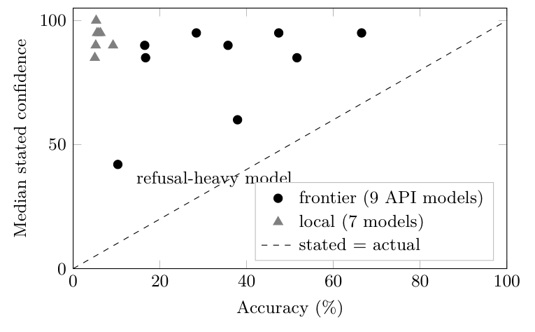

# Weakly Discriminative, Not Repaired by Profile Injection, and Manipulable: Self-Confidence in LLM Evaluation

**Vadym Chernets**, Independent Researcher · ORCID [0009-0007-4845-3163](https://orcid.org/0009-0007-4845-3163)

*Accepted as a poster at the NeurIPS 2026 workshop "TAE (Trust-AI-Eval): Can We Trust AI Evaluation?" (non-archival).* Archived copy: [10.5281/zenodo.23197651](https://doi.org/10.5281/zenodo.23197651). PDF: [self-confidence-evaluation.pdf](self-confidence-evaluation.pdf). Figures and tables below are converted from the LaTeX source; the PDF is authoritative.

## Abstract

Evaluation pipelines increasingly consume a model’s own stated confidence as a trust signal—as a judge-reliability weight, an abstention trigger, or a self-reported competence profile. We test whether that signal deserves the weight, using a pre-registered, protocol-frozen collection (16 models—one budget/mid-tier API model from each of nine providers, plus seven local open-weights; 22,248 graded answers at temperature zero with stated 0–100 confidence). Four findings. (1) Overconfidence is consistent across all sixteen evaluated models: typical stated confidence sits at 85–95 for seven of nine API models while accuracy spans 16.5–66.5%, and 60.1% of frontier answers stated with confidence $`\geq`$<!-- -->80 are wrong. (2) Self-confidence is weakly discriminative: its AUROC for predicting the model’s own correctness spans 0.532–0.788 and sits below 0.62 for six of nine models. (3) A panel of independent models reaches AUROC 0.832 where self-assessment gives 0.545 ($`\Delta`$ $`+0.287`$, 95% CI $`[+0.265, +0.309]`$); under a stricter label-free recoding of panel agreement the panel still leads (0.775 vs. 0.545). (4) Injecting the model’s own measured per-domain accuracy profile did not demonstrably improve discrimination on the one confirmatory rung of a placebo-controlled single-vendor ladder ($`\Delta`$AUROC $`+0.041`$, Holm-adjusted $`p = 0.085`$), while the same injection channel is causally manipulable: a false profile drove an exploratory rung’s self-assessment AUROC to chance level (0.474) and, once items are topic-labeled, degraded calibration in four of five local models. We conclude that self-assessed confidence, as currently elicited and measured here on verbalized integer confidence in open-form factual recall, is a target for measurement, not an input to trust: harnesses that ingest self-reported competence inherit an unauthenticated input channel. The three clauses of the title rest on different evidence and we label them as such throughout: *weakly discriminative* is confirmatory across sixteen models; *not repaired by profile injection* is one confirmatory rung on one vendor family, underpowered for the effect observed; *manipulable* is exploratory, with the causal direction shown on matched items but no tested attack on a deployed harness. Judge-style self-assessment, where a model rates another model’s answer, is a different task and is not tested here.

## Introduction

Modern evaluation practice quietly treats a model’s stated confidence as a measurement instrument: LLM judges report certainty scores, agent frameworks route on self-assessed competence, abstention policies trigger on verbalized uncertainty, and calibration benchmarks assume the self-report channel is at least honest. The assumption is convenient—self-reports are free, always available, and produced in the same pass as the answer—and it is almost never audited at the point of consumption. We ask the prior question: how discriminative is the self-assessment signal, can it be repaired with the model’s own measured profile, and can it be manipulated?

We answer with one pre-registered, protocol-frozen, blind collection: sixteen models (one budget/mid-tier API model from each of nine providers, plus seven local open-weights), 1,500 post-2023 factual questions each, temperature zero, every answer accompanied by a stated 0–100 confidence—22,248 graded answers, all analysis deterministic from raw. Against this measurement standard, the self-report channel fails three successively more charitable tests.

**C1 (weakly discriminative).** Stated confidence is saturated and decoupled from competence: per-model medians sit at 85–95 for seven of nine API models while accuracy spans 16.5–66.5%, and 60.1% of frontier answers stated with confidence $`\geq`$<!-- -->80 are wrong. As a predictor of the model’s own per-item correctness, self-confidence reaches AUROC only 0.532–0.788 depending on model—every bootstrap CI excludes chance, but six of nine models sit below 0.62, and selective prediction on even the best of them leaves substantial residual error (Section 4). A panel of independent models reaches 0.832 where self-assessment gives 0.545—an advantage that survives a stricter label-free recoding of panel agreement—while the apparent counterexample on the other panel largely reflects between-model identity rather than per-item self-knowledge (decomposition in Section 4); identifying the one model whose self-report discriminates well still requires the independent measurement the self-report was meant to replace.

**C2 (no confirmatory repair from profile injection).** The most direct repair—handing the model its own measured per-domain accuracy profile at answer time—did not significantly beat a placebo profile on the one confirmatory rung of a frozen, placebo-controlled ladder experiment ($`\Delta`$AUROC $`+0.041`$, raw $`p=0.064`$, Holm-adjusted $`0.085`$; no confirmatory endpoint passed). We report this as a null, not a trend (Section 5).

**C3 (manipulable).** The injection channel that a repair would use accepts forgeries: a shuffled (false) profile drove an exploratory frontier rung’s self-assessment AUROC to chance level (0.474 vs. 0.710; drop $`-0.237`$ $`[-0.421, -0.039]`$), a single fabricated “95% accuracy” claim moved a local model’s stated confidence from 50 to 95 on an item it gets wrong, and once items are topic-labeled, four of five local models consume a false profile to their own detriment (Brier $`+0.014`$ to $`+0.113`$; Section 6).

Together these results argue for a change of role: self-assessed confidence should be a measured target of evaluation, not an unaudited input to it. Section 7 spells out the consequences for judge pipelines, agent routing, and harness design; the companion paper (Chernets, 2026) examines the failure modes of the panel-based alternative and is cited, not restated, here.

## Related work

**Verbalized confidence and calibration.** Miscalibration of modern networks is a long-standing finding (Guo et al., 2017), and for QA-tuned language models calibration was found wanting well before the current model generation (Jiang et al., 2021). Models can be taught to express uncertainty in words (Lin et al., 2022b) and larger models partially “know what they know” on self-evaluation probes (Kadavath et al., 2022), yet they largely fail to recognize what they do not know (Yin et al., 2023); empirical audits of elicited confidence find persistent overconfidence across elicitation formats (Xiong et al., 2024), with verbalized scores sometimes better calibrated than token probabilities yet still inflated (Tian et al., 2023). Internal-state probing sharpens the frame: simple classifiers over hidden-layer activations recover truthfulness at 71–83% (Azaria and Mitchell, 2023)—the failure lives in the verbalized output channel, not necessarily in internal representations. Our contribution is scale and design: a pre-registered, frozen, 16-model blind collection scoring the same elicitation against ground truth and against independent-panel agreement on identical items—plus two questions this literature rarely asks: can the signal be repaired with the model’s own measured profile, and can the repair channel be attacked?

**Consuming self-reports downstream.** LLM-as-judge pipelines inherit judge biases and reliability limits (Zheng et al., 2023), and agreement-based confidence signals are themselves under audit (Ding, 2026); semantic-entropy detectors (Farquhar et al., 2024) sidestep self-reports by measuring answer distributions instead. Third-party evaluation frameworks make the governance case for independent measurement (Raji et al., 2022); we give it a quantitative floor: for six of the nine API models the self-report a pipeline would consume carries AUROC below 0.62.

**Untrusted inputs.** Indirect prompt injection shows that any text channel an LLM ingests is an attack surface (Greshake et al., 2023). Section 6 locates a specific, so-far-unnamed instance: the self-competence profile slot that calibration repairs would use is an unauthenticated input channel, and forging it degrades discrimination to chance level.

**Panels and their own failures.** Panels of diverse models are an increasingly standard evaluation instrument (Verga et al., 2024). The panel signal we use as comparator is not a free lunch: its failure regimes (difficulty inversion, constrained answer spaces, label-based independence assumptions, conformity) are measured in a companion submission (Chernets, 2026) on the same raw collection; this paper owns the self-assessment story, the companion owns the panel story, and no table is duplicated between them.

**Benchmarks.** We elicit on a post-2023 SimpleQA subset (Wei et al., 2024) precisely because of the benchmark-age gap we measure against 2021-vintage TruthfulQA (Lin et al., 2022a) (Section 3).

## Pre-registered experiment: design and data

One pre-registered, blind collection, protocol frozen publicly before confirmatory data: sixteen models (one budget/mid-tier API model per provider across nine providers, plus seven local open-weights) answered the same 1,500 post-2023 factual questions (SimpleQA subset) at temperature zero, each answer accompanied by a stated 0–100 confidence; 22,248 graded answers total (13,446 frontier, 8,802 local).

##### Pre-registration and freeze.

The collection protocol was frozen in a public registration before any confirmatory data existed (access route in the reproducibility appendix). The registration pre-specifies the benchmark and subsample (random $`n{=}1{,}500`$, fixed seed, SHA-256 of the subsample file recorded), the model roster, the elicitation format, the grading procedure, the analysis plan—including the AUROC comparison of panel agreement vs. own confidence used in Section 4, a pre-specified secondary metric (the registration’s primary endpoint, the confident-error flag rate of panel disagreement, is a panel-side quantity reported in the companion submission)—and a decision rule against post-hoc metric selection. A small exploratory pilot ($`\sim`$<!-- -->95 TruthfulQA items, three local models) ran before the freeze to validate the pipeline; its numbers are never mixed with confirmatory data.

##### Models and elicitation.

Nine frontier providers via their APIs—one budget/mid-tier model per provider, so provider names below label single models, not product lines (exact model IDs and collection dates in the reproducibility appendix)—and seven local open-weights models. Every model answers every item independently at temperature 0 and states an integer confidence 0–100 in the same response; panels are analytic combinations of this single blind collection—no model ever sees another model’s output.

##### Grading.

Normalized string equivalence to gold and refusal detection first; unresolved open-form cases go to a local open-weights LLM grader restricted to equivalence-to-gold only (qwen3:8b, local). A 50-item human spot-check found 98% agreement (one conservative error); a cross-family audit of the 342 hardest-stratum consensus verdicts agreed 342/342 (Limitations). No exclusions except parse failures (reported); they concentrate in one local reasoning model, which retains only 98 gradable answers of 1,500—all local-tier claims carry per-model $`n`$. All confirmatory analysis is deterministic from the raw JSONL.

##### Benchmark choice, measured.

The post-2023 primary benchmark is a design decision justified by measurement, not assumption: in an exploratory benchmark-age comparison, the same models scored $`+48`$ to $`+61`$ percentage points higher on 2021-vintage TruthfulQA MC than on post-2023 SimpleQA (deepseek $`+47.8`$ pp, 95% CI $`[+44.2, +51.3]`$; mistral $`+55.8`$ $`[+52.1, +59.5]`$; zhipu $`+60.8`$ $`[+57.7, +64.0]`$; e.g., 89.2% vs. 28.4%)—a gap consistent with benchmark-age and exposure effects, though this design cannot separate contamination from difficulty and construction differences. No headline number rests on the older benchmark; the 750-item TruthfulQA MC1 arm on the local tier is used only where labeled as such.

##### Pre-registered vs. exploratory.

Pre-registered and confirmatory: the collection above and the panel-vs-own AUROC comparison (Section 4). Exploratory, and labeled as such wherever used: the benchmark-age comparison arm, the frontier profile-injection rung and local microprobe of Section 6. The profile-injection ladder of Section 5 is a separate frozen, placebo-controlled protocol (arms, endpoints, and Holm family fixed before its confirmatory phase).

## Result 1: self-confidence is miscalibrated and weakly discriminative

We separate two properties that the term “calibration” often conflates: calibration-in-the-large (does the confidence level match the accuracy level?) and discrimination (does confidence rank a model’s own correct answers above its wrong ones?).

*Calibration.* Stated confidence is saturated and decoupled from competence: across the nine API models, stated confidence sits at 85–95 (median per model) for seven of nine while accuracy spans 16.5–66.5%; two depart—the refusal-heavy model (median 42 at 10.3% accuracy) and one dispersed-confidence model (median 60). Every model is overconfident in the large: the confidence-minus-accuracy gap (CITL, Table <a href="#tab:vendor" data-reference-type="ref" data-reference="tab:vendor">1</a>) ranges from $`+11.1`$ to $`+74.2`$ percentage points. The ECE column nearly equals $`|`$CITL$`|`$: the confidence–accuracy gap is positive in every occupied bin for seven of nine models (all but one for the other two), so binned and global miscalibration coincide. Even the refusal-heavy model retains $`+31.0`$ pp (ECE 0.310)—its low band reflects refusal behavior, not calibrated self-knowledge. Part of its discrimination advantage may likewise be mechanical—refusals graded incorrect at low stated confidence raise AUROC (excluding refusal rows it is 0.660, $`n=994`$)—so we read its 0.788 as an upper bound on elicited self-knowledge, not a calibration ranking. Pooled over the nine API models, 60.1% of answers stated with confidence $`\geq`$<!-- -->80 are wrong (5,598 of 9,310); the per-model rate spans 29.0–83.2% (macro-average 57.6%). A consumer that trusts high stated confidence accepts a majority of errors. *Discrimination.* As a predictor of the model’s own correctness, self-confidence achieves AUROC 0.532–0.788 depending on model. Bootstrap 95% CIs (Table <a href="#tab:vendor" data-reference-type="ref" data-reference="tab:vendor">1</a>) exclude 0.5 for every model, so the signal is not literally random—but for six of nine models it sits below 0.62. The consequence is operational: at 20% coverage (answering only the top-confidence fifth of items), the error rates of the three strongest self-AUROC models are still 75.3%, 33.3%, and 15.1% (Table <a href="#tab:riskcov" data-reference-type="ref" data-reference="tab:riskcov">2</a>)—a meaningful reduction only for the third, and far from a trust gate for the other two.

An architectural alternative—counting independent models that agree—reaches AUROC 0.832 (95% CI $`[0.817, 0.847]`$) on the panel where self-assessment yields 0.545 ($`[0.528, 0.562]`$); the item-clustered difference, $`\Delta = +0.287`$ $`[+0.265, +0.309]`$, excludes zero by a wide margin. The three pre-specified panels: US (Anthropic, OpenAI, Google), CN (DeepSeek, Alibaba, Moonshot), cross-bloc (Anthropic, DeepSeek, Mistral); the headline comparison is the CN panel. On the other pre-specified panel the pooled comparison appears to invert: self-assessment 0.842 pooled over the panel population vs. panel 0.697; $`\Delta = -0.145`$ $`[-0.170, -0.120]`$. A decomposition shows this apparent inversion largely reflects between-model identity rather than per-item self-knowledge: the pooled 0.842 mixes three models whose within-model self-AUROCs are only 0.596–0.784 (macro-average 0.709; panel-population values—Table <a href="#tab:vendor" data-reference-type="ref" data-reference="tab:vendor">1</a> reports the full graded set), and after within-model rank normalization (which removes between-model level differences while preserving each model’s own ranking) the pooled value falls to 0.672—a $`+0.169`$ between-model identity contribution. The 0.545 panel passes the same check (0.545 pooled vs. 0.582 rank-normalized): its self-assessment failure is genuinely per-item. What survives of the inversion is a narrower statement: the refusal-heavy model with the strongest self-confidence discrimination (0.788 on the full graded set) does outrank this panel’s agreement signal—and identifying which model that is requires exactly the independent measurement that self-reports were meant to replace. The third pre-specified panel (cross-bloc) falls between the two: panel 0.722 $`[0.698, 0.743]`$ vs. own 0.659 $`[0.643, 0.675]`$, $`\Delta = +0.063`$ $`[+0.036, +0.089]`$.

##### Sensitivity to label-free recoding of the panel signal.

The canonical equivalence coding behind the panel signal consults the primary model’s own correctness label (two answers both graded correct count as concurring), so panel agreement is partly a deterministic function of the target label—a label-mediated dependence, though not self-vote leakage: by construction a model’s own record never enters its own panel signal. A label-free recoding (string agreement only; correctness flags of neither primary nor panelist consulted) lowers the panel AUROC from 0.832 to 0.775 on the panel where self-assessment gives 0.545, and from 0.697 to 0.628 on the other; the headline panel advantage survives the stricter coding (0.775 vs. 0.545).

Table <a href="#tab:vendor" data-reference-type="ref" data-reference="tab:vendor">1</a> gives the per-model picture; Figure <a href="#fig:overconf" data-reference-type="ref" data-reference="fig:overconf">1</a> shows the same decoupling across all sixteen models: all models lie above the calibration diagonal, and the local tier collapses to a band of 85–100 stated confidence at $`\leq`$<!-- -->9.2% accuracy.

| Model | $`n`$ | Acc. (%) | Mean conf. | CITL (pp) | Brier | ECE | Self-AUROC | 95% CI |
|:---|---:|---:|---:|---:|---:|---:|---:|:--:|
| google | 1,461 | 66.5 | 92.8 | $`+26.3`$ | 0.271 | 0.263 | 0.746 | \[0.722, 0.770\] |
| moonshot | 1,500 | 51.6 | 75.8 | $`+24.2`$ | 0.292 | 0.242 | 0.619 | \[0.590, 0.648\] |
| alibaba | 1,497 | 47.4 | 92.3 | $`+44.8`$ | 0.446 | 0.448 | 0.532 | \[0.510, 0.556\] |
| xai | 1,500 | 37.9 | 48.9 | $`+11.1`$ | 0.197 | 0.111 | 0.777 | \[0.755, 0.798\] |
| deepseek | 1,500 | 35.7 | 89.2 | $`+53.4`$ | 0.513 | 0.535 | 0.570 | \[0.549, 0.592\] |
| zhipu | 1,493 | 28.4 | 92.6 | $`+64.2`$ | 0.612 | 0.642 | 0.611 | \[0.582, 0.639\] |
| openai | 1,500 | 16.7 | 77.6 | $`+60.9`$ | 0.531 | 0.610 | 0.598 | \[0.559, 0.636\] |
| mistral | 1,495 | 16.5 | 90.6 | $`+74.2`$ | 0.686 | 0.742 | 0.584 | \[0.550, 0.616\] |
| anthropic | 1,500 | 10.3 | 41.3 | $`+31.0`$ | 0.206 | 0.310 | 0.788 | \[0.758, 0.817\] |

Per-model calibration on the confirmatory SimpleQA collection (frontier tier, full graded set; provider names label the one budget/mid-tier model collected per provider). CITL: calibration-in-the-large, mean stated confidence minus accuracy, in percentage points. ECE: 10-bin expected calibration error. Self-AUROC: stated confidence as a predictor of the model’s own per-item correctness (tie-corrected Mann–Whitney), with bootstrap 95% CI (row-level resampling within model, 2,000 draws, fixed seed). All values are deterministic recomputations from raw graded JSONL; every CI excludes 0.5. CITL uses unrounded means; displayed values are rounded to one decimal. {#tab:vendor}

<table id="tab:riskcov">
<caption>Risk–coverage for the three models with the strongest self-confidence discrimination (full graded set): error rate among the covered fraction when items are answered in descending order of stated confidence. Most self-confidence rankings leave high residual risk even at low coverage; the exception is quantified in the text.</caption>
<thead>
<tr>
<th style="text-align: left;"></th>
<th colspan="5" style="text-align: center;">Error rate at coverage</th>
</tr>
</thead>
<tbody>
<tr>
<td style="text-align: left;">2-6 Model</td>
<td style="text-align: right;">100%</td>
<td style="text-align: right;">80%</td>
<td style="text-align: right;">60%</td>
<td style="text-align: right;">40%</td>
<td style="text-align: right;">20%</td>
</tr>
<tr>
<td style="text-align: left;">anthropic (self-AUROC 0.788)</td>
<td style="text-align: right;">89.7%</td>
<td style="text-align: right;">87.1%</td>
<td style="text-align: right;">82.9%</td>
<td style="text-align: right;">80.3%</td>
<td style="text-align: right;">75.3%</td>
</tr>
<tr>
<td style="text-align: left;">xai (0.777)</td>
<td style="text-align: right;">62.1%</td>
<td style="text-align: right;">52.8%</td>
<td style="text-align: right;">45.1%</td>
<td style="text-align: right;">39.5%</td>
<td style="text-align: right;">33.3%</td>
</tr>
<tr>
<td style="text-align: left;">google (0.746)</td>
<td style="text-align: right;">33.5%</td>
<td style="text-align: right;">24.5%</td>
<td style="text-align: right;">20.0%</td>
<td style="text-align: right;">18.7%</td>
<td style="text-align: right;">15.1%</td>
</tr>
</tbody>
</table>

*Consistent overconfidence across all sixteen evaluated models: per-model median stated confidence (means appear in Table 1) vs. actual accuracy for all 16 models on the same 1,500 blind SimpleQA items. All models lie above the calibration diagonal; the refusal-heavy model (median stated confidence 42 at 10.3% accuracy, CITL +31.0 pp) carries the best self-AUROC, 0.788, yet remains overconfident; the smallest calibration gap belongs to the dispersed-confidence model (+11.1 pp). Frontier medians per model: 95/85/95/60/90/95/85/90/42 in the row order of Table 1; the seven-model local tier spans accuracy 5.0–9.2% at median confidence 85–100 (graded n per local model 98–1,498 after parse-failure exclusion; the local tier serves the manipulation probes and this picture, not discrimination claims).*

## Result 2: no confirmatory improvement in discrimination from measured-profile injection

A natural repair is to hand the model its own measured competence profile—per-domain accuracy from held-out data—at answer time. In a placebo-controlled ladder experiment (arms: no profile, placebo profile matched for overall level, own measured profile, shuffled profile), the own-profile arm did not significantly beat placebo on the confirmatory endpoint: $`\Delta`$AUROC $`+0.041`$, 95% CI $`[-0.002, +0.086]`$, raw $`p = 0.064`$, Holm-adjusted $`p = 0.085`$; no confirmatory endpoint passed. We report this as a null with an explicitly narrow scope: on one confirmatory rung, discrimination was not corrected by measured-profile injection. The point estimate is positive, but under pre-registered correction the repair is not demonstrated; the design was powered only for moderate effects (SE $`\approx 0.022`$ from the CI: $`\sim`$<!-- -->80% power only for $`\Delta`$AUROC $`\geq 0.06`$, larger than the observed $`+0.041`$—so the data are compatible with both a true null and a small true effect). The design’s ceiling is not the limiting factor. Taking each item’s own bin accuracy—computed leave-one-out, so an item never contributes to its own predictor—as the sole predictor of that item’s correctness yields an oracle AUROC of 0.758 for the confirmatory subject (0.716–0.789 across the four ladder subjects), with per-bin accuracy spread SD 0.195 and range 0.15–1.00 over the 21 bins. Bins therefore differ enough for a truthful profile to carry substantial information: the null concerns the injection channel, not a battery too flat to register one.[^1] Exploratory patterns (larger gains where baseline calibration is weakest) are hypothesis-generating only.

##### Ladder design and placebo validation.

Four frozen rungs (subjects: Claude Haiku 4.5, Sonnet 5, Opus 4.8, and Fable 5; exact IDs claude-haiku-4-5-20251001, claude-sonnet-5, claude-opus-4-8, claude-fable-5), each with four blinded arms occupying the same calibration slot of an otherwise identical prompt: off (profile-shaped structural emptiness), placebo (calibration-irrelevant profile matched for overall level; validated per rung against the true profile at $`|\rho| < 0.10`$—measured $`\rho = 0.001`$, $`-0.0837`$, $`-0.039`$, $`+0.013`$), core (the model’s own measured per-domain profile), and shuffled (bin-permuted false profile; exploratory after a failed manipulation check demoted it from confirmatory status). The 315-item battery spans 21 domain bins with trap items and an explicit abstention token; item–arm assignments were frozen before the confirmatory phase, with per-item randomized arm order and no arm names in subject-visible text. A pre-registered degeneracy bound (off accuracy $`> 0.85`$) demoted three of four rungs from all confirmatory computation; Table <a href="#tab:ladder" data-reference-type="ref" data-reference="tab:ladder">3</a> reports the one eligible rung. The surviving rung’s off-arm accuracy is 0.847 against the 0.85 threshold, while the demoted rungs sit at 0.855, 0.888, and 0.900—with off-arm answered-only AUROCs of 0.575, 0.628, and 0.500 (descriptively, near-ceiling accuracy leaves little calibration signal to repair). All four subjects are drawn from a single vendor family; see Limitations.

| Arm | Acc. (all items) | AUROC | Brier | ECE | Paired $`\Delta`$AUROC (core$`-`$arm) |
|:---|---:|---:|---:|---:|:---|
| off (no profile) | 0.847 | 0.564 | 0.138 | 0.110 | $`+0.056`$ \[$`+0.002, +0.113`$\] |
| placebo | 0.857 | 0.578 | 0.127 | 0.090 | $`+0.041`$ \[$`-0.002, +0.086`$\] |
| core (own profile) | 0.857 | 0.625 | 0.127 | 0.099 | — |
| shuffled (false) | 0.842 | 0.589 | 0.140 | 0.113 | not computed (exploratory) |

Profile-injection ladder, confirmatory-eligible rung (subject: Claude Sonnet 5; $`n=588`$: 294 non-trap items $`\times`$ 2 pre-registered fresh-process replicates—the harness exposes neither temperature nor seed; AUROC answered-only). Confirmatory contrasts (item-clustered bootstrap): core$`>`$placebo $`\Delta`$AUROC $`+0.041`$, 95% CI $`[-0.002, +0.086]`$, raw $`p=.064`$; core$`>`$off $`+0.056`$, CI $`[+0.002, +0.113]`$, raw $`p=.042`$; both fail Holm correction ($`p_{\mathrm{adj}}=.085`$) and the two-way item$`\times`$batch gate (a pre-registered robustness requirement clustering by both item and collection batch). The paired-$`\Delta`$ column repeats the frozen analysis’ item-clustered paired contrasts against core; they are not the arithmetic difference of the per-arm AUROC column, and no confirmatory paired contrast was computed for shuffled (demoted to exploratory before the confirmatory phase). We note against our own hypothesis that core does not dominate on calibration: its ECE (0.099) is worse than placebo’s (0.090), which is one more reason to read the confirmatory null as a null. {#tab:ladder}

## Result 3: the self-image channel is manipulable

If an evaluation harness consumes a self-competence profile, that slot is an input channel, and inputs can be forged. We distinguish three claims of decreasing evidential strength and state which one each result supports. (i) *Causal manipulability*—demonstrated below: substituting a false profile causally changes stated confidence and degrades calibration in controlled runs. (ii) *Integrity vulnerability*—conditional: it matters only for harnesses that actually inject competence profiles from a source an adversary can influence. (iii) *Practical attack surface in deployed evaluation pipelines*—a hypothesis this paper motivates but does not test. Replacing the true profile with a shuffled (false) one drove an exploratory frontier rung’s self-assessment AUROC to chance level: 0.474 versus 0.710 with the true profile (ceiling-demoted exploratory rung; item-clustered bootstrap: 0.710 \[0.586, 0.820\] vs. 0.474 \[0.349, 0.599\], difference $`+0.237`$ \[$`+0.039`$, $`+0.421`$\]). For contrast, on the confirmatory-eligible rung shuffled sat between placebo and core (0.589 vs. 0.578 and 0.625; item-clustered paired contrast, exploratory: $`+0.029`$ $`[-0.014, +0.072]`$). That rung is weak manipulation evidence by construction: the false profile twice failed the pre-registered check (external judge 0.99/0.94 vs. a $`\leq 0.57`$ bound); the frozen rule demoted the arm before confirmatory data existed, a subject can discount a detectably implausible profile, and no consumed-check exists. Standalone finding: a frontier judge detects forgery from plausibility alone. On a zero-cost local stand, a single fabricated claim (“95% accuracy in this domain”) raised a model’s stated confidence on the same item from 50 to 95; the effect concentrates in models that have declarative calibration to lose; in this probe the largest shift ($`+45`$ points) occurred in the model with the most of it to forfeit (glm4:9b). Two boundary conditions bound the effect: the model must be able to associate the current item with a profile bin (on unlabeled items small local models ignore the profile; deltas $`\approx 0`$, consistent with the frozen null of Result 2), and ceiling-pinned models (confidence $`\approx 100`$ regardless) have nothing to attack.

The manipulation evidence—one exploratory frontier rung, a local microprobe, and a topic-labeled local pass—establishes causal manipulability, claim (i). Table <a href="#tab:microprobe" data-reference-type="ref" data-reference="tab:microprobe">4</a> shows the microprobe: the same item, the same model, and a one-line change in the injected self-profile move stated confidence by up to $`+45`$ points.

##### Exploratory topic-labeled pass: both sides of the boundary, live.

The first boundary condition above (the model must be able to associate the item with a profile bin) is itself testable: labeling each probe with its topic—a disclosed deviation from the frozen protocol—removes the association obstacle. In a full local pass (five models, 16 held-out probes per arm, temperature 0, fixed seed), the false profile that was inert on unlabeled items is consumed by four of five models once items are labeled: Brier degrades by $`+0.043`$ (glm4:9b), $`+0.113`$ (llama3.2:3b, with accuracy falling 37.5%$`\to`$<!-- -->25.0%), $`+0.057`$ (mistral:7b), and $`+0.014`$ (phi4-mini); per-probe bootstrap CIs at $`n=16`$ include zero for each model, so the microprobe establishes direction and mechanism rather than per-model effect sizes;

the fifth (qwen3:8b) answers the battery at ceiling (100% accuracy, confidence 100 in both arms, $`\Delta = 0`$), reproducing the “nothing to attack” boundary. The mechanism is directional and symmetric: a false *high* claim inflates confidence exactly in the weakest bin (llama3.2 physics: stated confidence 0$`\to`$<!-- -->100 in a bin with 25% held-out accuracy; phi4-mini logic 13$`\to`$<!-- -->65), and a false *low* claim deflates confidence on correct answers (llama3.2 history 100$`\to`$<!-- -->0 at 75% held-out accuracy), up to inducing abstention on items the model otherwise answers. Both sides of the boundary are thus shown by live runs: unlabeled items, profile inert (the frozen null); labeled items, the forged self-image propagates straight into stated confidence and degrades calibration end to end.

| Model       | Conf. @ “0%” | Conf. @ “95%” | $`\Delta`$ |
|:------------|-------------:|--------------:|-----------:|
| glm4:9b     |           50 |            95 |    $`+45`$ |
| llama3.2:3b |           80 |            95 |    $`+15`$ |
| mistral:7b  |           90 |           100 |    $`+10`$ |
| phi4-mini   |           90 |            95 |     $`+5`$ |
| qwen3:8b    |          100 |           100 |      $`0`$ |

Local microprobe (exploratory): stated confidence on the same (incorrectly answered) item when the injected profile slot claims “0% accuracy” vs. “95% accuracy” in the item’s domain; five local open-weights models, temperature 0. The ceiling-pinned model (bottom row) has no declarative calibration to attack. {#tab:microprobe}

## Implications for evaluation practice

Our results are measured on one task family (post-2023 open-form factual QA) with one elicitation format; the implications below extrapolate from those measurements.

**(1) Reverse the role of stated confidence.** Self-reported confidence should be a measured *target* of evaluation, not an *input* to it under current elicitation. Supporting numbers: 60.1% of high-confidence frontier answers are wrong, and the best self-AUROC (0.788) belongs to the model an accuracy leaderboard would rank last—neither ranking predicts whose self-reports discriminate.

**(2) Judge pipelines inherit weakly discriminative weights.** Any LLM-as-judge or ensemble scheme that weights votes by self-certainty imports, for six of nine models here, a signal with AUROC below 0.62—silently, because the saturated 85–95 band looks reassuring in logs. If certainty weighting is used at all, the weights should come from measured per-model calibration, not from the report itself.

**(3) Authenticate the profile slot.** The three-level threat model of Section 6 orders the concern: causal manipulability is demonstrated, integrity vulnerability is conditional on a harness actually injecting profiles from an influenceable source, and a practical attack surface in deployed pipelines remains a hypothesis. For harnesses in the conditional class, the repair channel is the exposure: the same injected profile that was supposed to fix calibration accepts forgeries that push discrimination to chance level (0.474) and degrade Brier scores end to end once items are associable. Such a harness needs an integrity gate—signed profiles, provenance checks, or at minimum separating who measures the profile from who supplies it at inference time. An unauthenticated self-image slot is an open prompt-injection port with a calibration payload.

**(4) External measurement is the alternative—with its own audit.** Independent-panel agreement dominates self-assessment where self-assessment fails worst ($`\Delta`$AUROC $`+0.287`$), but panels have their own measured failure regimes, examined in the companion paper (Chernets, 2026); adopting the panel signal without that audit would repeat the same mistake one level up. An extension pre-registered as exploratory adds a third angle: across 12 directed profile-swap pairs (3,780 calls), substituting another model’s *measured* profile shifted AUROC by at most $`0.04`$—and occasionally helped—while the similarity-rank prediction of transfer loss failed (Spearman $`\rho=-0.0839`$): measured profiles are portable instruments, not privileged self-access. A practical self-assessment diagnostic battery is described in the appendix.

## Limitations

Single benchmark family for the headline (post-2023 open-form factual QA); each provider is represented by one budget/mid-tier model, so provider-level generalization is not claimed; stated-confidence elicitation is one prompt format for the headline numbers—though an exploratory two-stage arm (150 items $`\times`$ five local models) suggests format is not the culprit: a stateless post-hoc confidence query lowered stated confidence and confident-error rates but not discrimination (self-AUROC 0.43–0.61 in both formats; pooled paired-bootstrap $`\Delta`$AUROC $`+0.05`$ $`[-0.05, +0.16]`$ on $`n=737`$ pairs, deterministic no-LLM labels on 142–150 rows per model—a labeled deviation from the string-only grader, under which $`>`$<!-- -->90% of cases are unresolvable); the injection null is one confirmatory rung of one ladder (315 items, 21 bins), all four subjects from a single vendor family, and it does not rule out better repair designs; the manipulation evidence combines one exploratory frontier rung, a local microprobe, and a topic-labeled local pass (a disclosed deviation)—not a confirmatory attack study; grading is partially LLM-based and its human validation is a 50-item spot-check (98% agreement, one conservative error). The grader’s vendor family also fields one CN-panel member, so grader independence is itself measured: a second grader from a family outside all panels and the grader’s own regraded all 342 hardest-quintile consensus verdicts and agreed 342/342. The grader is itself a local-tier subject; a cross-family regrade of all 1,441 self-graded rows agreed 98.3%, disagreement running toward self-leniency (24 down-flips vs. 1 up; accuracy 5.9$`\to`$<!-- -->4.4%)—strengthening the overconfidence picture; a fuller stratified re-audit remains future work. Panel-vs-self comparisons share data with the companion submission; no table is duplicated, the boundary is stated in Sections 1–2, and this paper’s scope stays self-assessment-only.

## Conclusion

Self-assessment, as currently elicited, fails three tests an evaluation signal must pass: it tracks correctness too weakly to gate decisions yet stays severely overconfident, the most direct self-knowledge intervention produced no demonstrable repair under placebo control, and its input channel accepts forgeries that push discrimination to chance level. Until models earn calibration on measured evidence, stated confidence is a phenomenon to study, not a signal to consume.

## References

Vadym Chernets. Verification theater: Measured failure modes of AI verifier panels. NeurIPS 2026 Workshop *Who Verifies the Agents?*, 2026. <https://doi.org/10.5281/zenodo.23197641> (cited for panel-side regimes only).

Kaihua Ding. When LLMs agree, are they right? Auditing self-consistency and cross-model agreement as confidence signals. *arXiv preprint arXiv:2607.08065*, 2026.

S. Farquhar, J. Kossen, L. Kuhn, and Y. Gal. Detecting hallucinations in large language models using semantic entropy. *Nature*, 630(8017):625–630, 2024.

K. Greshake, S. Abdelnabi, S. Mishra, C. Endres, T. Holz, and M. Fritz. Not what you’ve signed up for: Compromising real-world LLM-integrated applications with indirect prompt injection. In *Proceedings of the 16th ACM Workshop on Artificial Intelligence and Security (AISec)*, 2023. arXiv:2302.12173.

C. Guo, G. Pleiss, Y. Sun, and K. Q. Weinberger. On calibration of modern neural networks. In *ICML*, 2017. arXiv:1706.04599.

Z. Jiang, J. Araki, H. Ding, and G. Neubig. How can we know when language models know? On the calibration of language models for question answering. *Transactions of the Association for Computational Linguistics*, 9:962–977, 2021. arXiv:2012.00955.

S. Kadavath, T. Conerly, A. Askell, et al. Language models (mostly) know what they know. arXiv:2207.05221, 2022.

A. Azaria and T. Mitchell. The internal state of an LLM knows when it’s lying. In *Findings of EMNLP*, 2023. arXiv:2304.13734.

S. Lin, J. Hilton, and O. Evans. TruthfulQA: Measuring how models mimic human falsehoods. In *ACL*, 2022. arXiv:2109.07958.

S. Lin, J. Hilton, and O. Evans. Teaching models to express their uncertainty in words. *Transactions on Machine Learning Research*, 2022. arXiv:2205.14334.

I. D. Raji, P. Xu, C. Honigsberg, and D. Ho. Outsider oversight: Designing a third party audit ecosystem for AI governance. In *AIES*, pages 557–571, 2022.

K. Tian, E. Mitchell, A. Zhou, A. Sharma, R. Rafailov, H. Yao, C. Finn, and C. D. Manning. Just ask for calibration: Strategies for eliciting calibrated confidence scores from language models fine-tuned with human feedback. In *EMNLP*, 2023. arXiv:2305.14975.

P. Verga, S. Hofstätter, S. Althammer, Y. Su, A. Piktus, A. Arkhangorodsky, M. Xu, N. White, and P. Lewis. Replacing judges with juries: Evaluating LLM generations with a panel of diverse models. arXiv:2404.18796, 2024.

J. Wei et al. Measuring short-form factuality in large language models (SimpleQA). arXiv:2411.04368, 2024.

M. Xiong, Z. Hu, X. Lu, Y. Li, J. Fu, J. He, and B. Hooi. Can LLMs express their uncertainty? An empirical evaluation of confidence elicitation in LLMs. In *ICLR*, 2024. arXiv:2306.13063.

Z. Yin, Q. Sun, Q. Guo, J. Wu, X. Qiu, and X. Huang. Do large language models know what they don’t know? In *Findings of ACL*, 2023. arXiv:2305.18153.

L. Zheng, W.-L. Chiang, Y. Sheng, et al. Judging LLM-as-a-judge with MT-Bench and Chatbot Arena. In *NeurIPS Datasets and Benchmarks*, 2023. arXiv:2306.05685.

## Practical tool: a self-assessment diagnostic

A byproduct of this study is a compact self-assessment diagnostic: a fixed battery of short, deterministically gradable probes spanning the study’s domain bins (numerical, logic, physics, history, code, probability, and others), plus trap items with an explicit abstention token. Each answer carries a stated 0–100 confidence, and the tool scores a composite of Brier score, overconfidence gap (mean confidence minus accuracy), confidence discrimination (mean confidence on correct minus incorrect answers), and trap-abstention rate, mapping the result to tiers from *well-calibrated* to *confidently blind*. It operationalizes this paper’s thesis—calibration is something to measure about a model, not to read off its self-reports—and is released with the replication package as a tool, not as a result: it uses paraphrased probes rather than the frozen battery, and its discrimination score is a proxy, not the ladder’s AUROC endpoint.

## Reproducibility appendix

All headline numbers in this paper are deterministic functions of the released raw JSONL; no step involves randomness, network access, GPU computation, or re-querying any model.

##### Data availability.

The frozen pre-registration and the replication package (public OSF registration): <https://osf.io/4y9dv>. The oracle-ceiling script `oracle_auroc.py` is deposited with this paper at <https://doi.org/10.5281/zenodo.23197651>.

##### Elicitation prompt (verbatim).

System: `You answer short factual questions. Respond with ONLY a JSON object like {"answer": "<short answer>", "confidence": 85}. confidence is an integer 0-100 for how sure you are the answer is correct. No other text.` The user turn contains the bare question; refusals are detected from the answer field by the frozen refusal lexicon in the grading script.

##### Model identifiers and run dates.

One budget/mid-tier API model per provider, smoke-verified live on 2026-07-24 and collected in late July 2026 (per-call timestamps in the run manifest, released with the replication package): anthropic `claude-haiku-4-5-20251001`; openai `gpt-5-mini`; google `gemini-3.6-flash`; xai `grok-4-fast`; deepseek `deepseek-chat`; alibaba `qwen-plus`; moonshot `kimi-k3` (a disclosed collection deviation: 670 of 1,500 items on the first-party account, the remainder via an aggregator route served by the same first-party infrastructure with reasoning disabled, `served_by` recorded per call; a first-party-only sensitivity split was pre-committed); zhipu `glm-4.5`; mistral `mistral-small-latest`. Local tier (Ollama, temperature 0): `gemma4:e4b`, `llama3.2:3b`, `phi4-mini`, `qwen3:8b`, `deepseek-r1:8b`, `glm4:9b`, `mistral:7b`.

The companion paper (Chernets, 2026) shares the same frozen registration and raw collection. The replication package contains: the frozen registration text and protocol, the run manifest with exact model identifiers, the raw graded collections (frontier and local tiers, plus the exploratory benchmark-age comparison arm), and three dependency-free CPU scripts. The first (`compute_panel_vs_own_auroc.py`) is the canonical definition of the panel-agreement vs. own-confidence AUROC comparison (Section 4) and prints, alongside the canonical values, every non-canonical alternative reading (binary panel signal, indeterminate coding, tie handling, pooling variants) so the choice of reading is auditable. The second (`analysis_tae_week1.py`) re-prints Table <a href="#tab:vendor" data-reference-type="ref" data-reference="tab:vendor">1</a>, the Figure <a href="#fig:overconf" data-reference-type="ref" data-reference="fig:overconf">1</a> coordinates, the benchmark-age gaps of Section 3, and performs a read-only check of the frozen ladder values reported in Table <a href="#tab:ladder" data-reference-type="ref" data-reference="tab:ladder">3</a> against the ladder’s frozen analysis file. The third (`analysis_tae_decomposition.py`) re-prints the pooled-AUROC decomposition and rank-normalization of Section 4, the label-free recoding of the panel signal, the per-model high-confidence error rates, the CITL/Brier/ECE columns of Table <a href="#tab:vendor" data-reference-type="ref" data-reference="tab:vendor">1</a>, the risk–coverage values of Table <a href="#tab:riskcov" data-reference-type="ref" data-reference="tab:riskcov">2</a>, and the demoted-rung descriptives of Section 5. Each script runs in seconds on a laptop CPU with the Python standard library only. The profile-injection ladder ships as its own frozen bundle (protocol, battery, per-arm scored rows, and analysis JSON), pointed to from the package.

[^1]: Computed from the frozen per-item arm scores (`scored-arms-*.jsonl`; non-trap, status `ok`; $`n=2{,}336`$ for the confirmatory subject) by `oracle_auroc.py`, released with this paper; all arms and replicates of an item are left out together.
