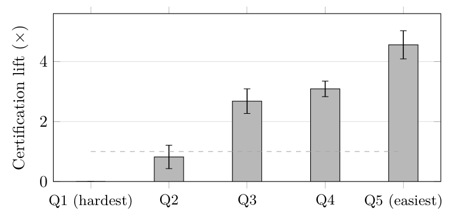
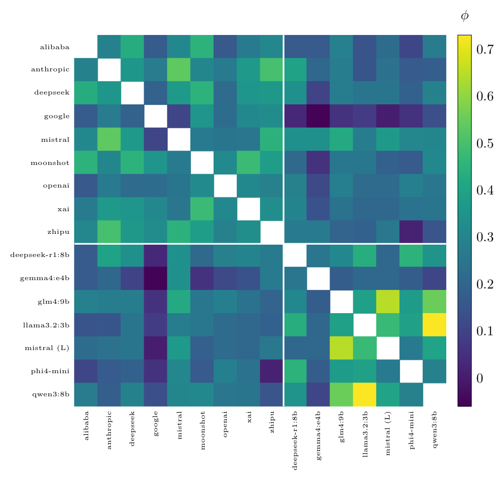

# Verification Theater: Measured Failure Modes of AI Verifier Panels

**Vadym Chernets**, Independent Researcher · ORCID [0009-0007-4845-3163](https://orcid.org/0009-0007-4845-3163)

*Accepted as a poster at the NeurIPS 2026 workshop "Who Verifies the Agents? Toward Reliable Agent Development" (non-archival).* Archived copy: [10.5281/zenodo.23197641](https://doi.org/10.5281/zenodo.23197641). PDF: [verification-theater.pdf](verification-theater.pdf). Figures and tables below are converted from the LaTeX source; the PDF is authoritative.

## Abstract

Multi-agent verification is becoming a default trust mechanism: an answer is trusted because independent models agreed on it. Using a pre-registered, blind, temperature-zero collection in which sixteen models (nine frontier vendors, seven local open-weights) answered the same 1,500 factual questions (plus a 750-question multiple-choice arm and an exploratory dialogue arm), we measure when panel verification stops working while continuing to look like it works—a condition we call *verification theater*. We report four failure regimes. First, a difficulty inversion: the certification lift of independent agreement—$`\times`$<!-- -->2.7–4.6 on the easier three quintiles of questions—falls to 0.82$`\times`$ on the second-hardest quintile and to zero on the hardest, where replicated answers were correct in 0 of 342 cases ($`\approx`$<!-- -->13 expected under independence). A leave-panel-out re-stratification (difficulty ranked by the 13 non-panel models) removes the pooled inversion (78/354 correct, lift 2.36$`\times`$) while the zero persists for the cross-bloc panel (0/116); we report both codings together throughout: on the questions the deployed population finds hardest, agreement functions as error certification. Second, constrained answer spaces: under multiple choice (local tier), panels unanimously certified a wrong answer on 4.0–7.9% of questions, versus 1.5–4.6% on the same tier’s open-form answers and 0.3–4.9% frontier open-form. Third, the labels used as proxies for independence fail empirically: geopolitical bloc does not predict error correlation (mean intra-bloc $`\phi`$ 0.285 vs. cross-bloc 0.274, difference $`+0.012`$), and a reasoning model distilled from the same base as its panel-mate was among the least correlated pairs measured ($`\phi = 0.135`$; 14th of the 15 US/CN-bloc local pairs, 20th of all 21 local pairs). Fourth, conformity: a verifier that had disagreed with an answer blind endorsed the same answer in 38.5% of cases when shown it as a colleague’s; a reverse-prompt control shows these flips track the presence of a confident proposal, not its truth (38.9% toward wrong vs. 34.7% toward correct; McNemar exact $`p = .012`$). We argue these regimes share an economic root and derive a measurement discipline that separates verification from its theater.

## Introduction: the theater problem

Panels of AI models checking each other are shipping as trust infrastructure, and agreement between them is increasingly priced as evidence. Security research has long had a name for mechanisms that produce the aesthetics of protection without its substance (Schneier, 2003); we ask, with measurements rather than metaphor, when panel verification earns that name. The core finding is an inversion: the certification value of agreement is concentrated on easy questions and vanishes—or reverses—exactly where verification matters most. We treat this not as a single anomaly but as one of four distinct regimes in which a verifier panel keeps the appearance of checking while losing its substance, and we tie the four to a common economic cause and a common remedy.

Concretely, this paper contributes: **(C1)** a difficulty-stratified measurement of certification lift showing that the certification value of independent agreement concentrates on easy questions and, under the population difficulty measure, inverts on the hardest quintile (0 of 342 replicated answers correct; under panel-independent difficulty the pooled inversion disappears and the zero persists for the cross-bloc panel, 0/116)—the two codings are reported together throughout; **(C2)** evidence that constrained (multiple-choice) answer spaces push unanimous certified error to 4.0–7.9%, well above the open-form bracket of 0.3–4.9%; **(C3)** two pre-registered null results showing that the labels routinely used as independence proxies—geopolitical bloc and model lineage—do not predict error correlation, so independence must be measured per-pair as a $`\phi`$-matrix rather than assumed from brand or family tree; and **(C4)** a conformity measurement with a reverse-prompt control demonstrating that dialogue-mode verifiers track the presence of a confident proposal rather than its truth. The blind collection protocol and the trust construct are stated in full in the companion paper and are summarized here only as far as the measurements require; everything reported as a result in this paper (C1–C4) is measured here and is not restated from it. From these we derive **(C5)** a measurement discipline—published per-task-class $`\phi`$-matrices, difficulty-stratified certification claims, blind-first elicitation, and hard-regime escalation—that operationally separates verification from its theater.

## Prior art and framing

Fault-tolerant consensus (BFT) assumes independent failures—the assumption we test and find unearned. The consensus-paradox literature already names agreement-stabilized error in homogeneous swarms (Shehata and Li, 2026). zkML verifies that a computation ran, not that its answer is true—complementary, not competing. The Verifier’s Dilemma supplies the incentive analysis; (Raji et al., 2022) supply the auditor-selection problem; (Du et al., 2024), (Farquhar et al., 2024), and (Ding, 2026) supply the agreement-signal literature this paper stress-tests. The trust construct itself was introduced in a companion paper (Chernets, 2026); this paper maps where the construct’s verification engine fails while appearing to run. Test-time-compute work reaches the complementary conclusion from the constructive side: ensembles of diverse aspect verifiers outperform any single verifier (Lifshitz et al., 2025), a panel of small judges drawn from disjoint families outperforms a single large judge at a fraction of the cost (Verga et al., 2024), and a systematic re-evaluation of multi-agent debate identifies model heterogeneity as the one reliable improver (Zhang et al., 2025); the debate line shows structured adversarial argument helping weaker judges reach truer answers (Khan et al., 2024). Peer-reviewed evidence already documents substantial cross-provider error correlation—largest precisely among the most accurate models, even across distinct architectures and providers (Kim et al., 2025)—which independently motivates measuring dependence rather than inferring it from labels. That literature selects panels for diversity; this paper measures what the selected-for property is worth—and what its absence silently costs—in verification.

## Data and measurement

One pre-registered, blind collection (protocol frozen publicly before confirmatory data collection; public registration at <https://osf.io/4y9dv>): sixteen models $`\times`$ a pre-registered random subsample of 1,500 of SimpleQA’s 4,326 items (fixed seed, drawn before any collection; subsample CSV with its SHA-256 attached to the frozen registration) at temperature zero with stated 0–100 confidence (13,446 clean frontier answers; 8,802 local-tier answers); a 750-item TruthfulQA MC1 arm on the local tier, derived from a frozen copy of the official repository file (790 items, byte-identical to the canonical CSV) by a pre-registered constructor requiring at least two distinct incorrect options per item (fixed shuffle seed; 695 items fully answered by all seven models); an exploratory active-vs-blind dialogue arm. SimpleQA is adversarially collected against a frontier model, with a single indisputable answer per question (Wei et al., 2024): the hard stratum therefore probes genuine parametric-knowledge boundaries, and grading reduces to equivalence-to-gold. TruthfulQA supplies the constrained-answer-space arm (Lin et al., 2022). Panels are analytic combinations of the single blind collection; all re-analysis is deterministic (string-equivalence coding with refusals and zero-overlap counted as non-agreement; indeterminate pairs reported as brackets). Difficulty is operationalized observationally as mean 16-model accuracy per question, split into rank quintiles of 300 questions. The same raw collection grounds the companion paper (Chernets, 2026), which reports the pooled certification ratios and brief summaries of the analyses detailed here; the difficulty-stratified lift ladder, robustness suite, $`\phi`$-matrix, and conformity decompositions appear only in this paper, and every remaining overlap is cross-flagged in the text.

Open-form grading is two-stage: a deterministic string-equivalence pass (26.8% of frontier grades) plus refusal detection (6.6%), with the remaining 66.5% graded by an LLM grader; a human spot-check agreed with the grader on 98% of a random sample ($`n=50`$). Because two-thirds of grades are model-produced, all headline results are accompanied by a grader-error sensitivity resampling (10% of model-graded verdicts flipped, 200 seeded resamples; Section 4 and Appendix A).

## Failure regime I: the difficulty inversion

The three pre-specified frontier panels are analytic 3-model combinations of the single blind collection: US-bloc (Anthropic, OpenAI, Google), CN-bloc (DeepSeek, Alibaba, Moonshot), and cross-bloc (Anthropic, DeepSeek, Mistral); an answer counts as *replicated* when at least one of the primary’s two panel-mates independently produced an equivalent answer under the frozen deterministic coding of Section 3, and lift is $`P(\text{correct}\mid\text{replicated}) /
P(\text{correct}\mid\text{not replicated})`$. Pooled across the three panels, the probability that a replicated answer is correct rises from 0.0% (0/342, CI 0.0–1.1) on the hardest quintile through 12.8%, 57.5%, and 81.0% to 95.1% on the easiest; the corresponding lift over non-replicated answers runs 0.00$`\times`$ / 0.82$`\times`$ / 2.68$`\times`$ / 3.09$`\times`$ / 4.56$`\times`$. On the hardest 20% of questions every observed agreement certified a wrong answer, and on the next quintile the point estimate puts agreement *below* parity with disagreement (0.82$`\times`$, CI \[0.51, 1.21\]); the hardest-quintile zero replicates in each panel separately (US 0.00–4.25$`\times`$, CN 0.00–9.76$`\times`$, cross-bloc 0.00–4.04$`\times`$); the Q2 sub-parity holds in the CN and cross-bloc panels, while the US panel’s Q2 lift is 1.20$`\times`$. Much of the pooled certification lift is carried by easy questions, so an unstratified lift claim overstates what verification delivers where it is needed. The Q1 zero is measured against a live base rate, not a floor: non-replicated Q1 answers are correct 3.9% of the time (89/2286), so independence predicts $`342 \times 0.039 \approx 13`$ correct replicated answers—the observed 0 (upper bound 1.1%) sits significantly *below* the stratum’s own base rate. The independence benchmark is conservative here, not liberal: a null preserving the full measured inter-model correlation structure—one common permutation of correctness labels across the stratum’s questions, replication structure frozen (2,000 permutations)—expects 11.7–12.4 correct replicated answers and never produced the observed 0 ($`p < .0005`$; minimum 3); folding the measured pairwise $`\phi`$ into an analytic bivariate null raises the expectation further, because positively correlated errors imply positively correlated correct answers. What populates the stratum is itself informative: the 342 cells span 106 questions—ordinary narrow factoids (median 17 words), not ambiguous phrasing, and models rarely abstain on them ($`\approx`$<!-- -->0.5 of 9 answers per question). Their wrong answers cluster: on 70.8% of these questions at least three of the nine frontier models produced the *same* wrong answer, and on 67.4% of the questions replicated by more than one panel, the independently composed panels certified the *identical* wrong consensus—typically a famous-neighbor answer displacing the correct but less prominent entity. A manual subject-matter adjudication of all 106 gold labels found 2 disputable and 0 outright wrong; crediting the one clearly-defensible panel answer and two partially defensible ones moves the hardest-quintile count from 0/342 to at most $`\approx`$<!-- -->13/342 (3.8%), so the near-zero conclusion holds while softening from a literal zero (one flagged label: a 2010 Royal Academy *election* scored against an honours title the academy does not confer). The claim is directly testable: it predicts Q1 lift $`\leq 1`$ in any replication stratified by the deployed population’s own accuracy (under panel-independent stratification the prediction is the cross-bloc zero, not the pooled lift). Nor is the zero a grader artifact: an independent second grader from a vendor family outside every panel and the original grader (temperature zero, the identical frozen equivalence-to-gold prompt) regraded all 342 Q1 replicated verdicts and agreed on 342/342 (flips to correct 0/342, upper bound 1.1%); synthetic flipping of 10% of model-graded labels likewise leaves the certified-error share at or above 86.5% in every resample (appendix).

##### Leave-panel-out re-stratification.

Because panel members contribute to the population difficulty index, the hardest quintile is partly conditioned on the panel’s own failure. Re-stratifying by the 13 non-panel models only, replicated answers on the hardest quintile are correct in 78/354 cases (22.0%, pooled lift 2.36$`\times`$, above the $`\approx`$<!-- -->33/354 expected under independence), and the zero persists only for the cross-bloc panel (0/116; 0/88 on the stratum where all 13 non-panel models fail). The surviving zero is itself characterized: the stratum’s base rate is 31/778 = 3.98% (Wilson 2.8–5.6%), giving an independence expectation of 4.6 correct among the 116; a correlation-preserving permutation null (2,000 permutations) yields $`E = 4.5`$, 95% range $`[1, 8]`$, and $`P(\text{count} \leq 0) = .0065`$ —significantly below the null, though not unreachable under it. The inversion above is therefore a claim about where verification fails relative to what the deployed population finds hard, not relative to panel-independent difficulty. As a second sensitivity check, we re-derived the ladder under a fully label-free replication coding (deterministic string comparison of blind answers only, never consulting the correctness label): the Q1 result is essentially unchanged (2/344 replicated answers correct, 0.6% \[0.2–2.1\]; lift 0.15$`\times`$) and the below-1 lifts on the two hardest quintiles persist, while the top-quintile lift attenuates (4.56$`\times`$ to 2.33$`\times`$) because pure string matching misses surface variants of the same correct answer; multiple-choice results are unaffected, as agreement there is coded by answer letter and is label-free by construction.

Three robustness checks support the inversion. (i) Question-level bootstrap (2,000 seeded resamples within quintile) gives 95% CIs for the five lifts of \[0.00, 0.00\], \[0.51, 1.21\], \[2.32, 3.09\], \[2.84, 3.35\], and \[4.16, 5.03\]: the hard-regime intervals exclude the easy-regime ones entirely. (ii) Grader-error sensitivity: flipping 10% of the model-graded verdicts (200 seeded resamples; 97.1% of the 342 hardest-quintile replicated answers are model-graded and thus flippable) leaves the certified-error share of the hardest quintile at or above 86.5% in every resample, keeps the Q1 lift below 1 in 92% of resamples (median 0.82), and never brings the Q1–Q2 lifts near the Q3–Q5 lifts, which stay above 2 in all 200 resamples. (iii) The seven-model local tier replicates the hard–easy contrast with independent models and panels, non-monotonically (Q3 $`= 0.00\times`$): lifts 0.00$`\times`$ / 0.94$`\times`$ / 0.00$`\times`$ / 1.89$`\times`$ / 4.37$`\times`$ across the same quintiles, with 0 of 166 replicated answers correct on the hardest quintile; this tier is 94.8% LLM-graded and is covered by the same grader-sensitivity resampling as (ii).

*Certification lift by difficulty quintile, pooled over three frontier panels, with question-level bootstrap 95% intervals (2,000 seeded resamples; Appendix A.1). The dashed line marks lift  = 1, parity with non-replicated answers: the two hardest quintiles sit at or below it by point estimate (Q1 0.00×—a measured zero, not missing data; Q2 0.82×, its CI crossing parity), the three easiest well above it.*

## Failure regime II: constrained answer spaces

On multiple choice, four pre-specified local-tier panels unanimously converged on a wrong option on 4.0–7.9% of the 695 fully-answered questions (per-panel: 4.0, 5.9, 6.6, 7.9), versus a deterministic bracket of 0.3–4.9% for confident unanimous wrong answers open-form on the frontier tier. Recomputing the same certification metric on the local tier’s own open-form answers (8,802 graded SimpleQA responses) removes the tier–format confound: the same local panels certify unanimous confident errors on only 1.5–4.6% of open-form items under strict deterministic coding (up to 9.8% including the indeterminate bracket), consistent with the frontier open-form range—a pattern consistent with the constrained answer space, rather than model tier, driving error certification; one confound remains, however: the multiple-choice arm and the open-form arms are different question sets (TruthfulQA MC1 against SimpleQA), so format and question set are not separated here, and the causal form of the claim is settled only by a same-question format swap, which we did not run.[^1] Per-panel bootstrap puts intervals on the gap where it is powered: MC minus open-form certified-consensus-error is $`+4.8`$ pp \[2.9, 6.8\] (pilot), $`+5.9`$ pp \[3.9, 8.1\] (US-local), and $`+4.4`$ pp \[2.6, 6.3\] (cross-bloc), each excluding zero; the CN-local panel, whose open-form cell rests on the footnote’s 87-item set, does not resolve it. A menu converts scattered errors into shared ones: when the answer space is small, lookalike models land on the same distractor and the panel’s unanimity becomes an error-amplifier. The rates are not explainable by independent errors: with each member independently wrong at its marginal rate and errors spread over the $`k{-}1`$ wrong options ($`P_q = w_1 w_2 w_3 / (k_q{-}1)^2`$), the expected unanimous-same-wrong-option rate is 0.49–0.92% across the four panels—the observed 4.0–7.9% is a 4.9–13.5$`\times`$ excess over the independence baseline. Design consequence, stated as a testable rule: any interface that hands agents a fixed option set should expect materially higher certified-consensus-error than open-form elicitation on the same content.

Requiring stated confidence $`\geq 75`$ from all three panelists barely dents the effect: the certified-consensus-error range moves from 4.0–7.9% to 4.0–7.2% (per-panel 4.0, 5.2, 6.0, 7.2), i.e. almost all unanimous wrong answers are also confident ones. The failure is also not confined to a topical niche: across the ten TruthfulQA categories with at least 20 items, pooled certified-consensus-error spans 1.0% (Conspiracies) to 8.6% (Economics), with Law, Health, and Sociology in between (Appendix A).

## Failure regime III: independence labels do not predict independence

Across 36 frontier vendor pairs (1,448 shared questions), pairwise error correlation spans $`\phi`$ 0.123–0.395, and the span is not organized by the labels people reach for: the most and least correlated pairs are both intra-bloc (google$`\times`$xai 0.395 vs. google$`\times`$openai 0.123), mean intra- vs. cross-bloc $`\phi`$ differ by $`+0.012`$, and the same-base lineage pair ranks 14th of the 15 pairs formed by the six US/CN-bloc local models on the 695 fully-answered multiple-choice items ($`\phi = 0.135`$; the seventh local model is EU-bloc and outside the pre-registered bloc/lineage design—including it yields 21 pairs, of which the lineage pair ranks 20th). Both pre-registered nulls (bloc, lineage) survive re-analysis; what remains predictive is measured correlation itself. The practical rule: independence is a per-pair, per-task-class quantity to be measured (a $`\phi`$-matrix), not inferred from brand, flag, or family tree—assembling a panel by labels is casting, not verification. Pairwise $`\phi`$ measures empirical error dependence, not full statistical independence: low $`\phi`$ does not exclude higher-order dependence in panels of three or more, a further reason to treat independence as a measured, task-conditioned quantity rather than an assumed property.

An exact permutation test over all 630 assignments of the bloc labels to the nine vendors finds no evidence of a bloc effect: the observed intra-minus-cross difference of $`+0.012`$ is exceeded or matched by 132 of 630 relabelings (one-sided $`p = .210`$; clustered-bootstrap 95% CI for the difference $`[-0.004, +0.028]`$). The test bounds the claim—small bloc effects are not excluded—and the operational conclusion stands: the label carries no signal usable in place of per-pair measurement. Because $`\phi`$ is bounded above when the pair’s base error rates differ, we re-ran the analysis on the marginal-normalized ratio $`\phi/\phi_{\max}`$: both pre-registered nulls survive (bloc difference $`+0.011`$, permutation $`p = .41`$; the lineage pair stays 14th of 15), the spread persists (0.278–0.821 across frontier pairs), and the extremes relocate to two *cross*-bloc pairs (anthropic$`\times`$moonshot 0.821, mistral$`\times`$openai 0.278)—under either metric, no label organizes the spread. Extending the matrix to all sixteen models: on the 81 questions answered by every model, pairwise $`\phi`$ spans $`-0.054`$ to $`0.728`$ (120 pairs; block means: frontier–frontier 0.320, local–local 0.350, frontier–local 0.210)—an order-of-magnitude spread that no label taxonomy in our data predicts (Figure <a href="#fig:phi-matrix" data-reference-type="ref" data-reference="fig:phi-matrix">2</a>). With 81 common items, individual cell estimates carry wide intervals; the result is the spread itself, not any single cell.

*Pairwise error-correlation (ϕ) among all sixteen models on the 81 questions answered by every model (nine frontier vendors, then seven local open-weights; the frontier/local partition is marked by the white rules). Each off-diagonal cell is one of the 120 unique pairs; the diagonal (self-correlation  = 1.0) is left blank by design so it does not compress the colour scale. ϕ spans −0.05 to 0.73 (mean 0.27): an order-of-magnitude spread in how correlated any two verifiers’ errors are, which no bloc or lineage label in our data predicts. Values are emitted deterministically by emit_phi_matrix.py (reusing analysis_week1.py sec. W5); none are hand-entered.*

## Failure regime IV: verification that surrenders (exploratory)

When a verifier that had disagreed blind was shown the same answer as a colleague’s proposal, it capitulated in 38.5% of cases (168/436); when it had produced the *correct* answer blind, it abandoned it for the wrong one in 30.9% (46/149), with per-vendor abandonment rates from 13.1% to 51.6% (per-vendor capitulation on the full disagreed-blind subset spans 20.4–58.1%).

Could these flips be rational belief updating rather than conformity? A reverse-prompt control argues against it. On a six-model local panel we re-ran the paired procedure with the exposure direction flipped: a verifier that had disagreed blind was shown, for the same question set, either the confident wrong answer (direct arm) or the gold answer (reverse arm). The two arms are prompt-identical—one shared template (“Proposed answer: …”), the shown answer differing only in content, with no confidence value or source attribution displayed—so the contrast isolates the shown answer’s truth value. If verifiers were updating on evidence, exposure to the correct answer should move them more; instead the two arms produced nearly the same flip rate—38.9% toward the wrong answer, 34.7% toward the correct one—and the within-pair comparison runs the wrong way for the updating story: of 174 discordant pairs, the verifier deserted its blind position for the wrong answer in 104 and for the correct one in 70 (McNemar exact $`p = .012`$). At the model level the two arms were indistinguishable (flip propensity 89.9% vs. 89.9% for the most compliant verifier, 1.5% vs. 1.5% for the least): what triggers agreement is that a confident proposal is present, not that it is true—the panel-verification face of preference-trained sycophancy (Sharma et al., 2024). Nor does the asymmetry depend on the most compliant verifier: excluding it leaves 835 paired items with discordant counts 94 vs. 60 (exact $`p = .0076`$). Two further decompositions reinforce this reading (Appendix A): every recorded flip in either arm came with stated post-exposure confidence $`\geq 75`$ (0 flips below that threshold, $`n = 547`$), and in the direct arm verifiers that had been *correct* blind abandoned the correct answer in 40.8% of cases (20/49), mirroring the frontier finding. The control ran on the local tier (Limitations). A prose summary of this control also appears in the companion paper (Chernets, 2026); the per-model decomposition, confidence-gate split, and correct-blind abandonment analysis are reported only here.

This bounds a design claim: when the goal is to measure independent disagreement, elicitation must be blind-first—a panel that deliberates before committing positions does not measure its disagreement, it erases it.

## Discussion: the economics of theater (conjecture, not evidence)

This section is discussion rather than evidence: it reports no new measurement, and nothing in it should be read as co-equal with the four measured regimes above. With that stated, the four regimes may persist because no party is paid to notice them: consumers cannot price verification quality, platforms are paid for confidence rather than doubt, and each verifier’s cheapest strategy is to agree. Add the auditor-selection problem (independence is a property of whoever picks the checkers) and the link-farm precedent (any agreement signal that carries commercial weight invites farming), and theater is an equilibrium, not an accident—a conjecture the measurements motivate but do not test. The incentive account complements, rather than excludes, engineering inertia and the absence of measurement standards; it is singled out because it is the falsifiable component. This section makes falsifiable market predictions rather than normative claims—e.g., unaudited panels should converge toward minimal-diversity compositions over time because correlated panels are cheaper and agree more.

## From theater to measurement

The remedy is a discipline, not a component: (1) publish the panel’s measured $`\phi`$-matrix per task class, not its brand list (one blind collection per task class suffices—this paper’s 16-model matrix came from a single 1,500-item pass); (2) stratify every certification claim by difficulty and report the hard-regime lift separately (difficulty is operationalized per task class from a calibration collection, not per item at inference); (3) elicit blind-first, always—the commit-reveal scheme of panel verification, which reorders elicitation rather than adding compute, since blind answers are parallelizable; (4) treat the hardest regime as an escalation trigger—on questions where the panel’s measured lift is $`\leq 1`$, agreement must route to a human or to abstention, never to certification. Each rule is stated so that a deployed system can be audited against it.

As a worked example, apply the recipe to this paper’s own frontier panel. Rule (1): its independence is reported as the measured $`\phi`$-matrix of Section 6 (span 0.123–0.395), not as a vendor roster—which would have concealed that the most correlated pair is intra-bloc (google$`\times`$xai). Rule (2): its certification lift is reported stratified (Table 1), with the hard-regime lift ($`0.00\times`$ on Q1, $`0.82\times`$ on Q2) stated separately rather than folded into a single pooled headline. Rule (3): every answer here was elicited blind before any panel was assembled, which is precisely what makes the conformity arm (Section 7) measurable rather than confounded. Rule (4): because the panel’s measured lift is $`\leq 1`$ on the two hardest quintiles, an audited deployment of this same panel would route those questions to abstention or human review, never to consensus certification. The discipline is therefore not hypothetical: it is the protocol under which the paper’s own numbers were produced.

## Limitations

Single benchmark family per tier (SimpleQA open-form frontier; TruthfulQA MC local), so regime boundaries are benchmark-relative; each frontier vendor is represented by one budget/mid-tier model, so vendor-capability claims are not made. Difficulty stratification is observational (post-hoc over a pre-registered collection) and quintile assignment shares data with the models evaluated. The conformity arm is exploratory and modest in $`n`$; its reverse-prompt control used local models, so transfer to frontier panels is by analogy, not measurement. Roughly two-thirds of open-form grades come from an LLM grader (human spot-check 98% agreement; a cross-family regrade of all 342 hardest-quintile replicated verdicts agreed 342/342; sensitivity resampling in the appendix). Both benchmarks are public, so training-set leakage cannot be ruled out; on SimpleQA its direction favors memorized-*correct* answers, which shrinks the hard stratum and makes the hard-regime results conservative; on TruthfulQA the public corpus carries the misconceptions themselves, so the direction there is not clear-cut— an alternative reading already bounded by the format-content caveat of Section 5. No causal claim is made about *why* agreement fails on hard questions—the mechanism candidates (shared priors, shared blind spots, shared training data) are named but not separated.

## Conclusion

Agreement is evidence only after independence and competence are measured, and the measurement is cheap—the entire re-analysis here runs in seconds on commodity hardware from public raw files. Until panels ship with their $`\phi`$-matrices and stratified lifts, “verified by consensus” should be read the way security engineers learned to read a bag search.

## References

B. Schneier. *Beyond Fear: Thinking Sensibly About Security in an Uncertain World*. Copernicus Books, 2003.

D. Shehata and M. Li. The inverse-wisdom law: Architectural tribalism and the consensus paradox in agentic swarms. arXiv:2604.27274, 2026.

I. D. Raji, P. Xu, C. Honigsberg, and D. Ho. Outsider oversight: Designing a third party audit ecosystem for AI governance. In *AIES*, pages 557–571, 2022.

Y. Du, S. Li, A. Torralba, J. B. Tenenbaum, and I. Mordatch. Improving factuality and reasoning in language models through multiagent debate. In *ICML*, 2024. arXiv:2305.14325.

S. Farquhar, J. Kossen, L. Kuhn, and Y. Gal. Detecting hallucinations in large language models using semantic entropy. *Nature*, 630(8017):625–630, 2024.

Kaihua Ding. When LLMs agree, are they right? Auditing self-consistency and cross-model agreement as confidence signals. *arXiv preprint arXiv:2607.08065*, 2026.

E. Kim, A. Garg, K. Peng, and N. Garg. Correlated errors in large language models. In *ICML*, 2025. arXiv:2506.07962.

M. Sharma, M. Tong, T. Korbak, D. Duvenaud, et al. Towards understanding sycophancy in language models. In *ICLR*, 2024. arXiv:2310.13548.

A. Khan, J. Hughes, D. Valentine, L. Ruis, et al. Debating with more persuasive LLMs leads to more truthful answers. In *ICML*, 2024. arXiv:2402.06782.

J. Wei, K. Nguyen, H. W. Chung, Y. J. Jiao, S. Papay, A. Glaese, J. Schulman, and W. Fedus. Measuring short-form factuality in large language models. arXiv:2411.04368, 2024.

S. Lin, J. Hilton, and O. Evans. TruthfulQA: Measuring how models mimic human falsehoods. In *ACL*, 2022. arXiv:2109.07958.

S. Lifshitz, S. A. McIlraith, and Y. Du. Multi-agent verification: Scaling test-time compute with multiple verifiers. arXiv:2502.20379, 2025.

P. Verga, S. Hofstätter, S. Althammer, Y. Su, A. Piktus, A. Arkhangorodsky, M. Xu, N. White, and P. Lewis. Replacing judges with juries: Evaluating LLM generations with a panel of diverse models. arXiv:2404.18796, 2024.

H. Zhang, Z. Cui, J. Chen, et al. Stop overvaluing multi-agent debate—we must rethink evaluation and embrace model heterogeneity. arXiv:2502.08788, 2025.

Vadym Chernets. Architectural trust: Verifiable decision architecture for agentic commerce. SSRN working paper 7191261, 2026. <https://doi.org/10.2139/ssrn.7191261> (cited for the trust construct and for its summary treatment of the shared blind collection; overlapping analyses are cross-flagged where they occur).

## Reproducibility appendix

All re-analysis is deterministic given the raw graded JSONL files and two fixed-seed scripts (a baseline script reproducing every headline number and a week-1 add-on producing the bootstrap, sensitivity, and decomposition tables below); the full recompute takes under 15 seconds on commodity hardware with no GPU, network, or model calls. The frozen pre-registration and replication package (public OSF registration): <https://osf.io/4y9dv>.

### Bootstrap confidence intervals for the lift ladder

Question-level resampling within quintile, 2,000 seeded draws, pooled over the three frontier panels.

| Quintile | $`P(\mathrm{corr}\mid\mathrm{rep})`$ | Wilson 95% | Boot 95% | Lift | Lift boot 95% |
|:---|:--:|:--:|:--:|:--:|:--:|
| Q1 (hardest) | 0/342 = 0.0% | \[0.0, 1.1\] | \[0.0, 0.0\] | 0.00$`\times`$ | \[0.00, 0.00\] |
| Q2 | 46/359 = 12.8% | \[9.7, 16.7\] | \[8.2, 18.2\] | 0.82$`\times`$ | \[0.51, 1.21\] |
| Q3 | 272/473 = 57.5% | \[53.0, 61.9\] | \[50.7, 64.6\] | 2.68$`\times`$ | \[2.32, 3.09\] |
| Q4 | 732/904 = 81.0% | \[78.3, 83.4\] | \[76.6, 85.1\] | 3.09$`\times`$ | \[2.84, 3.35\] |
| Q5 (easiest) | 1700/1788 = 95.1% | \[94.0, 96.0\] | \[93.4, 96.6\] | 4.56$`\times`$ | \[4.16, 5.03\] |

Certification lift by difficulty quintile with Wilson and bootstrap 95% intervals (percentages for $`P`$, ratios for lift). Under leave-panel-out difficulty (ranked by the 13 non-panel models) the pooled Q1 cell is 78/354 (22.0%, lift 2.36$`\times`$), the zero persisting for the cross-bloc panel (0/116); Section 4. Base rates $`P(\text{correct}\mid\text{not replicated})`$ per quintile: 3.9 / 15.6 / 21.5 / 26.2 / 20.8% ($`n`$ = 2286 / 2308 / 2209 / 1778 / 912).

### Grader-error sensitivity

Flipping 10% of the 8,948 model-graded frontier verdicts (200 seeded resamples; agreement coding and quintile assignment frozen at the original deterministic protocol coding so that only correctness labels move): the hardest-quintile “certified correct” cell rises from 0/342 to a median of 33/342 (9.6%; 95% range 23–46), so the certified-error share of Q1 agreement stays at or above 86.5% in every resample; the Q1 lift stays below 1 in 92% of resamples (median 0.82, 95% range 0.56–1.08) while the Q3–Q5 lifts never fall below 2 (medians 2.17 / 2.51 / 3.42). Of the 342 Q1 replicated answers, 332 (97.1%) are model-graded and therefore flippable in this exercise. Beyond synthetic flips, a cross-family audit regraded all 342 Q1 replicated verdicts with an independent second grader (a vendor family outside every panel and outside the original grader’s family; temperature 0; byte-identical frozen prompt): agreement 342/342 (flips to correct 0/342, Wilson upper bound 1.1%), uniform across model-graded (332) and string/refusal-coded (10) cells. Because the 342 cells span 106 unique questions, a cluster-conservative reading treats questions as the unit: 0/106 gives a Wilson upper bound of 3.4%; the question-level permutation null of Section 4 already operates at cluster level.

### Reverse-prompt control: per-model decomposition

Six local models, 2,399 valid paired observations; flip = the verifier abandons its blind answer for the shown one.

| Verifier    | Direct (to wrong) | Reverse (to correct) |     Diff     |
|:------------|:-----------------:|:--------------------:|:------------:|
| qwen3:8b    |  204/227 = 89.9%  |   196/218 = 89.9%    | $`+0.0`$ pp  |
| mistral     |  132/213 = 62.0%  |   113/203 = 55.7%    | $`-6.3`$ pp  |
| glm4:9b     |  66/213 = 31.0%   |    39/200 = 19.5%    | $`-11.5`$ pp |
| llama3.2:3b |  40/234 = 17.1%   |    38/227 = 16.7%    | $`-0.4`$ pp  |
| gemma4:e4b  |  33/202 = 16.3%   |    19/195 = 9.7%     | $`-6.6`$ pp  |
| phi4-mini   |   2/137 = 1.5%    |     2/130 = 1.5%     | $`+0.1`$ pp  |
| Pooled      | 477/1226 = 38.9%  |   407/1173 = 34.7%   | $`-4.2`$ pp  |

Flip rates by verifier and arm. No model flips more readily toward the correct answer than toward the confident wrong one. Paired recount: 1,028 items present in both arms (296 flipped in both, 558 in neither); discordant pairs 104 (wrong-only) vs. 70 (correct-only), exact binomial McNemar $`p = .0121`$ (asymptotic $`p = .010`$). All 884 recorded flips carry stated post-exposure confidence $`\geq 75`$; flip rate below that threshold is 0/547.

### MC certified-consensus-error by TruthfulQA category

Pooled over the four pre-specified local panels (events per item-panel; categories with at least 20 items): Economics 8.6%, Fiction 6.2%, Paranormal 6.0%, Law 5.9%, Superstitions 5.7%, Stereotypes 5.4%, Sociology 4.9%, Health 4.9%, Misconceptions 2.6%, Conspiracies 1.0%. Per-panel rates with all three members at confidence $`\geq 75`$: 4.0% (CN-local), 5.2% (cross-bloc), 6.0% (pilot), 7.2% (US-local).

[^1]: The 4.6% upper end rests on the one local panel sharing only 87 items with the reasoning model’s 98 gradable answers; excluding it, the strict local open-form range is 1.5–1.8%.
